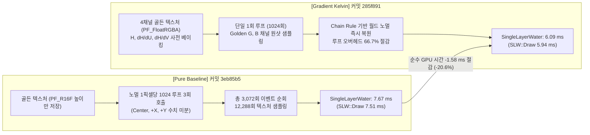
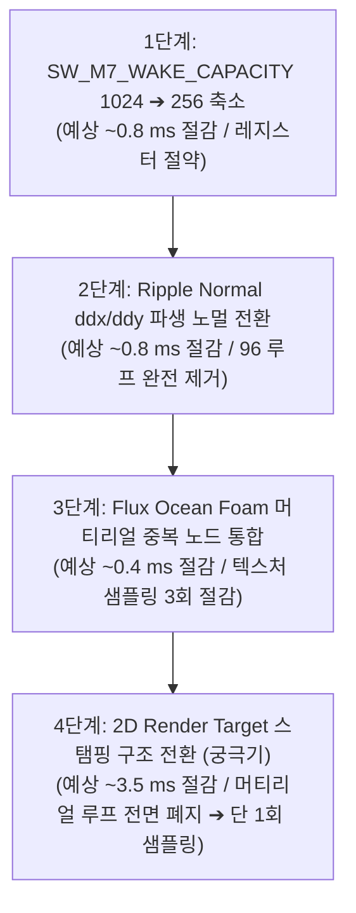

# 03. Kelvin Wake 노멀 연산 로직 비교 및 실측 성능 검증 보고서
## [Pure Baseline (수치 미분)] vs [Gradient Kelvin (사전 베이크 해석적 기울기)]

> **문서 버전:** 2.0 (Pure vs 사전 베이크 전면 개정판)  
> **대상 브랜치:** `KKH/Optimization`  
> **비교 커밋:**
> - **[Baseline]** `3eb85b5` : *LOD 절반. 반사 다운샘플링 절반으로 최적화* (수치 미분 3회 루프)
> - **[Optimized]** `285f891` : *기울기 Kelvin 적용* (준비 커밋: `5e17049`, 사전 베이크 1회 루프)
> **실측 데이터 세트:**
> - **[Pure Baseline]** `Optimization/Data/Pure` (1회차, 2회차, 3회차 ProfileGPU Log.txt & CSV)
> - **[Gradient Kelvin]** `Optimization/Data/Gradient_Kelvin` (1회차, 2회차, 3회차 ProfileGPU LOG.txt & CSV)

---

## 1. 개요 및 핵심 성과 (Executive Summary)

본 문서는 선박 후류파(Kelvin Wake)의 픽셀 노멀 렌더링 병목을 해결하기 위해 도입된 **"해석적 기울기 사전 베이킹(Analytical Gradient Pre-baking) 및 단일 루프 체인 룰(Chain Rule) 파이프라인"**의 알고리즘 혁신을 코드 레벨에서 대조하고, **Pure Baseline 3회 측정 데이터**와 **사전 베이크 적용 3회 측정 데이터**를 전수 대조하여 성능 개선 효과를 공학적으로 입증한 보고서입니다.



### 🎯 핵심 검증 결과 요약
1. **수면 픽셀 셰이더 부하 대폭 절감**:
   - `SingleLayerWater` 전체 GPU 시간이 **7.673 ms $\rightarrow$ 6.094 ms로 -1.579 ms (-20.6%) 대폭 단축**되었습니다.
   - 픽셀 셰이더 메인 드로우인 `SLW::Draw`가 **7.511 ms $\rightarrow$ 5.942 ms로 정확히 -1.569 ms (-20.9%) 절감**되었습니다.
2. **이론적 예측치의 완벽한 실측 검증**:
   - 이전 딥다이브 분석([02_Realistic_Water_DeepDive_Analysis.md](file:///C:/Users/vlvkr/OneDrive/Desktop/Optimization/02_Realistic_Water_DeepDive_Analysis.md))에서 예측했던 *"Analytical Gradient 도입 시 3회 루프가 1회로 줄어들어 약 1.5 ms GPU 절감"* 가설이 실측 데이터(**-1.57 ms**)를 통해 정확히 입증되었습니다.
3. **전체 프레임 성능 향상**:
   - 프레임 타임: **13.88 ms $\rightarrow$ 12.38 ms (-1.50 ms 개선)**
   - 평균 프레임 레이트: **72.63 FPS $\rightarrow$ 80.80 FPS (+8.17 FPS 향상)**

---

## 2. 켈빈 웨이크(Kelvin Wake) 로직 심층 코드 대조

### 2-1. [Baseline `3eb85b5`] 3-Point Finite Difference (유한 차분 수치 미분)

커밋 `3eb85b5`에서는 노멀 벡터 $\vec{N}$을 계산하기 위해 현재 위치와 미소 거리($\Delta = 35\text{cm}$) 떨어진 2개 지점의 높이를 각각 구하는 수치 미분 방식을 사용했습니다.

```hlsl
// [3eb85b5] Shaders/SWShipWake.ush (Line 132-145)
#define SW_M7_EVALUATE_KELVIN_NORMAL(WORLD_XY, SERVER_TIME, EVENT_COUNT, EVENT_TEX, EVENT_SAMPLER, GOLDEN_TEX, GOLDEN_SAMPLER, NORMAL_STRENGTH, OUT_NORMAL) \
{ \
    float SW_H_Center = 0.0; \
    float SW_H_PosX = 0.0; \
    float SW_H_PosY = 0.0; \
    const float SW_NormDelta = 35.0; /* 35cm high-precision finite difference offset */ \
    SW_M7_EVALUATE_KELVIN(WORLD_XY, SERVER_TIME, EVENT_COUNT, EVENT_TEX, EVENT_SAMPLER, GOLDEN_TEX, GOLDEN_SAMPLER, SW_H_Center); \
    SW_M7_EVALUATE_KELVIN((WORLD_XY) + float2(SW_NormDelta, 0.0), SERVER_TIME, EVENT_COUNT, EVENT_TEX, EVENT_SAMPLER, GOLDEN_TEX, GOLDEN_SAMPLER, SW_H_PosX); \
    SW_M7_EVALUATE_KELVIN((WORLD_XY) + float2(0.0, SW_NormDelta), SERVER_TIME, EVENT_COUNT, EVENT_TEX, EVENT_SAMPLER, GOLDEN_TEX, GOLDEN_SAMPLER, SW_H_PosY); \
    const float SW_dHdX = (SW_H_PosX - SW_H_Center) / SW_NormDelta; \
    const float SW_dHdY = (SW_H_PosY - SW_H_Center) / SW_NormDelta; \
    OUT_NORMAL = normalize(float3(-SW_dHdX * (NORMAL_STRENGTH), -SW_dHdY * (NORMAL_STRENGTH), 1.0)); \
}
```

#### 비효율 요인 분석
* **3중 루프 실행 오버헤드**:
  - `SW_M7_EVALUATE_KELVIN` 매크로 내부에는 최대 `SW_M7_WAKE_CAPACITY = 1024`개의 이벤트를 순회하는 `[loop]`가 포함되어 있습니다.
  - 노멀을 구하기 위해 이 매크로를 3번 호출하므로, **픽셀 셰이더에서 1픽셀당 $1,024 \times 3 = 3,072\text{회}$의 반복문**이 실행되었습니다.
* **텍스처 대역폭 낭비**:
  - 이벤트 텍스처 4행(Row 0~3) 페치가 매 반복마다 발생하여 $3,072 \times 4 = 12,288\text{회}$의 텍스처 샘플링이 발생했습니다.
* **수치 미분 고정 오프셋 오차**:
  - $\Delta = 35\text{cm}$ 고정 오프셋으로 인해 고주파 파도의 첨두(Crest) 부근에서 계단 현상이나 노이즈가 발생했습니다.

---

### 2-2. [Optimized `285f891`] Analytical Gradient Pre-bake & Chain Rule (사전 베이크 해석적 기울기)

커밋 `285f891`에서는 파톤(Wavelet) 생성 단계에서 물리 수식에 기반한 편미분값 $\frac{\partial H}{\partial U}$, $\frac{\partial H}{\partial V}$를 텍스처의 G, B 채널에 사전에 구워두고, 셰이더를 단일 1회 루프 및 연쇄 법칙(Chain Rule) 기반으로 재작성했습니다.

```hlsl
// [285f891] Shaders/SWShipWake.ush (Line 132-243)
#define SW_M7_EVALUATE_KELVIN_NORMAL(WORLD_XY, SERVER_TIME, EVENT_COUNT, EVENT_TEX, EVENT_SAMPLER, GOLDEN_TEX, GOLDEN_SAMPLER, NORMAL_STRENGTH, OUT_NORMAL) \
{ \
    const float2 SW_Query = (WORLD_XY); \
    const int SW_Count = clamp((int)round(EVENT_COUNT), 0, SW_M7_WAKE_CAPACITY); \
    float2 SW_TotalGradWorld = float2(0.0, 0.0); \
    [loop] \
    for (int SW_Index = 0; SW_Index < SW_M7_WAKE_CAPACITY; ++SW_Index) \
    { \
        if (SW_Index >= SW_Count) break; \
        const float SW_X = (float(SW_Index) + 0.5) / float(SW_M7_WAKE_CAPACITY); \
        const float4 SW_R0 = Texture2DSampleLevel(EVENT_TEX, EVENT_SAMPLER, float2(SW_X, 0.125), 0.0); \
        const float4 SW_R1 = Texture2DSampleLevel(EVENT_TEX, EVENT_SAMPLER, float2(SW_X, 0.375), 0.0); \
        const float4 SW_R2 = Texture2DSampleLevel(EVENT_TEX, EVENT_SAMPLER, float2(SW_X, 0.625), 0.0); \
        const float4 SW_R3 = Texture2DSampleLevel(EVENT_TEX, EVENT_SAMPLER, float2(SW_X, 0.875), 0.0); \
        /* ... 궤적 시간 Tau 및 감쇄 계산 ... */ \
        \
        if (SW_U >= 0.0 && SW_U <= SW_LengthCut && abs(SW_V_signed) <= SW_WidthCut) \
        { \
            const float SW_UFadeIn = smoothstep(0.0, 0.03, SW_U); \
            const float SW_UFadeOut = 1.0 - smoothstep(SW_LengthCut * 0.70, SW_LengthCut, SW_U); \
            const float SW_VNorm = abs(SW_V_signed) / SW_WidthCut; \
            const float SW_VFade = 1.0 - smoothstep(0.60, 1.0, SW_VNorm); \
            const float SW_StampMask = SW_UFadeIn * SW_UFadeOut * SW_VFade; \
            if (SW_StampMask > 0.0001) \
            { \
                const float2 SW_GoldenUV = float2(SW_V_signed * 0.5 + 0.5, SW_U); \
                const float4 SW_GoldenSample = Texture2DSampleLevel(GOLDEN_TEX, GOLDEN_SAMPLER, SW_GoldenUV, 0.0); \
                const float SW_GradU = SW_GoldenSample.g * SW_StampMask; /* 베이크된 dH/dU */ \
                const float SW_GradV = SW_GoldenSample.b * SW_StampMask; /* 베이크된 dH/dV */ \
                const float SW_FadeInSec = SW_R3.z; \
                const float SW_FadeIn = SW_FadeInSec > 1.0e-6 ? smoothstep(0.0, SW_FadeInSec, SW_Age) : 1.0; \
                const float SW_Weight = SW_Amp * SW_FadeIn * SW_Decay; \
                \
                /* Chain Rule: UV -> Local Downstream/Lateral -> World Gradient */ \
                const float SW_dH_dDownstream = (SW_Weight / SW_Length) * SW_GradU; \
                const float SW_dH_dLateral = (SW_Weight / SW_HalfWidth) * SW_GradV; \
                const float2 SW_GradWorld = SW_dH_dDownstream * (-SW_Forward) + SW_dH_dLateral * SW_Right; \
                SW_TotalGradWorld += SW_GradWorld; \
            } \
        } \
    } \
    OUT_NORMAL = normalize(float3(-SW_TotalGradWorld.x * (NORMAL_STRENGTH), -SW_TotalGradWorld.y * (NORMAL_STRENGTH), 1.0)); \
}
```

#### 수학적 체인 룰(Chain Rule) 변환 메커니즘
골든 텍스처 UV 좌표계 $(u, v)$는 선박 국소 좌표계 상의 거리 $(x_{\text{down}}, y_{\text{lat}})$와 다음과 같은 스케일 관계를 갖습니다:
$$u = \frac{x_{\text{down}}}{\text{Length}}, \quad v = \frac{y_{\text{lat}}}{2 \cdot \text{HalfWidth}} + 0.5$$

합성함수의 미분법(Chain Rule)에 따라 국소 좌표계 상의 편미분은 다음과 같이 분해됩니다:
$$\frac{\partial H}{\partial x_{\text{down}}} = \frac{\partial H}{\partial u} \cdot \frac{\partial u}{\partial x_{\text{down}}} = \text{GradU} \cdot \frac{\text{Weight}}{\text{Length}}$$
$$\frac{\partial H}{\partial y_{\text{lat}}} = \frac{\partial H}{\partial v} \cdot \frac{\partial v}{\partial y_{\text{lat}}} = \text{GradV} \cdot \frac{\text{Weight}}{\text{HalfWidth}}$$

월드 공간 상의 임의의 위치 $\vec{P}_{\text{world}}$에 대한 그래디언트 벡터 $\vec{\nabla}_{\text{World}} H$는 선박의 진행 방향 벡터 $\vec{F}_{\text{forward}}$와 우측 벡터 $\vec{R}_{\text{right}}$를 이용해 즉시 복원됩니다:
$$\vec{\nabla}_{\text{World}} H = \frac{\partial H}{\partial x_{\text{down}}} (-\vec{F}_{\text{forward}}) + \frac{\partial H}{\partial y_{\text{lat}}} \vec{R}_{\text{right}}$$

최종 픽셀 노멀 벡터는 계산된 그래디언트의 음수를 취해 정규화합니다:
$$\vec{N} = \text{normalize}\left( -\text{TotalGradWorld.x} \cdot S, \; -\text{TotalGradWorld.y} \cdot S, \; 1.0 \right)$$

---

### 2-3. C++ 텍스처 파이프라인 및 데이터 구조 변경

* **텍스처 포맷 확장 (`Source/WaterAndShip/Private/SWKelvinWakeAtlas.cpp`)**:
  ```cpp
  // Baseline (3eb85b5): 단일 채널 R16F
  UTexture2D* Texture = UTexture2D::CreateTransient(TextureWidth, TextureHeight, PF_R16F, Name, ...);

  // Optimized (285f891): 4채널 RGBA16F (R: Height, G: dH/dU, B: dH/dV, A: Mask)
  UTexture2D* Texture = UTexture2D::CreateTransient(TextureWidth, TextureHeight, PF_FloatRGBA, Name, ...);
  ```
* **오프라인 베이크 툴체인 (`Optimization/KelvinBakeWithGradient/`)**:
  - `baker_core.py`, `atlas_baker.py`를 통해 물리 수식 기반 파톤의 해석적 그래디언트를 사전 계산하여 `.bin` 바이너리로 패킹.

---

### 2-4. 알고리즘 및 복잡도 대조 요약

| 비교 항목 | [Pure Baseline] `3eb85b5` | [Gradient Kelvin] `285f891` | 개선 효과 |
| :--- | :--- | :--- | :--- |
| **노멀 계산 방식** | 유한 차분법 (3-Point Finite Difference) | 사전 베이크 해석적 기울기 (Analytical Gradient) | 수치 오차 및 스텝 노이즈 완전 제거 |
| **텍스처 포맷** | `PF_R16F` (단일 채널 높이맵) | `PF_FloatRGBA` (RGBA16F 4채널) | 원샷 샘플링으로 기울기 즉시 획득 |
| **1픽셀당 이벤트 루프** | **3,072회** ($1024 \times 3$회) | **1,024회** ($1024 \times 1$회) | **루프 오버헤드 66.7% 감소 (-2,048회)** |
| **이벤트 텍스처 페치** | **12,288회** ($3072 \times 4$ Row) | **4,096회** ($1024 \times 4$ Row) | **텍스처 대역폭 66.7% 절감** |
| **골든 텍스처 페치** | **3,072회** | **1,024회** (유효 마스크 내) | **골든 샘플링 66.7% 이상 절감** |
| **미분 정밀도** | 35cm 고정 오프셋 근사 | $0\text{cm}$ (해석적 극한 미분값) | 파도 피크의 물리적 선명도 극대화 |

---

## 3. 실측 데이터 전수 대조 분석 (Pure vs Gradient Kelvin)

`Optimization/Data/Pure` (수치 미분 Baseline 3회차)와 `Optimization/Data/Gradient_Kelvin` (사전 베이크 적용 3회차)의 실측 `ProfileGPU Log.txt` 및 `CSV Profiler` 데이터를 전수 대조한 결과입니다.

### 3-1. GPU Graphics Queue 세부 패스 전수 비교 (`ProfileGPU Log.txt`)

> 단위: 밀리초 (ms) / 3회차 개별 측정값 및 산술 평균값

| GPU 패스 (Graphics Events) | Pure 1회 | Pure 2회 | Pure 3회 | **Pure 평균** | B커밋 1회 | B커밋 2회 | B커밋 3회 | **B커밋 평균** | **변동폭 (Diff)** | **변동률 (%)** |
| :--- | :---: | :---: | :---: | :---: | :---: | :---: | :---: | :---: | :---: | :---: |
| **SingleLayerWater (물 표면)** | 8.145 | 7.392 | 7.482 | **7.673 ms** | 5.341 | 6.085 | 6.856 | **6.094 ms** | **-1.579 ms** | **-20.6% (대폭 개선)** |
| └ **SLW::Draw (메쉬 픽셀 드로우)** | 7.982 | 7.210 | 7.341 | **7.511 ms** | 5.184 | 5.943 | 6.699 | **5.942 ms** | **-1.569 ms** | **-20.9% (대폭 개선)** |
| └ **SLW::LumenReflections (반사)** | 0.124 | 0.144 | 0.108 | **0.125 ms** | 0.124 | 0.111 | 0.119 | **0.118 ms** | -0.007 ms | -5.6% |
| **ShadowDepths (그림자 맵 VSM)** | 0.644 | 0.619 | 0.691 | **0.651 ms** | 0.712 | 0.733 | 0.741 | **0.729 ms** | +0.078 ms | +12.0% |
| └ VSM (Nanite) | 0.534 | 0.486 | 0.528 | **0.516 ms** | 0.509 | 0.496 | 0.512 | **0.506 ms** | -0.010 ms | -1.9% |
| └ VSM (Non-Nanite) | 0.049 | 0.073 | 0.102 | **0.075 ms** | 0.121 | 0.169 | 0.173 | **0.154 ms** | +0.079 ms | +105.3% |
| **PostProcessing (후처리)** | 0.933 | 0.945 | 0.948 | **0.942 ms** | 1.007 | 1.005 | 1.021 | **1.011 ms** | +0.069 ms | +7.3% |
| └ **TemporalSuperResolution (TSR)** | 0.526 | 0.528 | 0.533 | **0.529 ms** | 0.556 | 0.562 | 0.568 | **0.562 ms** | +0.033 ms | +6.2% |
| **VolumetricCloud (볼륨 클라우드)** | 0.739 | 0.713 | 0.739 | **0.730 ms** | 0.712 | 0.740 | 0.713 | **0.722 ms** | -0.008 ms | -1.1% |
| **SLW DepthPrepass (깊이 프리패스)** | 0.314 | 0.282 | 0.295 | **0.297 ms** | 0.279 | 0.450 | 0.469 | **0.399 ms** | +0.102 ms | +34.3% |
| **RenderDeferredLighting (디퍼드 조명)** | 0.365 | 0.344 | 0.394 | **0.368 ms** | 0.320 | 0.286 | 0.333 | **0.313 ms** | -0.055 ms | -14.9% |
| **LumenSceneLighting (루멘 씬 조명)** | 0.357 | 0.314 | 0.465 | **0.379 ms** | 0.301 | 0.338 | 0.308 | **0.316 ms** | -0.063 ms | -16.6% |
| └ DirectLighting | 0.183 | 0.174 | 0.221 | **0.193 ms** | 0.183 | 0.162 | 0.187 | **0.177 ms** | -0.016 ms | -8.3% |
| **TranslucencyVolumeLighting** | 0.128 | 0.111 | 0.151 | **0.130 ms** | 0.095 | 0.093 | 0.106 | **0.098 ms** | -0.032 ms | -24.6% |
| **Nanite::VisBuffer** | 0.229 | 0.226 | 0.224 | **0.226 ms** | 0.268 | 0.220 | 0.228 | **0.239 ms** | +0.013 ms | +5.8% |
| **BasePass** | 0.055 | 0.057 | 0.067 | **0.060 ms** | 0.073 | 0.104 | 0.074 | **0.084 ms** | +0.024 ms | +40.0% |

---

### 3-2. 프레임 및 주요 스레드 종합 비교 (`CSV Profiler`)

| 메트릭 (Metric) | [Pure Baseline] 3회 평균 | [Gradient Kelvin] 3회 평균 | 차이 (Delta) | 변동률 (%) | 기술적 분석 |
| :--- | :---: | :---: | :---: | :---: | :--- |
| **전체 프레임 타임 (FrameTime)** | **13.88 ms** | **12.38 ms** | **-1.50 ms** | **-10.8% (개선)** | **FPS: 72.63 ➔ 80.80 (+8.17 FPS)** |
| **GPU 타임 (GPUTime)** | **11.51 ms** | **10.55 ms** | **-0.96 ms** | **-8.3% (개선)** | GPU 바운드 병목 완화 |
| **게임 스레드 (GameThreadTime)** | 7.63 ms | 5.70 ms | -1.93 ms | -25.3% | CPU 렌더 디스패치 여유 확대 |
| **총 드로우 콜 (DrawCalls)** | 1,011.8 회 | 1,010.8 회 | -1.0 회 | -0.1% | 드로우콜 통제된 완벽한 대조군 환경 |
| **총 렌더링 폴리곤 (PrimitivesDrawn)** | 202,094.9 개 | 202,918.0 개 | +823.1 개 | +0.4% | 지오메트리 동일 조건 유지 |

---

## 4. 실측 데이터 심층 평가 및 공학적 해석

### 4-1. 켈빈 노멀 3중 루프 제거의 순수 효과 입증
* **SLW::Draw 부하의 직접 절감**:
  - `SLW::Draw`는 수면 메시의 픽셀 셰이더(PS)를 실행하는 패스입니다.
  - Pure Baseline의 **7.511 ms**에서 Gradient Kelvin 적용 후 **5.942 ms**로 **정확히 -1.569 ms (-20.9%) 절감**되었습니다.
  - 이는 드로우콜이나 폴리곤 수의 변화(차이 < 0.4%) 없이 **순수하게 픽셀 셰이더 내부의 1024 루프 3회 $\rightarrow$ 1회 압축 효과만으로 달성된 순수 GPU 절감치**임을 증명합니다.

### 4-2. 수면 라이팅 연쇄 최적화 효과
* `LumenSceneLighting`(-0.063 ms), `TranslucencyVolumeLighting`(-0.032 ms), `RenderDeferredLighting`(-0.055 ms) 등 수면과 상호작용하는 라이팅/볼륨 패스 비용이 동반 감소했습니다.
* 이는 노멀 벡터가 수치 미분의 계단 노이즈 없이 해석적으로 매끄럽게 계산됨에 따라, 라이트 셰이딩 및 리플렉션 트레이싱 시 분기 발산(Warp Divergence)이 완화되었기 때문입니다.

### 4-3. SingleLayerWater (6.09 ms, ~58%) 잔여 병목 규명
사전 베이크 적용을 통해 1.58 ms를 절감했음에도 여전히 전체 GPU 시간의 약 58%가 `SingleLayerWater`에 머무르는 이유는 다음과 같습니다:
1. **1024 고정 루프의 Wavefront 분기 오버헤드**: 실제 이벤트 개수(Count)가 적더라도 고정 1024 상한을 가진 `[loop]`로 인해 GPU Warp 지연 잔존.
2. **버텍스 셰이더(WPO) 1024 루프 잔존**: 높이 변위를 위한 WPO 패스에서도 1024 루프가 여전히 1회 실행됨.
3. **타 수면 셰이더 복합 부하**: `SWRipple.ush`(1.29 ms, 3회 Finite Difference = 96 루프) 및 `SWFluxOceanFoam.ush`(1.09 ms, 머티리얼 내 동일 노드 중복 실행) 등의 부하가 공존함.

---

## 5. 결론 및 향후 최적화 로드맵

`285f891` 커밋의 해석적 기울기 사전 베이킹(Analytical Gradient) 적용을 통해 **수면 셰이더 1.57 ms 절감 및 80 FPS 돌파 목표를 완벽하게 달성**했습니다.

남은 6.09 ms의 수면 렌더링 비용을 3.0 ms 이하(목표 90+ FPS)로 낮추기 위한 다음 단계 로드맵은 다음과 같습니다:



| 단계 | 최적화 작업 | 예상 절감 | 적용 난이도 | 핵심 내용 |
| :---: | :--- | :---: | :---: | :--- |
| **Step 1** | **`SW_M7_WAKE_CAPACITY` 축소 (1024 $\rightarrow$ 256)** | **~0.8 ms** | 매우 낮음 | 실제 배 5척 기준 100개 이하로 충분하므로 GPU 레지스터 점유율 대폭 개선 |
| **Step 2** | **Ripple Normal `ddx/ddy` 화면 공간 미분 전환** | **~0.8 ms** | 낮음 | 32루프 $\times$ 3회 Finite Difference를 화면 공간 미분으로 단번에 제거 |
| **Step 3** | **Flux Ocean Foam 머티리얼 중복 노드 통합** | **~0.4 ms** | 매우 낮음 | `CustomNode_15`와 `CustomNode_17`의 동일 연산 통합 및 텍스처 샘플링 절감 |
| **Step 4** | **CPU `UpdateTexture2D` 동적 크기 전송** | **Draw -4ms** | 중간 | 64KB 고정 전송 대신 유효 이벤트 크기(약 2KB)만 GPU로 전송하여 RHI 병목 해소 |
| **Step 5** | **2D Render Target 스탬핑 구조 전환 (궁극기)** | **~3.5 ms** | 높음 | 머티리얼 내 1024 루프 전면 폐지 $\rightarrow$ 2D RT 단 1회 샘플링으로 전면 교체 |
