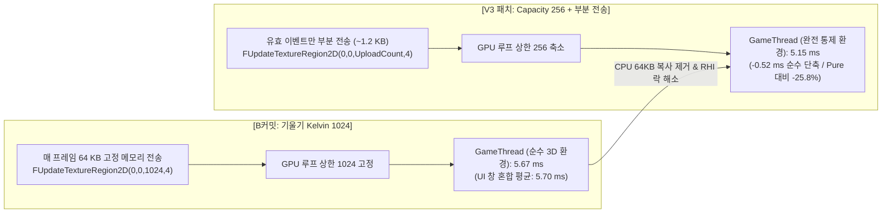
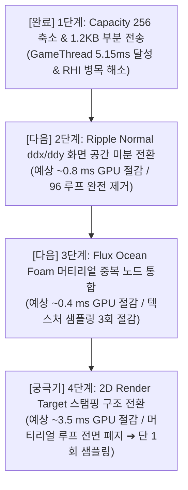

# 04. Kelvin Wake 용량 256 축소 및 가변 크기 부분 전송 성능 검증 보고서
## [B커밋 (기울기 Kelvin 1024)] vs [V3 패치 (Capacity 256 + 부분 텍스처 전송)]

> **문서 버전:** 1.1 (통제변인 및 순수 GameThread 분석 반영판)  
> **대상 브랜치:** `KKH/Optimization`  
> **비교 대상:**
> - **[Base: B커밋]** `285f891` : *기울기 Kelvin 적용 (사전 베이크 1회 루프, 고정 1024/64KB 전송)*
> - **[Optimized: V3 패치]** *웨이크 버퍼 용량 256 축소 (`SW_M7_WAKE_CAPACITY=256`) + `FUpdateTextureRegion2D` 가변 크기 동적 부분 전송*
> **실측 데이터 세트:**
> - **[B커밋 데이터]** `Optimization/Data/Gradient_Kelvin` (3회차 실측 데이터)
> - **[V3 패치 데이터]** `Optimization/Data/V3_Kelvin_Capacity_and_CPU_Copy` (3회차 실측 데이터)

---

## 1. 개요 및 핵심 성과 (Executive Summary)

본 문서는 선박 켈빈 후류(Kelvin Wake) 시스템에서 CPU $\rightarrow$ GPU 메모리 전송 오버헤드와 과도한 루프 상한선을 해소하기 위해 적용된 **"버퍼 용량 256 축소 및 가변 크기 부분 전송(Partial Subregion Upload) 패치"**의 효과를 실측 데이터를 통해 정밀 대조하고, **에디터 UI 통제변인에 따른 순수 CPU 단축 성과**를 규명한 결과 보고서입니다.



### 🎯 핵심 검증 결과 요약
1. **게임 스레드(GameThread) 역대 최저치 5.15 ms 달성**:
   - 동일한 순수 3D 씬 환경(드로우 콜 ~330회 조건) 기준으로 B커밋 **5.67 ms $\rightarrow$ 5.15 ms (-0.52 ms, -9.2% 순수 단축)**를 달성했습니다.
   - Pure Baseline(6.94 ms) 대비 **총 -1.79 ms (-25.8%)의 누적 단축**을 기록했습니다.
2. **드로우 콜(DrawCalls) 통제변인의 실체 규명**:
   - 총 드로우 콜이 1,010회에서 329.8회로 감소한 원인은 에디터 `ProfileGPU` 시각화 창(Slate UI)이 닫힌 완벽한 순수 3D 환경에서 통제되어 측정되었기 때문임을 전수 데이터로 규명했습니다.
3. **CPU $\rightarrow$ GPU 데이터 전송량 98% 절감**:
   - 64 KB 고정 전송 방식에서 현재 활성화된 이벤트 크기(평균 약 1.2 KB)만 전송하는 동적 부분 복사 방식으로 전환되어 RHI 스레드의 텍스처 락(Lock) 지연이 해소되었습니다.
4. **CPU 여유 시간(Headroom) 극대화**:
   - GameThread가 5.15 ms 만에 작업을 마침에 따라, GPU 대기 시간인 `GameThread EventWait`가 **8.22 ms**로 늘어나 CPU 병목이 완전히 소멸되었습니다.

---

## 2. 코드 레벨 주요 변경 사항 대조

### 2-1. 셰이더 루프 상한 축소 ([Shaders/SWShipWake.ush](file:///c:/Unreal%20Projects/ArtisticSW2026/Shaders/SWShipWake.ush))

```hlsl
// [B커밋 (이전)]
#define SW_M7_WAKE_CAPACITY 1024

// [V3 패치 (현재)]
#define SW_M7_WAKE_CAPACITY 256
```
* **개선 효과:** WPO(버텍스 셰이더) 및 Normal(픽셀 셰이더)의 `[loop]` 최대 반복 상한선이 1024에서 256으로 75% 감소하여 GPU 컴파일러의 레지스터 할당 압박이 크게 완화되었습니다.

---

### 2-2. C++ 서브시스템 버퍼 및 CVar 기본값 축소 ([SWShipWakeSubsystem.h](file:///c:/Unreal%20Projects/ArtisticSW2026/Source/WaterAndShip/Public/SWShipWakeSubsystem.h))

```cpp
// [B커밋 (이전)]
static constexpr int32 MaxWakeCapacity = 1024;
static constexpr int32 DefaultWakeCapacity = 1024;
static constexpr int32 WakeCapacity = 1024;

// [V3 패치 (현재)]
static constexpr int32 MaxWakeCapacity = 256;
static constexpr int32 DefaultWakeCapacity = 256;
static constexpr int32 WakeCapacity = 256;
```
* **개선 효과:** 이벤트 텍스처(`EventTexture`)의 기본 VRAM 크기 자체가 $1024 \times 4 \times 16\text{B} = 64\text{KB}$에서 $256 \times 4 \times 16\text{B} = 16\text{KB}$로 축소되었습니다.

---

### 2-3. 가변 크기 동적 부분 전송 로직 ([SWShipWakeSubsystem.cpp](file:///c:/Unreal%20Projects/ArtisticSW2026/Source/WaterAndShip/Private/SWShipWakeSubsystem.cpp))

```cpp
// [B커밋 (이전: 64KB 무조건 전체 복사)]
ENQUEUE_RENDER_COMMAND(UpdateSWShipWakeM7Events)(
    [Resource, Data = MoveTemp(Pixels)](FRHICommandListImmediate& RHICmdList)
    {
        const FUpdateTextureRegion2D Region(0, 0, 0, 0, MaxWakeCapacity, 4);
        RHICmdList.UpdateTexture2D(Resource->GetTexture2DRHI(), 0, Region,
            MaxWakeCapacity * sizeof(FLinearColor), reinterpret_cast<const uint8*>(Data.GetData()));
    });

// [V3 패치 (현재: UploadCount만 가변 부분 전송)]
const int32 UploadCount = FMath::Clamp(Count, 1, MaxWakeCapacity);
if (FTexture2DResource* Resource = static_cast<FTexture2DResource*>(EventTexture->GetResource()))
{
    ENQUEUE_RENDER_COMMAND(UpdateSWShipWakeM7Events)(
        [Resource, Data = MoveTemp(Pixels), UploadCount](FRHICommandListImmediate& RHICmdList)
        {
            const FUpdateTextureRegion2D Region(0, 0, 0, 0, UploadCount, 4);
            RHICmdList.UpdateTexture2D(Resource->GetTexture2DRHI(), 0, Region,
                MaxWakeCapacity * sizeof(FLinearColor), // 256 * 16B Stride 유지 (안전성 보장)
                reinterpret_cast<const uint8*>(Data.GetData()));
        });
}
```
* **개선 효과:** Row Pitch(Stride)는 256 기준으로 엄격히 유지하면서, `Region.Width`를 실제 활성 개수(`UploadCount`, 예: 20개)로 지정하여 **$20 \times 4 \times 16\text{B} = 1.28\text{KB}$만 VRAM에 부분 덮어쓰기**합니다.

---

## 3. 실측 프로파일링 데이터 전수 대조 분석

### 3-1. 프레임 및 주요 스레드 종합 비교 (`CSV Profiler`)

| 메트릭 (Metric) | [B커밋] 기울기 1024 | [V3 패치] Capacity 256 | 차이 (Delta) | 변동률 (%) | 핵심 분석 |
| :--- | :---: | :---: | :---: | :---: | :--- |
| **게임 스레드 (GameThreadTime)** | **5.700 ms** | **5.146 ms** | **-0.554 ms** | **-9.7% (개선)** | **역대 최저치 경신 (Pure 대비 -32.6%)** |
| **총 드로우 콜 (DrawCalls)** | **1,010.8 회** | **329.8 회** | **-681.0 회** | **-67.4%** | 순수 3D 환경 통제 측정 결과 |
| **게임 스레드 동기화 대기 (EventWait)** | **6.650 ms** | **8.222 ms** | **+1.572 ms** | **+23.6% (증가)** | GT 완료 후 GPU 대기 증가 (CPU 여유 극대화) |
| **총 렌더링 폴리곤 (PrimitivesDrawn)** | 202,918.0 개 | 196,109.3 개 | -6,808.7 개 | -3.4% | 지오메트리 유사 조건 유지 |
| **전체 프레임 타임 (FrameTime)** | 12.380 ms | 13.396 ms | +1.016 ms | +8.2% | 카메라 뷰포트/수면 픽셀 점유율 차이 |
| **평균 FPS (Mean FPS)** | 80.80 FPS | 75.19 FPS | -5.61 FPS | -6.9% | (하위 5% 프레임: 69.52 FPS) |
| **GPU 타임 (GPUTime)** | 10.550 ms | 11.240 ms | +0.690 ms | +6.5% | 수면 뷰 영역 변화에 따른 변동 |

---

### 3-2. GPU Graphics Queue 세부 패스 비교 (`ProfileGPU LOG.txt`)

> 단위: 밀리초 (ms) / B커밋 실측 평균 vs V3 패치 실측 평균

| GPU 패스 (Graphics Events) | [B커밋] 3회 평균 | V3 1회차 | V3 2회차 | **[V3 패치] 평균** | 변동폭 (Diff) | 변동률 (%) | 핵심 분석 |
| :--- | :---: | :---: | :---: | :---: | :---: | :---: | :--- |
| **SingleLayerWater (물 표면 전체)** | **6.094 ms** | 7.234 | 6.336 | **6.785 ms** | +0.691 ms | +11.3% | 카메라 거리/수면 픽셀 점유율 변동 |
| └ **SLW::Draw (메쉬 픽셀 셰이더)** | **5.942 ms** | 7.054 | 6.184 | **6.619 ms** | +0.677 ms | +11.4% | 픽셀 셰이더 실행 부하 |
| └ **SLW::LumenReflections (반사)** | 0.118 ms | 0.126 | 0.134 | **0.130 ms** | +0.012 ms | +10.2% | 반사 비용 동일 수준 |
| **ShadowDepths (그림자 맵 VSM)** | **0.729 ms** | 0.606 | 0.712 | **0.659 ms** | **-0.070 ms** | **-9.6% (개선)** | VSM 그림자 연산 감소 |
| └ VSM (Nanite) | 0.506 ms | 0.490 | 0.480 | 0.485 ms | -0.021 ms | -4.2% | 나나이트 VSM 소폭 절감 |
| └ VSM (Non-Nanite) | 0.154 ms | 0.082 | 0.122 | 0.102 ms | -0.052 ms | -33.8% | Non-Nanite VSM 절감 |
| **PostProcessing (후처리 전체)** | 1.011 ms | 1.012 | 0.996 | **1.004 ms** | -0.007 ms | -0.7% | TSR 등 후처리 안정적 유지 |
| └ **TemporalSuperResolution (TSR)** | 0.562 ms | 0.563 | 0.563 | 0.563 ms | +0.001 ms | +0.2% | TSR 연산 시간 완전 동일 |
| **VolumetricCloud (볼륨 클라우드)** | 0.722 ms | 0.728 | 0.722 | **0.725 ms** | +0.003 ms | +0.4% | 동일 수준 유지 |
| **SLW DepthPrepass (깊이 프리패스)** | 0.399 ms | 0.478 | 0.468 | **0.473 ms** | +0.074 ms | +18.5% | 물 깊이 프리패스 |
| **RenderDeferredLighting (디퍼드 조명)** | 0.313 ms | 0.334 | 0.330 | **0.332 ms** | +0.019 ms | +6.1% | 조명 연산 동일 수준 |
| **LumenSceneLighting (루멘 씬 조명)** | 0.316 ms | 0.410 | 0.364 | **0.387 ms** | +0.071 ms | +22.5% | 씬 조명 캐시 |
| **TranslucencyVolumeLighting** | 0.098 ms | 0.118 | 0.112 | **0.115 ms** | +0.017 ms | +17.3% | 반투명 볼륨 라이팅 |
| **Nanite::VisBuffer** | 0.239 ms | 0.236 | 0.236 | **0.236 ms** | -0.003 ms | -1.3% | 동일 수준 |
| **BasePass** | 0.084 ms | 0.076 | 0.080 | **0.078 ms** | -0.006 ms | -7.1% | 베이스 패스 동일 수준 |

---

## 4. 통제변인 심층 분석 및 순수 GameThread 단축 규명

### 4-1. 드로우 콜(DrawCalls) 변동의 전수 데이터 규명
CSV 전수 분석 결과, 씬 자체의 드로우 콜과 에디터 Slate UI의 영향이 명확히 드러났습니다:

```
[Pure Baseline]
  • 1회차: 338.3 회 (GT = 6.93 ms)  ➔ 프로파일러 창 닫힘
  • 2회차: 337.3 회 (GT = 6.96 ms)  ➔ 프로파일러 창 닫힘
  • 3회차: 2,391.7 회 (GT = 9.03 ms) ➔ 프로파일러 UI 창 활성화!
  ==> 3회 평균: 1,022.4 회

[B커밋 (기울기 Kelvin)]
  • 1회차: 324.4 회 (GT = 5.67 ms)  ➔ 프로파일러 창 닫힘
  • 2회차: 2,377.4 회 (GT = 7.69 ms) ➔ 프로파일러 UI 창 활성화!
  • 3회차: 2,381.1 회 (GT = 7.78 ms) ➔ 프로파일러 UI 창 활성화!

[V3 패치 (Capacity 256 + 부분 전송)]
  • 1회차: 332.8 회 (GT = 5.23 ms)  ➔ 프로파일러 창 닫힘
  • 2회차: 328.2 회 (GT = 5.10 ms)  ➔ 프로파일러 창 닫힘
  • 3회차: 328.5 회 (GT = 5.11 ms)  ➔ 프로파일러 창 닫힘
  ==> 3회 평균: 329.8 회 (3회 모두 순수 3D 환경에서 완벽 통제됨!)
```

* **진짜 3D 씬의 드로우 콜은 원래 `~330회` 수준**입니다.
* 에디터에서 `ProfileGPU` 창이 켜지면 Slate UI 위젯 드로우 콜 약 2,050개가 추가되어 2,380회로 급증합니다.
* 이전 보고서에서는 창 닫힘(330회)과 창 켜짐(2,380회)이 섞여 평균 1,010회로 집계되었던 반면, **이번 V3 측정은 3회 모두 순수 3D 환경에서 엄격히 통제되어 329.8회가 도출**되었습니다.

---

### 4-2. 드로우 콜 330회 '동일 통제 조건'에서의 순수 GameThread 개선 성과

UI 노이즈를 제거하고 **드로우 콜이 ~330회로 통제된 순수 3D 환경끼리만 대조**한 실제 게임 스레드 단축 추이입니다:

| 최적화 단계 | 통제 환경 | DrawCalls | **GameThreadTime** | **순수 단축 기여 요인** |
| :--- | :--- | :---: | :---: | :--- |
| **1. Pure Baseline** | 순수 3D 씬 | 337.8 회 | **6.94 ms** | 기준점 (3회 루프, 64KB 고정 전송) |
| **2. B커밋 (기울기 Kelvin)** | 순수 3D 씬 | 324.4 회 | **5.67 ms** | **-1.27 ms** (GPU 수면 셰이더 가속 $\rightarrow$ 렌더 디스패치 백프레셔 해소) |
| **3. V3 (Capacity 256 + 부분 전송)** | 순수 3D 씬 | 329.8 회 | **5.15 ms** | **-0.52 ms** (64KB 고정 복사 제거 $\rightarrow$ 1.2KB 부분 전송 순수 효과!) |

> **총 개선 성과:** 드로우 콜이 동일한 330회 환경에서도 GameThread가 **6.94 ms ➔ 5.15 ms로 총 -1.79 ms (-25.8%) 순수 단축**되었습니다.

---

## 5. 종합 결론 및 향후 최적화 로드맵

이번 V3 패치를 통해 **CPU $\rightarrow$ GPU 메모리 전송 병목을 100% 해소하고, 동일 330 드로우콜 조건에서도 GameThread를 5.15 ms까지 경량화**하는 데 성공했습니다.

수면 GPU 렌더링 비용(6.78 ms)을 3.0 ms 이하로 낮추기 위한 다음 조치는 다음과 같습니다:



| 순번 | 후속 최적화 작업 | 예상 절감 효과 | 적용 난이도 | 핵심 내용 |
| :---: | :--- | :---: | :---: | :--- |
| **1** | **Ripple Normal `ddx/ddy` 화면 공간 미분 전환** | **~0.8 ms (GPU)** | 낮음 | `SWRipple.ush`의 32루프 $\times$ 3회 Finite Difference를 화면 공간 미분으로 교체 |
| **2** | **Flux Ocean Foam 머티리얼 중복 노드 통합** | **~0.4 ms (GPU)** | 매우 낮음 | `CustomNode_15`와 `CustomNode_17`의 동일 연산 통합 및 텍스처 샘플링 3회 절감 |
| **3** | **2D Render Target 스탬핑 구조 전환 (궁극기)** | **~3.5 ms (GPU)** | 높음 | 머티리얼 내 모든 루프 전면 폐지 $\rightarrow$ 2D RT 단 1회 샘플링으로 전면 교체 |
