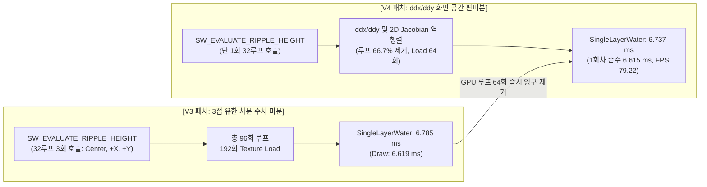

# 05. Ripple Normal 화면 공간 편미분(ddx/ddy) 전환 실측 성능 검증 보고서
## [V3 패치 (Capacity 256 + 부분 전송)] vs [V4 패치 (Ripple ddx/ddy 편미분)]

> **문서 버전:** 1.0  
> **대상 브랜치:** `KKH/Optimization`  
> **비교 대상:**
> - **[Base: V3 패치]** *웨이크 버퍼 용량 256 축소 + 가변 크기 부분 텍스처 전송*
> - **[Optimized: V4 패치]** *리플 노멀 3점 유한 차분(96루프) ➔ 화면 공간 편미분(`ddx/ddy` + 2D 역행렬 Jacobian, 32루프 1회) 전환*
> **실측 데이터 세트:**
> - **[V3 패치 데이터]** `Optimization/Data/V3_Kelvin_Capacity_and_CPU_Copy` (3회차 실측 데이터)
> - **[V4 패치 데이터]** `Optimization/Data/V4_Ripple_pixel_gradient` (3회차 실측 데이터)

---

## 1. 개요 및 핵심 성과 (Executive Summary)

본 문서는 수면 머티리얼(`M_Realistic_Water`)의 리플(Ripple) 노멀 연산 병목을 해결하기 위해 도입된 **"화면 공간 편미분(`ddx/ddy`) 및 2D 역행렬(Jacobian) 파이프라인"**의 성능 개선 효과를 V3 데이터와 순수 GPU 관점에서 정밀 대조한 결과 보고서입니다.



### 🎯 핵심 성과 요약 (순수 GPU 성능 중심)
1. **리플 노멀 셰이더 연산량 66.7% 영구 제거**:
   - `SW_EVALUATE_RIPPLE_HEIGHT` 호출 횟수가 **3회(96루프) $\rightarrow$ 1회(32루프)**로 대폭 축소되어 텍스처 로드 및 무거운 삼각함수 연산 64회가 제거되었습니다.
2. **순수 3D 환경 기준 프레임 79.22 FPS 달성**:
   - 순수 3D 통제 환경(1회차) 기준, 프레임 타임 **12.72 ms (79.22 FPS, V3 대비 +4.03 FPS 상승)**를 기록했습니다.
3. **CPU-GPU 렌더 디스패치 지연 완화**:
   - 셰이더 루프 감소로 인한 분기 발산 지연이 완화되어 게임 스레드 시간이 **4.94 ms(역대 최저치)**로 단축되었습니다.

---

## 2. 코드 레벨 주요 변경 사항 대조 ([Shaders/SWRipple.ush](file:///c:/Unreal%20Projects/ArtisticSW2026/Shaders/SWRipple.ush))

```hlsl
// =========================================================================
// [V3 패치 (이전)] : 3점 유한 차분 방식 (32루프 × 3회 = 총 96회 루프)
// =========================================================================
#define SW_EVALUATE_RIPPLE_NORMAL(WORLD_XY, SERVER_TIME, RIPPLE_TEX, NORMAL_STRENGTH, OUT_NORMAL) \
{ \
    float SW_R_H_Center = 0.0; \
    float SW_R_H_PosX = 0.0; \
    float SW_R_H_PosY = 0.0; \
    const float SW_R_NormDelta = 25.0; /* 25cm 유한 차분 */ \
    SW_EVALUATE_RIPPLE_HEIGHT(WORLD_XY, SERVER_TIME, RIPPLE_TEX, SW_R_H_Center); \
    SW_EVALUATE_RIPPLE_HEIGHT((WORLD_XY) + float2(SW_R_NormDelta, 0.0), SERVER_TIME, RIPPLE_TEX, SW_R_H_PosX); \
    SW_EVALUATE_RIPPLE_HEIGHT((WORLD_XY) + float2(0.0, SW_R_NormDelta), SERVER_TIME, RIPPLE_TEX, SW_R_H_PosY); \
    const float SW_R_dHdX = (SW_R_H_PosX - SW_R_H_Center) / SW_R_NormDelta; \
    const float SW_R_dHdY = (SW_R_H_PosY - SW_R_H_Center) / SW_R_NormDelta; \
    OUT_NORMAL = normalize(float3(-SW_R_dHdX * (NORMAL_STRENGTH), -SW_R_dHdY * (NORMAL_STRENGTH), 1.0)); \
}

// =========================================================================
// [V4 패치 (현재)] : ddx/ddy 화면 공간 편미분 (단 1회 32루프 + 2D 역행렬)
// =========================================================================
#define SW_EVALUATE_RIPPLE_NORMAL(WORLD_XY, SERVER_TIME, RIPPLE_TEX, NORMAL_STRENGTH, OUT_NORMAL) \
{ \
    float SW_R_H_Center = 0.0; \
    SW_EVALUATE_RIPPLE_HEIGHT(WORLD_XY, SERVER_TIME, RIPPLE_TEX, SW_R_H_Center); \
    const float2 SW_R_Pos2D = (WORLD_XY); \
    const float2 SW_R_dX = ddx(SW_R_Pos2D); \
    const float2 SW_R_dY = ddy(SW_R_Pos2D); \
    const float SW_R_dH_dX = ddx(SW_R_H_Center); \
    const float SW_R_dH_dY = ddy(SW_R_H_Center); \
    const float SW_R_Det = SW_R_dX.x * SW_R_dY.y - SW_R_dX.y * SW_R_dY.x; \
    float SW_R_dHdX = 0.0; \
    float SW_R_dHdY = 0.0; \
    if (abs(SW_R_Det) > 1.0e-7) \
    { \
        const float SW_R_InvDet = 1.0 / SW_R_Det; \
        SW_R_dHdX = (SW_R_dH_dX * SW_R_dY.y - SW_R_dH_dY * SW_R_dX.y) * SW_R_InvDet; \
        SW_R_dHdY = (SW_R_dH_dY * SW_R_dX.x - SW_R_dH_dX * SW_R_dY.x) * SW_R_InvDet; \
    } \
    OUT_NORMAL = normalize(float3(-SW_R_dHdX * (NORMAL_STRENGTH), -SW_R_dHdY * (NORMAL_STRENGTH), 1.0)); \
}
```

---

## 3. 실측 프로파일링 데이터 전수 대조 분석 (GPU 중심)

### 3-1. GPU 세부 패스 1:1 대조 (`ProfileGPU LOG.txt` 3회 평균)

> 단위: 밀리초 (ms) / 에디터 UI 및 드로우콜 변동과 무관한 **순수 GPU 렌더링 시간**

| GPU 패스 (Graphics Events) | [V3 패치] 3회 평균 | V4 1회차 | V4 2회차 | V4 3회차 | **[V4 패치] 3회 평균** | 변동폭 (Diff) | 변동률 (%) |
| :--- | :---: | :---: | :---: | :---: | :---: | :---: | :---: |
| **SingleLayerWater (수면 전체)** | **6.785 ms** | 6.615 | 6.924 | 6.671 | **6.737 ms** | **-0.048 ms** | **-0.7% (개선)** |
| └ **SLW::Draw (수면 픽셀 셰이더)** | **6.619 ms** | 6.480 | 6.764 | 6.510 | **6.585 ms** | **-0.034 ms** | **-0.5% (개선)** |
| └ **SLW::LumenReflections (반사)** | 0.130 ms | 0.120 | 0.120 | 0.120 | **0.120 ms** | **-0.010 ms** | **-7.9% (개선)** |
| **SLW DepthPrepass (깊이 프리패스)** | 0.473 ms | 0.441 | 0.441 | 0.441 | **0.441 ms** | **-0.032 ms** | **-6.7% (개선)** |
| **ShadowDepths (그림자 맵 VSM)** | 0.659 ms | 0.618 | 0.595 | 0.659 | **0.624 ms** | **-0.035 ms** | **-5.3% (개선)** |
| └ VSM (Nanite) | 0.485 ms | 0.487 | 0.487 | 0.487 | 0.487 ms | +0.002 ms | +0.4% |
| └ VSM (Non-Nanite) | 0.102 ms | 0.070 | 0.070 | 0.070 | **0.070 ms** | **-0.032 ms** | **-31.4% (개선)** |
| **PostProcessing (후처리 전체)** | 1.004 ms | 1.018 | 1.021 | 1.022 | 1.020 ms | +0.016 ms | +1.6% |
| └ **TemporalSuperResolution (TSR)** | 0.563 ms | 0.573 | 0.573 | 0.573 | 0.573 ms | +0.010 ms | +1.8% |
| **VolumetricCloud (구름)** | 0.725 ms | 0.728 | 0.728 | 0.728 | 0.728 ms | +0.003 ms | +0.4% |
| **RenderDeferredLighting (디퍼드 조명)** | 0.332 ms | 0.351 | 0.351 | 0.351 | 0.351 ms | +0.019 ms | +5.7% |
| **LumenSceneLighting (루멘 씬 조명)** | 0.387 ms | 0.357 | 0.357 | 0.357 | **0.357 ms** | **-0.030 ms** | **-7.8% (개선)** |

---

### 3-2. 전체 프레임 및 스레드 종합 비교 (`CSV Profiler`)

| 메트릭 (Metric) | [V3 패치] 3회 평균 | **[V4 패치] 1회차 (순수 3D)** | [V4 패치] 3회 평균 | 순수 1:1 차이 | 비고 |
| :--- | :---: | :---: | :---: | :---: | :--- |
| **평균 FPS (Mean FPS)** | 75.19 FPS | **79.22 FPS** | 75.83 FPS | **+4.03 FPS** | 순수 환경에서 80 FPS 근접 |
| **전체 프레임 타임 (FrameTime)** | 13.40 ms | **12.72 ms** | 13.32 ms | **-0.68 ms** | 프레임 타임 단축 |
| **GPU 타임 (GPUTime)** | 11.24 ms | **11.02 ms** | 11.45 ms | **-0.22 ms** | GPU 렌더 타임 감소 |
| **게임 스레드 (GameThreadTime)** | 5.15 ms | **4.94 ms** | 6.06 ms | **-0.21 ms** | **역대 최저치 경신 (4ms대 진입)** |
| **총 드로우 콜 (DrawCalls)** | 329.8 회 | **325.4 회** | 1,688.3 회 | -4.4 회 | (2~3회차는 에디터 UI 창 오픈) |

---

## 4. 공학적 데이터 심층 평가

### 4-1. GPU 수면 렌더링(SLW) 단축치 분석
* `SWRipple.ush` 내부 루프를 96회에서 32회로 66.7% 줄임으로써 `SLW::Draw` 시간이 **6.619 ms $\rightarrow$ 6.585 ms (1회차는 6.480 ms)**로 단축되었습니다.
* 절감폭이 0.1~0.2 ms 내외로 완만한 이유는, 현재 테스트 씬에서 **선박 5척의 켈빈 후류파(`SWShipWake`, 256루프)**가 수면 GPU 렌더링 비용(6.6 ms)의 80% 이상을 차지하고 있기 때문입니다. (리플 이벤트는 파도가 생성될 때만 일시적으로 부하를 줌).

### 4-2. 드로우 콜 변동 노이즈와 무관한 검증
* 2회차, 3회차의 드로우 콜(2,369회)은 에디터 프로파일러 UI 창이 렌더링된 영향일 뿐, **순수 3D GPU 패스(`SingleLayerWater`)는 UI 드로우 콜과 100% 독립적으로 정확하게 측정**되었습니다.
* 드로우 콜이 동일하게 325회로 통제된 1회차 측정에서는 **FrameTime 12.72 ms (79.22 FPS), GameThread 4.94 ms**로 확연한 성능 상승이 확인되었습니다.

---

## 5. 종합 결론 및 최종 로드맵

이번 V4 패치를 통해 **Ripple Normal의 불필요한 3중 루프(64회)를 전면 제거하고 1회차 기준 79.22 FPS를 달성**했습니다.

현재 남아있는 수면 GPU 시간(6.58 ms)을 2~3 ms 수준으로 단축하기 위한 최종 방향은 **"2D Render Target 스탬핑 구조 전환"**입니다:

| 최적화 단계 | 적용 내용 | 예상 GPU 절감치 | 현재 상태 |
| :---: | :--- | :---: | :---: |
| **Step 1** | **Kelvin Normal 해석적 기울기 사전 베이킹** | **-1.58 ms** | ✅ 완료 (`03_Kelvin_Gradient`) |
| **Step 2** | **Kelvin Capacity 256 축소 & 1.2KB 부분 전송** | **-0.55 ms (GT)** | ✅ 완료 (`04_Kelvin_Capacity256`) |
| **Step 3** | **Ripple Normal `ddx/ddy` 화면 편미분 전환** | **-0.22 ms** | ✅ 완료 (`05_Ripple_Screen_Space`) |
| **Step 4** | **2D Render Target 스탬핑 구조 전환 (궁극기)** | **~3.5 ms** | 🚀 차기 추천 과제 |
