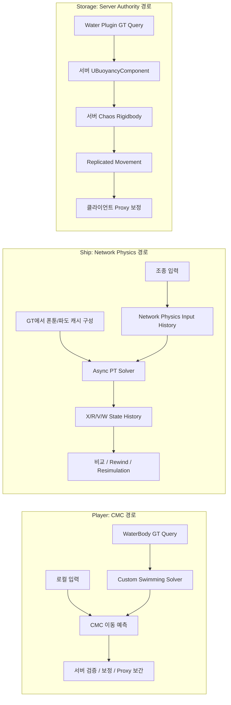
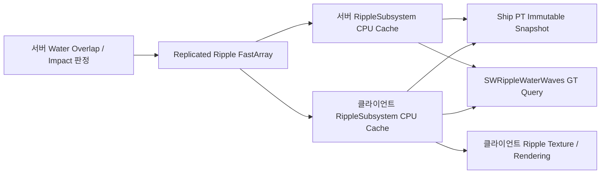
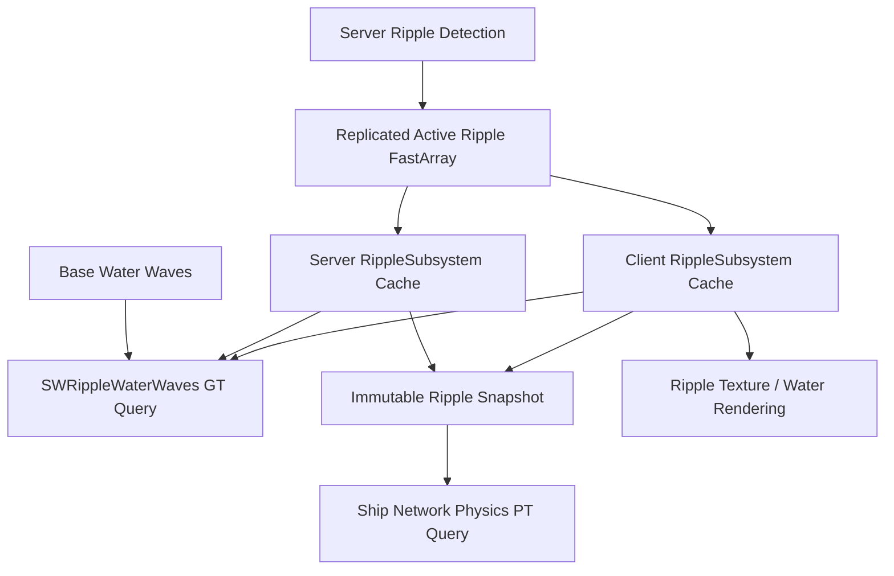
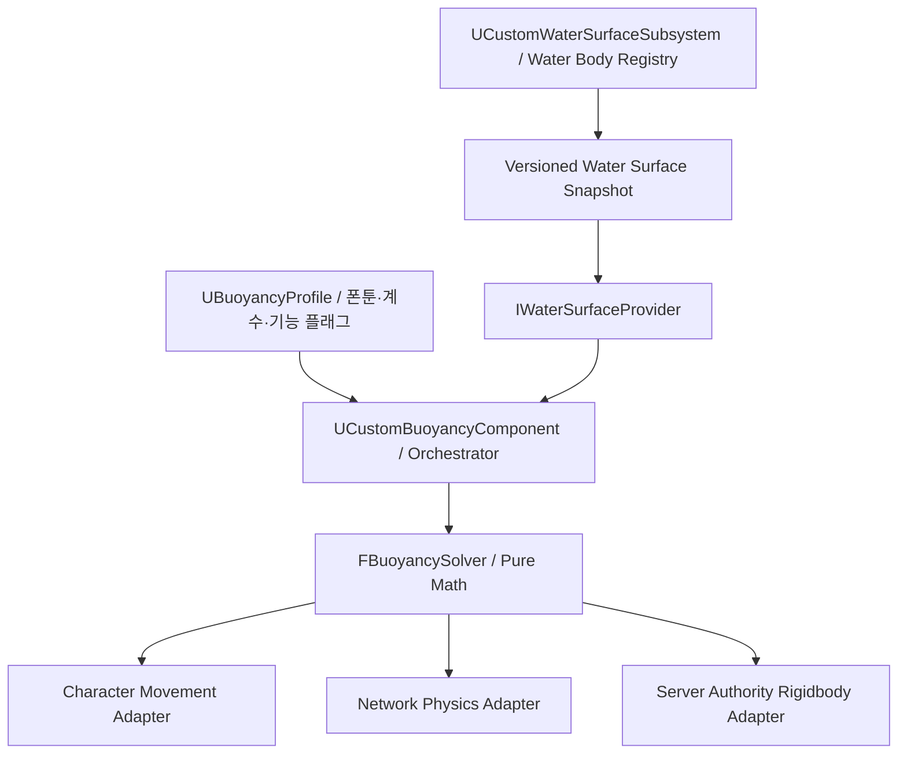

# Player / Ship / Storage 부력 아키텍처 비교와 통합 설계 제안

> 기준: Unreal Engine 5.7, 2026-07-15 현재 프로젝트 코드  
> 목적: 현재 세 부력 경로의 물리·수면 쿼리·실행 스레드·네트워크 동기화·비용·확장성을 비교하고, Water Plugin의 `UBuoyancyComponent`에 의존하지 않는 통합 커스텀 부력 시스템의 설계 방향을 제시한다.

---

## 1. 결론부터

현재 세 구현은 단순히 “부력 공식이 세 개”인 것이 아니다. **움직임의 소유자와 네트워크 오차를 처리하는 방식이 서로 다른 세 개의 시뮬레이션 아키텍처**다.

| 대상 | 실제 운동 모델 | 부력 계산 | 계산 위치 | 네트워크 모델 | 핵심 성격 |
|---|---|---|---|---|---|
| Player | 비물리 Kinematic Character + CMC | 커스텀 1-폰툰 구체 잠김 체적 | CMC의 Custom Movement 처리 중 Game Thread | CMC client prediction / server validation / correction / proxy smoothing | 입력 반응성이 가장 중요하고 회전 물리는 필요 없음 |
| Ship | Chaos Dynamic Rigidbody | 커스텀 다중 폰툰 구체 잠김 체적 | 모든 peer의 Async Physics Thread | Network Physics prediction + rewind/resimulation | 물리 상호작용과 저지연 조종이 중요함 |
| Storage | Chaos Dynamic Rigidbody | UE Water Plugin `UBuoyancyComponent` | 서버 Game Thread, 동기 경로 | 서버 권위 + 기본 replicated rigid-body movement | 수동 오브젝트라 예측 비용을 쓰지 않음 |

따라서 통합의 올바른 목표는 “모든 객체를 같은 Tick과 같은 네트워크 방식으로 처리하는 단일 컴포넌트”가 아니다. 목표는 다음과 같아야 한다.

1. **수면 샘플링 규약**을 하나로 만든다.
2. **폰툰 잠김 체적·부력·감쇠 계산기**를 순수한 공용 코드로 만든다.
3. 계산 결과를 CMC, Chaos PT, 서버 권위 Rigidbody에 적용하는 **Motion Adapter**를 분리한다.
4. CMC Prediction, Network Physics Resimulation, Server Authority를 **교체 가능한 Network/Execution Policy**로 둔다.
5. 객체마다 코드를 복제하지 않고 Profile/DataAsset과 정책 선택만으로 새 부력 객체를 만든다.

즉, **공통 Solver + 공통 Water Surface API + 복수 실행 어댑터**가 가장 확장성 있는 구조다.

---

## 2. 분석 범위와 코드 기준

### 프로젝트 구현

- Player 부력 및 수면 쿼리
  - `Source/ClassFeature/Public/SwimmingComponent.h`
  - `Source/ClassFeature/Private/SwimmingComponent.cpp`
  - `Source/ClassFeature/Public/SWCharacterMovementComponent.h`
  - `Source/ClassFeature/Private/SWCharacterMovementComponent.cpp`
  - `Source/ClassFeature/Private/BasePlayer.cpp`
- Ship 부력 및 Network Physics
  - `Source/WaterAndShip/Public/Ship.h`
  - `Source/WaterAndShip/Private/Ship.cpp`
  - `Source/WaterAndShip/Public/ShipPhysicsAsync.h`
  - `Source/WaterAndShip/Private/ShipPhysicsAsync.cpp`
  - `Planning/AShip_NetworkPhysics_Worklog.md`
  - `Planning/AShip_NetworkPhysics_and_Wave_Theory.md`
- Storage 부력
  - `Source/ClassFeature/Public/Storage/StorageChest.h`
  - `Source/ClassFeature/Private/Storage/StorageChest.cpp`
- 공통 수면/리플 시간축
  - `Source/ClassFeature/Private/SWRippleWaterWaves.cpp`
  - `Source/ClassFeature/Private/RippleSubsystem.cpp`
  - `Source/ClassFeature/Private/BasePlayerController.cpp`
- 프로젝트 물리 설정
  - `Config/DefaultEngine.ini`

### 엔진 구현

Storage가 사용하는 실제 공식을 확인하기 위해 UE 5.7 Water Plugin의 다음 구현도 기준으로 삼았다.

- `Engine/Plugins/Experimental/Water/Source/Runtime/Private/BuoyancyComponent.cpp`
- `Engine/Plugins/Experimental/Water/Source/Runtime/Public/BuoyancyTypes.h`
- `Engine/Plugins/Experimental/Water/Source/Runtime/Public/BuoyancyComponentSimulation.h`

### 용어

- **GT**: Game Thread
- **PT**: Physics Thread
- **CMC**: `UCharacterMovementComponent`
- **폰툰(Pontoon)**: 수면을 샘플링하고 부력을 생성하는 가상 구체
- **Authority**: 서버가 최종 상태를 결정하는 권한
- **Prediction**: 권위 상태를 받기 전에 클라이언트가 미래 상태를 먼저 계산하는 것
- **Reconciliation**: 서버 상태와 클라이언트 예측 상태를 비교하고 수정하는 것
- **Resimulation**: 과거 권위 프레임으로 되돌아가 저장된 입력을 다시 실행하는 것

---

## 3. 세 시스템의 전체 구조



공통점은 모두 수면 높이와 구체 잠김 정도에서 위쪽 힘을 만든다는 것이다. 차이점은 그 힘을 **어떤 상태 표현에 적용하는가**, **어느 peer가 계산하는가**, **오차를 어떻게 회수하는가**다.

---

## 4. 공통 물리 원리

### 4.1 구형 폰툰의 잠긴 체적

세 경로 모두 핵심적으로 구의 일부가 물에 잠긴 체적을 사용한다. 반지름을 `R`, 구 바닥부터 수면까지의 잠김 높이를 `h`라고 하면:

```text
h = Clamp(WaterZ - (PontoonCenterZ - R), 0, 2R)

SubmergedVolume = (π / 3) × h² × (3R - h)
```

이 공식은 spherical cap 체적 적분이다.

- `h = 0`: 전혀 잠기지 않음
- `h = R`: 구의 절반이 잠김
- `h = 2R`: 완전히 잠김

### 4.2 기본 부력과 수직 감쇠

현재 세 구현의 기본 형태는 다음과 같다.

```text
LinearTerm    = BuoyancyDamp  × VelocityZ
QuadraticTerm = Sign(VelocityZ) × BuoyancyDamp2 × VelocityZ²
Damping       = -Max(LinearTerm + QuadraticTerm, 0)

RawForce = SubmergedVolume × BuoyancyCoefficient + Damping
ForceZ   = Clamp(RawForce, 0, MaxBuoyantForce)
```

여기에는 주목할 특징이 있다.

- 감쇠는 `-Max(..., 0)`이므로 주로 **위로 올라가는 운동을 억제**한다.
- 아래로 내려갈 때는 식의 합이 음수가 되어 `Max(..., 0)`에서 0이 되기 쉽다. 즉, 일반적인 양방향 점성 항과 달리 하강 감쇠가 사실상 적용되지 않는다.
- 최종 힘은 음수가 될 수 없으므로 부력 계산이 물체를 아래로 누르지는 않는다.
- 이 비대칭은 프로젝트 커스텀 코드만의 실수가 아니라 현재 참조한 Epic `UBuoyancyComponent` 공식과 동일한 계열이다. 다만 통합 시스템에서는 의도인지 명시하고, 필요하면 양방향 감쇠 모드를 별도로 제공하는 편이 좋다.

### 4.3 세 시스템이 공유하지 않는 것

같은 체적 공식을 사용해도 결과가 같지는 않다.

- Player는 힘을 `Mass`로 나눠 **가속도**로 만든 뒤 CMC 속도에 직접 적분한다.
- Ship은 폰툰별 힘과 모멘트 암으로 **Chaos force/torque**를 만든다.
- Storage는 Water Plugin이 폰툰별 `PontoonCoefficient`, 전진 속도 ramp, river force, 선택적 drag까지 포함할 수 있다.
- 수면 높이를 구하는 방식과 시간축도 서로 다르다.

---

## 5. Player 부력 상세

## 5.1 운동 모델

Player는 `ACharacter`이며, 생성 시 기본 CMC를 `USWCharacterMovementComponent`로 교체한다.

```text
ABasePlayer
 ├─ CapsuleComponent
 ├─ USWCharacterMovementComponent
 └─ USwimmingComponent
```

Capsule은 Chaos Dynamic Rigidbody로 자유 시뮬레이션되지 않는다. `SafeMoveUpdatedComponent`와 sweep/slide를 통해 CMC가 위치를 결정한다. 따라서 Water Plugin `UBuoyancyComponent`가 기대하는 “물리 시뮬레이션 중인 루트 Primitive에 Force 적용” 모델을 그대로 사용할 수 없다.

## 5.2 실행 순서

`USWCharacterMovementComponent`가 두 지점에서 수영 컴포넌트를 호출한다.

1. `UpdateCharacterStateBeforeMovement`
   - `USwimmingComponent::CheckWaterTransitions()` 호출
   - Walking/Falling ↔ Custom Swimming 전환 판단
2. `PhysCustom`
   - `CustomMovementMode == CMOVE_Swimming`일 때 `UpdateSwimmingMovement(DeltaTime)` 호출

`USwimmingComponent` 자체의 일반 Tick은 현재 실제 이동 계산에 사용되지 않는다. 에디터 폰툰 디버그용 수면 쿼리만 남아 있다. 실제 부력은 CMC 이동 루프 안에서 계산된다. 이 점이 CMC prediction에 편입되는 핵심이다.

## 5.3 물 진입과 이탈

Capsule overlap으로 `AWaterBody`를 추적한다.

- `OverlappingWaterBodies`: 현재 겹치는 Water Body 목록
- `LastActiveWaterBody`: overlap이 잠시 끊겨도 bobbing/jumping 경계에서 쿼리를 유지하기 위한 fallback

진입 판단:

```text
FeetLocation = ActorLocation - CapsuleHalfHeight
FeetSubmersion = WaterHeight - FeetLocation.Z

FeetSubmersion > SwimEntryOffset
    → MOVE_Custom / CMOVE_Swimming
```

진입 시 `CharacterMovement->Buoyancy = 0`으로 두어 CMC의 기본 Swimming 부력을 사용하지 않는다.

이탈 판단에는 hysteresis와 바닥 검사가 들어간다.

- `EffectiveExitOffset = Max(SwimExitOffset, SwimEntryOffset - 2)`
- 얕아졌고 walkable floor가 있으면 Walking
- 물을 찾지 못했거나 수면에서 크게 이탈했으면 Falling

장점은 물 경계에서 Movement Mode가 매 프레임 왕복하는 현상을 줄인다는 것이다. 단, 진입/이탈 조건도 클라이언트와 서버가 각각 로컬 Water Body overlap 및 수면 쿼리로 계산하므로 외부 데이터가 다르면 mode correction이 발생할 수 있다.

## 5.4 수면 높이 쿼리

Player는 Water Plugin의 부력 컴포넌트를 쓰지 않지만, Water Body API는 직접 사용한다.

1. `GameState->GetServerWorldTimeSeconds()`로 동기화된 시간 획득
2. River라면 가장 가까운 spline input key 계산
3. `TryQueryWaterInfoClosestToWorldLocation`으로 flat surface location과 depth 획득
4. `UWaterWavesBase`에서 wave attenuation 계산
5. 동기화 시간으로 wave height 계산
6. `USWRippleWaterWaves`가 아니면 `URippleSubsystem`의 ripple을 수동으로 추가
7. 겹친 Water Body가 여러 개면 유효한 것 중 가장 높은 `WaterZ` 선택

이 경로는 Ship보다 Water Plugin의 수면 정의에 가깝다.

- Water Body의 기본 수면 Z를 포함한다.
- depth와 wave attenuation을 포함한다.
- River spline query를 포함한다.
- wrapper wave와 local ripple을 포함할 수 있다.

숨은 쿼리 오프셋도 있다. `UpdateSwimmingMovement`가 폰툰 아래 `Radius + 100 cm` 위치를 넘기고, `GetWaterHeightAtLocation`이 다시 100 cm 아래로 내린다. 결과적으로 부력용 Water Body query 지점은 폰툰 중심에서 대략 `Radius + 200 cm` 아래다. Water Plugin의 “폰툰 바닥에서 100 cm 아래” 의도를 이중 적용한 형태일 가능성이 있으므로 통합 시 정리해야 한다.

## 5.5 부력 및 이동 계산

Player는 하나의 가상 폰툰만 사용한다.

```text
PontoonCenter = ActorLocation + PontoonOffset
Submersion    = WaterZ - (PontoonCenter.Z - Radius)
ForceZ        = SphericalCapVolume × Coefficient + Damping
AccelZ        = ForceZ / CharacterMovement.Mass
TotalAccelZ   = WorldGravityZ × GravityScale + AccelZ
Velocity.Z   += TotalAccelZ × DeltaTime
```

수평 이동은 별도 계산이다.

```text
InputDirection    = CurrentAcceleration.SafeNormal2D
TargetAcceleration = InputDirection × SwimAcceleration
Friction           = -HorizontalVelocity × SwimFriction
HorizontalVelocity += (TargetAcceleration + Friction) × DeltaTime
HorizontalVelocity = ClampMagnitude(HorizontalVelocity, MaxSwimSpeed)
```

마지막으로 `SafeMoveUpdatedComponent`와 `SlideAlongSurface`가 충돌을 처리한다.

## 5.6 네트워크 동기화

Player용 별도 부력 RPC나 부력 상태 복제 구조체는 없다. 부력 로직이 CMC의 이동 함수 안에서 실행되므로 CMC의 기존 네트워크 파이프라인에 올라탄다.

### Autonomous Proxy

- 로컬 입력으로 즉시 Custom Swimming을 시뮬레이션한다.
- CMC saved move/input 전송 구조를 사용한다.
- 서버 응답을 기다리지 않아 조작 지연이 작다.

### Server

- 수신한 CMC move를 서버 상태에서 실행한다.
- 서버의 수면 쿼리와 부력 계산 결과가 권위 상태다.
- 차이가 크면 CMC correction을 보낸다.

### Simulated Proxy

- 로컬 플레이어처럼 입력 예측하는 대상이 아니다.
- 서버 Character movement 결과를 CMC의 simulated proxy smoothing 경로로 표시한다.

### 구조적 주의점

현재는 커스텀 `FSavedMove` 확장이 없다. 즉, 다음 데이터는 move payload에 명시적으로 저장되지 않는다.

- 폰툰 설정 변경
- Water Body 선택 결과
- 수면 높이 샘플
- ripple 이벤트
- 커스텀 수영 파라미터의 런타임 변경

현재 방식은 “서버와 클라이언트가 같은 asset/config와 충분히 유사한 수면 입력을 갖는다”는 전제에 의존한다.

가장 큰 결정론 위험은 ripple이다.

- `URippleSubsystem`은 dedicated server에서 ripple 생성과 높이 계산을 건너뛴다.
- 클라이언트 ripple 배열은 로컬 overlap으로 생성되며 네트워크 복제되지 않는다.
- Player 수면 쿼리는 클라이언트에서 ripple을 물리 높이에 더할 수 있지만 dedicated server에서는 0을 받는다.

따라서 현재 ripple은 시각 효과처럼 구현되어 있으면서 Player 예측 물리에는 들어갈 수 있다. 이는 반복 correction의 원인이 될 수 있다. 통합 시스템에서는 ripple을 기본적으로 cosmetic으로 분리하거나, gameplay ripple 이벤트를 서버 권위로 frame/time stamp와 함께 복제해야 한다.

## 5.7 장점

- Character에 `Simulate Physics`가 필요 없다.
- CMC 충돌, step, floor, correction, smoothing 생태계를 유지한다.
- 로컬 조작 반응성이 좋다.
- 별도 물리 상태 history나 Network Physics component가 필요 없다.
- Water Body base surface, depth, attenuation을 비교적 충실하게 사용한다.
- 구현 규모와 네트워크 bandwidth가 Ship보다 작다.

## 5.8 단점과 한계

- 단일 폰툰이므로 roll/pitch 부력과 복원 torque가 없다.
- Character는 기본적으로 upright하며 실제 rigid-body 부유가 아니다.
- 수면 query, transition, force, 수영 조작이 한 컴포넌트에 섞여 있다.
- 수면 쿼리 오프셋이 중복되어 의도가 불명확하다.
- 외부 수면 데이터가 CMC saved move에 들어가지 않아 완전 결정론적이지 않다.
- ripple의 서버/클라이언트 권위 정책이 현재 prediction과 충돌한다.
- CMC가 한 프레임을 여러 substep으로 나누면 수면 쿼리가 여러 번 실행될 수 있다.
- `FindComponentByClass`를 movement hook마다 호출한다. 캐시할 수 있다.
- 진입/이탈용 발 쿼리와 부력용 폰툰 쿼리가 별도로 실행된다.

## 5.9 비용 특성

대략적인 CPU 비용은 다음 항목에 비례한다.

```text
CMC movement substeps
× (겹친 Water Body query + wave evaluation + 선택적 ripple 최대 32개 순회)
```

클라이언트의 로컬 Player와 서버 모두 계산하며, remote simulated proxy가 동일한 `PhysCustom`을 어떤 조건에서 실행하는지는 CMC 역할별 경로에 좌우된다. Network Physics history 메모리는 쓰지 않지만, CMC 자체 saved move/correction 비용은 존재한다.

---

## 6. Ship 부력 상세

## 6.1 운동 모델

Ship의 `BuoyancyRoot`는 실제 Chaos Dynamic Rigidbody다.

```text
AShip
 ├─ UStaticMeshComponent BuoyancyRoot [Simulate Physics]
 ├─ UNetworkPhysicsComponent
 ├─ FShipPhysicsAsync [Chaos Sim Callback]
 └─ UBuoyancyComponent [Blueprint 설정 저장소로만 사용, BeginPlay에서 비활성]
```

중요한 점은 Ship에 붙은 Water Plugin `UBuoyancyComponent`가 실제 force를 적용하지 않는다는 것이다. `BeginPlay`에서 비활성화된다. 다만 Blueprint에 설정된 다음 값을 커스텀 PT solver가 읽는다.

- 폰툰 relative locations
- 첫 번째 폰툰의 radius — 현재 모든 폰툰에 공통 반경으로 사용
- `BuoyancyCoefficient`
- `BuoyancyDamp`
- `BuoyancyDamp2`
- `MaxBuoyantForce`

즉, 현재 Ship의 내장 컴포넌트는 **계산기라기보다 임시 설정 컨테이너**다.

현재 코드/누적 런타임 검증에서 확인된 대표 Ship 설정은 다음과 같다. Blueprint별 override가 가능하므로 이를 모든 Ship asset의 영구 보장값으로 보아서는 안 된다.

| 항목 | 대표값 |
|---|---:|
| Mass | 10,000 kg |
| Linear / Angular Damping | 0.8 / 3.0 |
| Pontoon | 4개 |
| 공통 Radius | 300 cm |
| Buoyancy Coefficient | 0.10 |
| Buoyancy Damp | 1,000 |
| 폰툰별 Max Buoyant Force | 5,000,000 |
| Forward Force | 2,000,000 |
| Turn Torque | 6,000,000,000 |
| Lateral Drag | 200 |

## 6.2 GT → PT 데이터 경로

매 Actor Tick에서 GT가 `FAsyncInputShip` producer buffer를 채운다.

- 로컬 조종 입력
- 폰툰 offset 배열
- Gerstner wave 배열
- gravity
- 전진 force / 회전 torque / lateral drag
- 부력 계수와 감쇠
- 최대 부력
- resimulation 임계값
- 서버 물리 시간 원점과 solver step
- client local physics frame을 server frame으로 바꾸는 tick offset

PT는 정상 forward simulation 중 이 데이터를 cache한다. Resimulation 중에는 GT의 최신 값을 다시 읽지 않고 기존 cache와 Network Physics input history를 사용한다. 이 분리는 rewind 중 GT가 과거를 침범하지 않게 하는 데 중요하다.

다만 현재 GT는 매 Tick:

- 모든 `AWaterBody`를 `TActorIterator`로 순회하고,
- `SWRippleWaterWaves` wrapper를 클래스 이름과 reflection으로 벗기며,
- Gerstner 배열을 복사하고,
- 폰툰 배열도 다시 복사한다.

정적 데이터에 비해 비용이 과하다. 통합 시스템에서는 Water Body registry와 versioned immutable snapshot이 필요하다.

## 6.3 물리 시간축

Ship은 일반 gameplay server time을 PT에서 그때그때 읽지 않는다. 서버가 한 번 다음 매핑을 만든다.

```text
ServerPhysicsTimeOrigin
    = ServerWorldTime
    - UpcomingServerFrame × SolverStepSeconds

SimTime
    = ServerPhysicsTimeOrigin
    + CurrentServerPhysicsFrame × ServerPhysicsStepSeconds
```

클라이언트 PT에서는:

```text
CurrentServerPhysicsFrame
    = CurrentLocalPhysicsStep + NetworkPhysicsTickOffset
```

이렇게 하면 forward simulation과 과거 resimulation이 동일한 server frame에서 동일한 파도 시간을 계산할 수 있다.

현재 프로젝트는:

- Async Physics 활성
- fixed step `0.016666667 s`, 즉 약 60 Hz
- Physics Prediction 활성
- Physics History Capture 활성

상태다.

## 6.4 수면 계산

PT는 복사된 `FGerstnerWave` 목록을 순회해 수직 offset만 계산한다.

```text
Phase = Dot(PositionXY, WaveVector) - WaveSpeed × Time + PhaseOffset
WaveHeightZ += cos(Phase) × Amplitude
```

이 경로의 장점은 PT에서 UObject/WaterSubsystem을 건드리지 않고, 같은 frame/time에 같은 수식을 재실행할 수 있다는 점이다.

그러나 현재 Ship 수면은 Water Plugin의 완전한 수면 정의가 아니다.

- Water Body의 base surface Z가 빠져 있다. 사실상 평균 수면 Z=0을 전제한다.
- 현재 위치가 어느 Water Body 안인지 판정하지 않는다.
- spline/river/lake별 surface location을 반영하지 않는다.
- water depth와 wave attenuation을 반영하지 않는다.
- Water Body transform과 LWC 세부 처리를 반영하지 않는다.
- Gerstner의 수평 displacement 역산을 하지 않는다.
- surface normal과 water velocity를 구하지 않는다.
- ripple을 포함하지 않는다.
- 첫 번째로 찾은 유효 Gerstner asset 하나만 사용한다.

또한 `CachedGerstnerWaves.Num() > 0`이 static data ready 조건과 부력 실행 조건에 포함되어 있다. 따라서 파도가 없는 flat water는 현재 Ship solver에서 “유효한 물”로 취급되지 않아 부력이 아예 시작되지 않는다.

## 6.5 다중 폰툰 부력

각 폰툰의 world position:

```text
PontoonWorld = BodyPosition + BodyRotation × LocalOffset
```

폰툰 중심의 point velocity:

```text
PontoonVelocity
    = LinearVelocity
    + AngularVelocity × (PontoonWorld - BodyPosition)
```

폰툰별 위쪽 힘을 합산하고 모멘트 암으로 torque를 만든다.

```text
TotalForce  += Up × PontoonForceZ
TotalTorque += (PontoonWorld - BodyPosition) × (Up × PontoonForceZ)
```

이 구조 때문에 선수/선미/좌현/우현의 잠김 차이가 pitch와 roll을 만든다. Player와 Storage의 중앙 단일 폰툰에는 없는 특성이다.

현재는 각 폰툰의 raw force를 독립적으로 `MaxBuoyantForce`에 clamp한다. Water Plugin의 `PontoonCoefficient`는 적용하지 않는다. 네 개의 완전한 구체 체적을 합산하는 현재 튜닝 모델에 sprung-mass 정규화 계수를 추가하면 총 지지력이 너무 낮아졌기 때문이다.

별도로 다음 힘도 PT에서 처리한다.

- 선체 우측 방향 속도에 반대되는 lateral drag
- 조종 입력에 따른 전진 force
- yaw torque
- Chaos 자체 gravity와 mesh linear/angular damping

gravity는 Chaos가 이미 적용하므로 수동 `Mass × Gravity`를 추가하지 않는다.

## 6.6 Network Physics 동기화

Ship은 `EPhysicsReplicationMode::Resimulation`을 사용한다.

### Input history

`FNetInputShip`:

- `ServerFrame`
- `MovementInput`
- `SteeringInput`

입력 두 개는 int8 범위로 양자화된다. `ServerFrame`은 상속 필드가 자동 직렬화된다고 가정하지 않고 packed integer로 명시적으로 직렬화한다.

### State history

`FNetStatePhysicsShip`:

- `ServerFrame`
- Position
- Rotation
- LinearVelocity
- AngularVelocity
- 위치/회전 resim threshold

### 비교와 rewind

수신한 권위 state와 동일 frame의 로컬 history를 비교한다.

```text
Position error <= location threshold
AND
Rotation angular error <= rotation threshold
    → match

otherwise
    → authoritative state 적용
    → 저장된 입력으로 현재 frame까지 resimulation
```

Linear/Angular Velocity는 state에 저장·복원되지만 현재 `CompareData`의 mismatch 판정 조건에는 들어가지 않는다.

### 역할별 동작

- 로컬 조종 Ship: 즉시 로컬 PT 시뮬레이션, 입력 history 전송
- 서버: 권위 PT 시뮬레이션과 state 생성
- Simulated Proxy Ship: 단순 transform만 받는 것이 아니라, tick offset 준비 후 같은 PT solver와 입력을 실행하고 필요 시 rewind

즉, Ship은 소유 클라이언트뿐 아니라 관찰 클라이언트도 계산 비용을 지불하는 구조다.

### 중복/보조 복제 경로

- `ShipMove/ShipTurn` Server RPC가 Network Physics input과 함께 존재한다.
- release 누락 방지를 위해 stop RPC는 reliable이다.
- `FShipReplicatedState`는 Location/Rotation을 복제하지만 현재 주 용도는 디버그 비교다.
- C++ 생성자는 `SetReplicateMovement(true)`지만 과거 런타임 CDO 확인에서 일부 Ship Blueprint가 이를 `false`로 override했다. asset별 설정 불일치는 문서화하고 정리해야 한다.

## 6.7 장점

- 실제 rigid-body 충돌과 force/torque 상호작용을 유지한다.
- 다중 폰툰으로 roll/pitch와 복원 모멘트를 자연스럽게 만든다.
- 조종 클라이언트의 응답이 빠르다.
- 권위 frame과 로컬 history를 비교해 과거부터 재계산한다.
- 동일 server frame의 wave time과 force를 재현할 수 있다.
- 서버뿐 아니라 simulated proxy도 물리적으로 연속된 움직임을 예측할 수 있다.

## 6.8 단점과 한계

- 세 방식 중 구현 복잡도가 가장 높다.
- 모든 peer의 PT 계산, history capture, state 비교, rollback 비용이 든다.
- 수면 모델이 Water Plugin 렌더/쿼리 수면과 불완전하게 일치한다.
- 평균 수면 Z=0, Gerstner wave 필수라는 강한 숨은 전제가 있다.
- 모든 폰툰이 첫 폰툰 radius 하나를 공유한다.
- 정적 파라미터가 frame-stamped network history에 포함되지 않는다. 런타임 변경은 rewind 결정론을 깨뜨릴 수 있다.
- GT가 매 Tick 전체 Water Body 검색과 배열 복사를 수행한다.
- wrapper 접근에 문자열 클래스명과 reflection을 사용한다.
- Network Physics 입력과 이동 RPC가 중복되어 책임이 흐리다.
- Blueprint별 `Replicate Movement` override가 다르면 복제 경로 해석이 달라진다.
- 초기 tick offset/history 준비 전에는 부력을 의도적으로 기다리므로 startup 구간 정책이 필요하다.

## 6.9 비용 특성

### CPU

- GT: 매 Ship × 매 Tick 전체 Water Body 순회 및 wave/pontoon 배열 복사
- PT: 매 Ship × 60 Hz × 폰툰 수 × wave 수
- mismatch 시: 과거 frame부터 현재까지 같은 계산을 반복

### 메모리

- Network Physics input history
- X/R/V/W state history
- Chaos rewind history
- peer별 wave/pontoon cache

### 네트워크

- frame-tagged input
- 권위 physics state
- 별도 actor/property replication
- 현재는 조종 RPC까지 중복

세 방식 중 가장 비싸지만, 조종 가능한 대형 물리 오브젝트에는 그 비용을 정당화할 수 있다.

---

## 7. Storage 부력 상세

## 7.1 기억과 현재 코드의 차이

Storage는 “서버에서만 부력을 계산하고 클라이언트에 결과를 복제한다”는 설명이 큰 틀에서 맞다. 하지만 부력 공식 자체는 현재 커스텀이 아니다.

- `AStorageChest`가 C++에서 `UBuoyancyComponent`를 생성한다.
- Water Plugin의 기본 부력 계산을 사용한다.
- `bUseAsyncPath = false`로 강제하여 GT 동기 경로를 사용한다.
- 서버에서만 `SetCanBeActive(true)`다.
- 클라이언트에서는 `SetCanBeActive(false)`다.

비동기 경로를 끈 이유는 UE 5.7 async buoyancy snapshot이 직접 `UGerstnerWaterWaves`를 기대하는 반면, 현재 레벨은 `USWRippleWaterWaves` wrapper를 사용하기 때문이다. 동기 경로는 virtual wave query를 통해 wrapper를 평가할 수 있다.

## 7.2 운동 및 컴포넌트 설정

```text
AStorageChest
 ├─ UStaticMeshComponent ChestMesh [Root]
 ├─ UBuoyancyComponent
 ├─ UInteractableComponent
 └─ UStorageComponent
```

생성자 설정:

- `bReplicates = true`
- `SetReplicateMovement(true)`
- `NetUpdateFrequency = 30 Hz`
- `MinNetUpdateFrequency = 10 Hz`
- 중앙 폰툰 1개
- 기본 C++ 폰툰 반경 50 cm
- `bUseAsyncPath = false`

서버 `BeginPlay`:

- collision을 `QueryAndPhysics`로 승격
- mass를 기본 25 kg로 override
- `Simulate Physics = true`
- rigid bodies wake
- BuoyancyComponent 활성 허용

클라이언트 `BeginPlay`:

- BuoyancyComponent 비활성
- 서버 root rigid-body state를 replicated movement로 수신

## 7.3 Water Plugin 부력 계산

동기 `UBuoyancyComponent`는 대략 다음 순서로 실행된다.

1. Water Body overlap으로 현재 후보 목록 관리
2. 폰툰 world center 계산
3. spline key 계산
4. Water Body query에 `ComputeLocation`, `ComputeNormal`, `ComputeImmersionDepth`, `ComputeVelocity`, `IncludeWaves` 사용
5. 여러 Water Body 중 immersion depth가 가장 큰 결과 선택
6. 폰툰 잠김 여부와 spherical cap volume 계산
7. buoyancy ramp와 수직 damping 적용
8. `MaxBuoyantForce` clamp
9. `PontoonCoefficient` 적용
10. `AddForceAtLocation`으로 Rigidbody에 force 적용
11. 설정에 따라 river force, linear/angular drag 추가

Ship 커스텀 solver보다 Water Body 의미론이 풍부하다.

- base water surface
- wave 포함 query
- normal
- immersion depth
- water velocity
- spline 기반 Water Body
- 여러 겹친 물 중 선택
- river current/shore behavior

정밀하게 보면 현재 UE 5.7 동기 `GetWaterHeight`가 구성하는 query flag에는 `ComputeDepth`가 명시적으로 들어가지 않는다. 따라서 폰툰 출력 필드 `WaterDepth` 자체가 항상 채워진다고 전제해서는 안 된다. 여기서 말하는 “풍부한 Water Body 의미론”은 표준 `IncludeWaves`와 immersion/normal/velocity/spline 경로를 사용한다는 뜻이며, 프로젝트의 공통 sample 계약에서는 필요한 depth를 명시적으로 요청하는 편이 안전하다.

Storage는 중앙 폰툰 하나이므로 부력점과 COM이 같다면 부력 자체에서 roll/pitch torque를 거의 만들지 않는다. 상자 충돌과 외력은 회전을 만들 수 있지만, 다중 폰툰 선체처럼 자세를 적극 복원하지는 않는다.

## 7.4 Water Plugin만의 추가 계수

### 전진 속도 Ramp

```text
RampFactor = Clamp(
    (ForwardSpeedKmh - RampMinVelocity)
    / (RampMaxVelocity - RampMinVelocity),
    0, 1)

EffectiveCoefficient
    = BuoyancyCoefficient
    × (1 + RampFactor × (BuoyancyRampMax - 1))
```

기본 `BuoyancyRampMax = 1`이면 효과가 없지만, 설정 변경 시 고속에서 부력이 증가할 수 있다.

### PontoonCoefficient

Water Plugin은 활성 폰툰의 위치와 COM을 바탕으로 sprung mass 계수를 계산한다. 폰툰별 raw force에 이 정규화 계수를 곱한다. 다중 폰툰 구성에서 단순히 모든 구의 전체 체적을 더하는 Ship 모델과 총 지지력 의미가 다르다.

## 7.5 네트워크 동기화

Storage에는 다음이 없다.

- 소유 클라이언트 입력 prediction
- custom input history
- custom physics state history
- rewind/resimulation
- 부력 sample 복제

서버가 부력과 Rigidbody를 계산하고 Unreal의 기본 replicated movement가 rigid-body 상태를 전달한다.

클라이언트는 서버 transform을 매 패킷마다 그대로 순간이동시키는 완전한 kinematic actor라고 단정해서는 안 된다. 현재 코드가 클라이언트 `ChestMesh->SetSimulatePhysics(false)`를 명시적으로 호출하지 않기 때문이다. Blueprint/replicated physics 상태에 따라 클라이언트 Chaos body가 패킷 사이를 시뮬레이션하고 기본 physics replication이 보정할 수 있다. 확실한 것은 **클라이언트가 부력 force를 제출하지 않는다**는 점이다.

따라서 가장 정확한 표현은:

> 서버 권위 부력 시뮬레이션 + 기본 rigid-body replicated movement를 통한 클라이언트 proxy 보정

이다.

## 7.6 장점

- 프로젝트 커스텀 네트워크 코드가 거의 없다.
- 부력 계산은 서버 한 곳에서만 하므로 결정론 문제가 작다.
- 클라이언트별 Water Body/ripple 차이가 권위 결과를 바꾸지 않는다.
- Network Physics history와 rollback 비용이 없다.
- Water Plugin의 풍부한 Water Body query 기능을 사용한다.
- 비소유 수동 오브젝트에 적합하다.

## 7.7 단점과 한계

- 네트워크 지연과 update frequency가 움직임 품질에 직접 보인다.
- 로컬 플레이어가 밀거나 잡는 상호작용에서는 반응이 늦거나 correction이 보일 수 있다.
- 패킷 손실/낮은 update rate에서 proxy가 출렁임을 정확히 따라가기 어렵다.
- `UBuoyancyComponent`와 Water Plugin 내부 동작에 계속 의존한다.
- wrapper 때문에 async path를 사용하지 못하고 GT 비용을 지불한다.
- 서버 한 곳에 모든 passive buoyant object 비용이 집중된다.
- 중앙 단일 폰툰은 자세 안정화 표현력이 낮다.
- 클라이언트 body를 완전 kinematic proxy로 만들 것인지, passive local physics + correction으로 둘 것인지 코드에 명시되어 있지 않다.
- 현재 ripple은 dedicated server에서 0이므로 서버 권위 Storage 물리에는 ripple이 들어가지 않는다.

## 7.8 비용 특성

### 서버

```text
활성 Storage 수
× GT Tick
× (폰툰 수 × 현재 Water Body query + wave 평가)
```

추가로 Chaos rigid-body simulation과 replicated movement 송신 비용이 있다.

### 클라이언트

- 부력 query/force 계산 없음
- replicated movement 수신 및 physics correction/smoothing
- actor relevancy와 net update에 따른 bandwidth

많은 수동 오브젝트에는 Ship 방식보다 훨씬 경제적이다. 다만 수백 개로 늘면 서버 GT Water query와 movement replication을 위한 거리/수면 활성화 LOD가 필요하다.

---

## 8. 항목별 정밀 비교

| 비교 항목 | Player | Ship | Storage |
|---|---|---|---|
| 루트 운동 | CMC Kinematic | Chaos Dynamic | Chaos Dynamic |
| Simulate Physics | 불가/미사용 | 사용 | 서버 사용, 클라이언트는 부력 미계산 |
| 실제 부력 구현 | 프로젝트 커스텀 | 프로젝트 커스텀 | Epic Water Plugin |
| 내장 Buoyancy 사용 | 안 함 | 설정값 저장소로만 사용 후 비활성 | 실제 계산기로 사용 |
| 실행 스레드 | GT, CMC movement loop | Async PT; 설정 수집은 GT | 서버 GT 동기 경로 |
| 기본 update cadence | CMC movement tick/substep | 고정 60 Hz PT | 서버 actor/component tick + 30/10 Hz net update |
| 폰툰 수 | 1 | Blueprint 다중 폰툰, 현재 대표 구성 4 | C++ 기본 1 |
| 폰툰별 반경 | 1개 | 첫 반경을 모두 공유 | 폰툰별 가능, 현재 1개 |
| 수면 base Z | 포함 | 미포함, Z=0 전제 | 포함 |
| Water Body overlap | Capsule 목록 + fallback | 사용 안 함 | Plugin이 관리 |
| 다중 Water Body | 최고 surface 선택 | 미지원 | 최대 immersion 선택 |
| River spline | 지원 | 미지원 | 지원 |
| depth attenuation | 지원 | 미지원 | Plugin query에 포함 |
| wave | virtual Water Waves query | custom cosine Gerstner vertical offset | virtual Water Waves query |
| ripple | 로컬 ripple이 물리에 들어갈 수 있음 | 미포함 | 서버에서는 dedicated 정책상 미포함 |
| surface normal | 계산 결과를 사용하지 않음 | 없음 | query함 |
| water velocity/current | 없음 | 없음, 별도 lateral drag만 | river/water force 지원 |
| 힘 적용 | `Velocity += Accel × dt` | `AddForce/AddTorque` | `AddForceAtLocation` |
| 부력 torque | 없음 | 있음 | 다중/비중앙 폰툰이면 가능, 현재 중앙 1개라 제한적 |
| 중력 | CMC에 수동 합산 | Chaos built-in | Chaos built-in |
| 네트워크 권위 | 서버 CMC | 서버 Network Physics | 서버 Rigidbody |
| 로컬 예측 | CMC | Network Physics | 없음 |
| 오차 회수 | CMC correction/replay/smoothing | rewind/resimulation | 기본 physics replication correction |
| 상태 history | CMC saved moves | custom input/state + Chaos history | 없음 |
| 구현 난이도 | 중간 | 매우 높음 | 낮음 |
| peer CPU | 로컬/서버 CMC 계산 | 모든 peer PT 계산 | 주로 서버 계산 |
| 가장 적합한 대상 | Character | 조종/충돌이 중요한 물리 선박 | 비소유 passive 물체 |

---

## 9. 품질 속성 비교

| 품질 속성 | Player | Ship | Storage |
|---|---:|---:|---:|
| 로컬 입력 반응성 | 매우 높음 | 매우 높음 | 해당 없음/낮음 |
| 물리 충돌 사실성 | 낮음~중간 | 높음 | 중간~높음 |
| roll/pitch 표현 | 낮음 | 높음 | 현재 낮음 |
| Water Plugin 수면 일치도 | 높음 | 낮음~중간 | 높음 |
| 네트워크 구현 단순성 | 중간 | 낮음 | 매우 높음 |
| 결정론 요구 수준 | 중간 | 매우 높음 | 낮음 |
| 서버 확장성 | 중간 | 낮음 | passive 수가 적으면 높음 |
| 클라이언트 확장성 | 높음 | 낮음 | 높음 |
| 런타임 설정 변경 안전성 | 별도 move data 없으면 낮음 | frame-stamp 없으면 매우 낮음 | 서버만 바꾸면 비교적 높음 |
| 신규 타입 재사용성 | 현재 낮음 | 현재 낮음 | 현재 중간 |

---

## 10. 현재 구조의 핵심 중복과 부채

## 10.1 수면 정의가 셋으로 갈라져 있다

- Player: Water Body base + virtual waves + attenuation + local ripple
- Ship: Z=0 기준 custom Gerstner vertical offset
- Storage: Water Plugin full query + virtual wrapper, 서버 ripple 0

같은 `(Position, Time)`을 넣어도 서로 다른 `WaterZ`가 나올 수 있다. 통합 전 가장 먼저 고정해야 할 것은 force 공식보다 **“게임플레이 수면이 무엇인가”**다.

## 10.2 설정 모델이 일관되지 않다

- Player: `USwimmingComponent` UPROPERTY
- Ship: `AShip` UPROPERTY + 비활성 `UBuoyancyComponent`의 Blueprint 값
- Storage: C++ `UBuoyancyComponent` 기본값 + Blueprint override 가능성

Designer가 어디를 바꿔야 하는지 대상마다 다르다.

## 10.3 계산과 네트워크 정책이 객체 클래스에 박혀 있다

- Swimming solver가 Player component와 CMC hook에 직접 결합
- Ship solver가 `AShip`과 `FShipPhysicsAsync`에 직접 결합
- Storage 권위 정책이 `AStorageChest::BeginPlay`에 직접 결합

새 객체가 나오면 공식을 재사용하는 대신 기존 Actor를 복사하거나 새 네트워크 경로를 다시 작성하게 된다.

## 10.4 ripple의 성격이 불명확하다

현재 ripple은:

- 렌더에는 유효
- 로컬 Player 물리에는 들어갈 수 있음
- Ship 물리에는 없음
- dedicated server Storage/Player 권위 물리에는 없음
- 이벤트 복제가 없음

이는 “cosmetic인가 gameplay인가”가 결정되지 않은 상태다.

## 10.5 정적 데이터가 매 프레임 전달된다

특히 Ship의 폰툰과 wave array는 대부분 정적이지만 GT에서 매 Tick 찾고 복사한다. Network Physics 결정론을 위해 필요한 것은 “매 프레임 최신값”이 아니라 **특정 frame부터 유효한 versioned config**다.

---

## 11. 수정된 통합 범위와 다섯 가지 핵심 목표 평가

앞선 분석에서 제시한 “Player까지 포함한 공통 Surface Provider, 복수 Motion Adapter, Profile 중심 전면 통합”은 장기적으로는 깔끔하지만, 현재 프로젝트의 안정성과 개발 생산성을 고려하면 범위가 지나치게 크다. 이번 통합의 목표를 다음처럼 축소한다.

> **Player의 CMC 수영 경로는 유지한다. Ship과 Storage처럼 실제 Chaos Rigidbody를 사용하는 객체만 새 커스텀 부력 컴포넌트로 통합한다. Ripple은 서버가 생성한 이벤트를 복제하고, 서버와 모든 클라이언트가 같은 이벤트 캐시와 같은 계산식으로 물리·렌더링에 사용한다.**

### 11.1 목표 1 — Player는 유지하고 Chaos Rigidbody만 통합

**평가: 적극 권장한다. 이번 작업의 가장 중요한 범위 제한이다.**

Player와 Rigidbody 부력은 최종적으로 힘을 적용하는 대상이 다르다.

- Player: CMC의 예측 이동, `Velocity` 적분, sweep/slide
- Ship/Storage: Chaos body에 force/torque 적용

Player를 새 Rigidbody 부력 컴포넌트에 억지로 포함하면 CMC prediction과 movement mode까지 다시 설계해야 한다. 얻는 이익에 비해 회귀 위험이 매우 크다. 따라서:

- `USwimmingComponent`와 `USWCharacterMovementComponent`는 현 구조를 유지한다.
- 새 `USWBuoyancyComponent`는 `UPrimitiveComponent` 기반 Simulate Physics 객체만 지원한다.
- Ship의 Network Physics와 Storage의 서버 권위 복제는 그대로 유지한다.
- 공통화는 Rigidbody의 폰툰 설정, 수면 쿼리, 부력 수학, Details UI에 한정한다.

이 방식이면 기존 세 네트워크 시스템 중 안정화된 두 축을 보존한다.

```text
Player
  SwimmingComponent → CMC Prediction            [유지]

Ship
  SWBuoyancyComponent 설정/계산
  → ShipPhysicsAsync → Network Physics Resim     [기존 네트워크 유지]

Storage / Passive Rigidbody
  SWBuoyancyComponent
  → Authority Chaos → Replicated Movement        [기존 네트워크 유지]
```

새 컴포넌트가 Ship의 `UNetworkPhysicsComponent`나 Storage의 `FRepMovement`를 대체할 필요는 없다. **부력 계산을 공유하되 네트워크 동기화 책임은 기존 Actor 경로에 남기는 것**이 최소 변경안이다.

### 11.2 목표 2 — SW 커스텀 파도를 일관된 파도 진입점으로 사용

**평가: 방향은 옳다. 다만 “모든 객체가 `USWRippleWaterWaves` UObject를 직접 호출한다”는 형태로 구현하면 안 된다.**

현재 의도는 다음과 같이 이해하는 것이 정확하다.

```text
Base Water Wave
      +
Server-authorized Ripple Cache
      ↓
동일한 최종 Gameplay Wave Height
```

GT에서 동작하는 Player와 서버 권위 Storage는 `USWRippleWaterWaves::GetWaveHeightAtPosition`을 통해 이 정의를 직접 사용할 수 있다. 그러나 Ship의 Network Physics 계산은 Async PT에서 실행된다. PT에서는 다음 객체를 안전하게 직접 호출할 수 없다.

- `USWRippleWaterWaves`
- `URippleSubsystem`
- `UWaterBodyComponent`
- 기타 UObject/World API

따라서 진짜 공통점은 UObject 호출 경로가 아니라 **데이터와 수학**이어야 한다.

권장 구조:

- GT 경로: `USWRippleWaterWaves`가 base wave와 `URippleSubsystem` cache를 조회
- PT 경로: GT가 발행한 immutable ripple snapshot과 solver-safe wave data를 조회
- 양쪽 모두: 같은 `FSWRippleEvaluator` 순수 함수를 사용해 ripple 높이 계산

```cpp
struct FSWRippleEvent
{
    uint32 EventId;
    FVector2D Origin;
    double StartServerTime;
    int32 EffectiveServerPhysicsFrame;
    float InitialAmplitude;
    float WaveSpeed;
    float DecayRate;
    float WaveLength;
    double ExpireServerTime;
};

struct FSWRippleEvaluator
{
    static float EvaluateHeight(
        const FVector2D& Position,
        double ServerTime,
        TConstArrayView<FSWRippleEvent> Events);
};
```

`USWRippleWaterWaves`와 Ship PT가 모두 이 evaluator를 사용하면 ripple 계산식은 일관된다.

중요한 한계도 남는다. **Ripple을 일치시킨다고 Ship의 전체 수면 정의가 자동으로 Player/Storage와 같아지지는 않는다.** 현재 Ship은 base surface Z, Water Body 선택, attenuation 등을 Water Plugin과 다르게 계산한다. 이번 범위에서는 다음 두 보장 수준을 구분한다.

1. 1차 목표: 서버와 모든 클라이언트에서 ripple 이벤트·시간·높이 계산이 일치
2. 후속 목표: Ship의 base wave와 Water Body base surface까지 `USWRippleWaterWaves` GT 결과와 오차 범위 내 일치

이렇게 나누면 Ripple 통합 때문에 기존 Ship Network Physics를 한 번에 재작성하지 않아도 된다.

### 11.3 목표 3 — 서버에서 Ripple 생성, 이벤트를 클라이언트에 복제

**평가: 반드시 필요하며, 물리 파도에 Ripple을 포함하려면 사실상 유일하게 안전한 방향이다.**

현재 `URippleSubsystem`은 각 World에 따로 존재하는 `UWorldSubsystem`이다. Subsystem 자체는 네트워크 복제 Actor가 아니므로 “서버 cache가 자동으로 클라이언트에 전달”되지는 않는다. 작은 복제 bridge가 필요하다.

권장안은 `GameState`에 붙는 replicated component 또는 전용 `ASWRippleReplicator`다.



#### 서버 처리

1. 서버만 Water Body 진입/충돌을 판정한다.
2. 서버가 `FSWRippleEvent`를 생성하고 고유 `EventId`를 부여한다.
3. 이벤트의 시작을 `StartServerTime`과 가능하면 `EffectiveServerPhysicsFrame`으로 기록한다.
4. 서버 RippleSubsystem cache에 추가한다.
5. replicated Fast Array에 추가한다.

#### 클라이언트 처리

1. Fast Array의 add/change/remove callback으로 로컬 RippleSubsystem cache를 갱신한다.
2. 수면 쿼리는 로컬에서 cache된 이벤트를 같은 server time으로 계산한다.
3. 렌더링용 ripple texture도 이 인증된 cache만으로 생성한다.
4. 클라이언트 로컬 overlap은 gameplay ripple을 직접 생성하지 않는다.

#### 왜 Multicast RPC보다 Fast Array인가

- 패킷 손실 뒤에도 최종 상태를 회복할 수 있다.
- late join client가 현재 활성 ripple을 받을 수 있다.
- 생성뿐 아니라 만료/삭제 상태를 표현할 수 있다.
- 현재 활성 이벤트 수가 최대 32개라 데이터 크기도 제한적이다.

높이 샘플을 매 프레임 복제할 필요는 없다. 다음 이벤트 파라미터만 복제하고 각 peer가 계산한다.

- origin
- 시작 server time/frame
- amplitude
- speed
- decay
- wavelength
- expire time
- event ID

#### Network Physics Resimulation 주의점

Ship이 과거 frame으로 rollback할 때 “현재 활성 ripple 배열”만 보면 정확하지 않을 수 있다. 예를 들어 현재는 만료된 ripple이 과거 rewind frame에서는 활성 상태였을 수 있다.

따라서 서버와 클라이언트는 ripple 이벤트를 화면상 만료 즉시 완전히 폐기하지 말고:

```text
보존 종료 시점
    = RippleExpireTime + NetworkPhysicsRewindHorizon
```

까지 CPU history에 유지해야 한다. 렌더 active 목록과 physics rewind history 목록을 분리하면 된다. `EffectiveServerPhysicsFrame`을 사용하면 특정 resim frame에서 이벤트가 활성인지 정확히 판정할 수 있다.

Dedicated Server는 texture를 만들 필요가 없지만 **CPU ripple cache와 높이 계산은 반드시 실행**해야 한다.

#### “동일 이벤트”와 “엄밀한 예측 결정론”의 차이

서버 인증 이벤트 복제는 모든 peer가 결국 같은 Ripple 정의를 갖게 하지만, 네트워크 지연 자체를 없애지는 않는다.

- 서버는 Ripple을 이미 물리에 반영했지만 클라이언트는 이벤트 패킷을 아직 받지 못한 짧은 구간이 생긴다.
- Ship은 이벤트의 effective frame과 history를 보존하면 권위 state 수신 후 과거 frame부터 resimulation할 수 있다.
- Player의 현재 `USwimmingComponent`는 수면 쿼리 때 호출 순간의 `GameState->GetServerWorldTimeSeconds()`를 사용한다. CMC saved move에 Ripple event revision이나 과거 wave query time이 저장되어 있지 않다.

따라서 Player까지 엄밀한 replay 결정론을 요구한다면 후속으로 다음 중 하나가 필요하다.

1. CMC movement simulation timestamp를 수면 쿼리에 전달하여 replay 때도 과거 시각으로 평가
2. saved move에 필요한 wave/ripple revision을 기록
3. 구현 변경을 피하려면 서버 이벤트 도착 전후의 짧은 CMC correction을 허용

이번 최소 변경안에서는 3번으로 시작할 수 있다. 서버와 클라이언트가 장기적으로 다른 Ripple을 갖는 현재 문제는 해결되며, 실제 correction 빈도가 문제일 때만 1~2번을 추가한다.

### 11.4 목표 4 — Details Panel 조작 일관성

**평가: 권장한다. 컴포넌트까지 하나로 만들기보다 공통 설정 USTRUCT를 재사용하는 것이 가장 저렴하다.**

Player는 `USwimmingComponent`, Rigidbody는 `USWBuoyancyComponent`로 나뉘더라도 Details Panel의 용어·기본값·단위는 같게 만들 수 있다.

최소 공통 설정:

```cpp
USTRUCT(BlueprintType)
struct FSWBuoyancyForceSettings
{
    UPROPERTY(EditAnywhere, Category="Buoyancy", meta=(ClampMin="0"))
    float BuoyancyCoefficient = 0.1f;

    UPROPERTY(EditAnywhere, Category="Buoyancy", meta=(ClampMin="0"))
    float BuoyancyDamp = 1000.0f;

    UPROPERTY(EditAnywhere, Category="Buoyancy", meta=(ClampMin="0"))
    float BuoyancyDamp2 = 1.0f;

    UPROPERTY(EditAnywhere, Category="Buoyancy", meta=(ClampMin="0"))
    float MaxBuoyantForce = 5000000.0f;
};
```

사용 방식:

- `USwimmingComponent`: `FSWBuoyancyForceSettings` + 단일 Player pontoon + 수영 이동 설정
- `USWBuoyancyComponent`: `FSWBuoyancyForceSettings` + `TArray<FSWPontoon>`

권장 Details 카테고리:

```text
Buoyancy|Pontoons
Buoyancy|Force
Buoyancy|Water Query
Buoyancy|Debug
Swimming|Movement       // Player 전용
Buoyancy|Network        // 고급 설정, 일반 Designer에게는 숨김 가능
```

이렇게 하면 Player를 새 컴포넌트로 이전하지 않고도 같은 이름과 같은 튜닝 감각을 제공한다. 공통 USTRUCT 도입조차 기존 Player serialization/Blueprint에 부담이 된다면 1차에는 필드 이름과 Category만 맞추고, 안정화 뒤 USTRUCT로 이동해도 된다.

### 11.5 목표 5 — “정적 데이터가 매 프레임 전달”된다는 의미

이것은 네트워크로 매 프레임 전송된다는 뜻이 아니다. 현재 Ship의 **GT → PT 스레드 경계 복사**를 말한다.

`AShip::Tick`은 매 프레임 다음 작업을 한다.

1. 비활성 `UBuoyancyComponent`에서 폰툰 배열을 읽어 `TempPontoons` 생성
2. World의 모든 `AWaterBody`를 순회
3. wrapper 내부 Gerstner asset을 reflection으로 찾음
4. `TempWaves` 배열에 전체 wave 데이터를 복사
5. `FAsyncInputShip` producer buffer에 폰툰과 wave 배열을 대입
6. PT가 이를 받아 자신의 cache에 다시 저장

폰툰 위치, 반경, Gerstner wave asset은 대부분 플레이 중 변하지 않으므로 여기서 “정적 데이터”라고 표현했다. 조종 입력처럼 매 프레임 달라지는 데이터와 성격이 다르다.

이 문제는 당장 기능 오류는 아니다. Ship 수와 wave 수가 적다면 우선순위가 낮다. 이번 최소 변경안에서는 다음 정도만 권장한다.

- 새 부력 컴포넌트가 `BuoyancyConfigRevision`을 가진다.
- Water/Ripple 쪽은 `WaveDataRevision`, `RippleRevision`을 가진다.
- revision이 바뀔 때만 큰 배열/snapshot을 재구성한다.
- 매 physics step에는 입력, frame/time, revision 같은 작은 값만 전달한다.
- Network Physics rewind가 참조할 snapshot은 rewind horizon 동안 보존한다.

첫 단계에서는 최적화하지 않고 현재 복사 경로를 유지해도 된다. 새 컴포넌트 통합과 서버 Ripple 복제가 안정화된 뒤 profiler에서 병목이 확인될 때 revision 방식으로 바꾸는 것이 생산성 측면에서 합리적이다.

---

## 12. 축소된 `USWBuoyancyComponent` 설계

새 컴포넌트의 책임은 다음 네 가지로 제한한다.

1. Rigidbody용 폰툰과 부력 설정을 Details Panel에 제공
2. 공통 spherical-cap 부력/감쇠 계산 제공
3. GT용 Water query와 PT용 solver-safe 입력을 준비
4. 계산 결과를 기존 서버 권위 경로 또는 기존 Ship PT 경로에 전달

책임에서 제외할 것:

- Player CMC 이동
- Network Physics input/state serializer
- Actor movement replication
- Ship propulsion/steering
- Ripple 네트워크 복제 자체
- Water rendering

```cpp
UCLASS(ClassGroup=(Water), meta=(BlueprintSpawnableComponent))
class USWBuoyancyComponent : public UActorComponent
{
    FSWBuoyancyForceSettings ForceSettings;
    TArray<FSWPontoon> Pontoons;
    ESWBuoyancyExecutionMode ExecutionMode;
    UPrimitiveComponent* SimulatingComponent;
};

enum class ESWBuoyancyExecutionMode : uint8
{
    ServerAuthority,
    ExternalNetworkPhysics
};
```

### ServerAuthority

Storage와 향후 passive object에 사용한다.

- Authority에서만 water query와 force 적용
- client에서는 부력 Tick 비활성
- 기존 `SetReplicateMovement(true)` 유지
- Network Physics history 없음

### ExternalNetworkPhysics

Ship에 사용한다.

- 컴포넌트가 GT에서 설정/snapshot을 제공
- 실제 PT force 적용은 기존 `FShipPhysicsAsync`가 담당
- 기존 `FNetInputShip`, `FNetStatePhysicsShip`, resimulation 로직 유지
- Ship 전용 propulsion/lateral drag도 `FShipPhysicsAsync`에 유지

ActorComponent가 PT에서 스스로 Tick하려고 하지 않는 것이 중요하다. Ship 경로에서는 컴포넌트를 **설정 소유자와 공통 계산 코드 제공자**로 사용한다.

---

## 13. 일관된 Wave/Ripple 데이터 흐름

이번 범위에서 권장하는 최종 흐름은 다음과 같다.



일관성 규칙:

1. Ripple 생성 권한은 서버에만 있다.
2. 모든 peer는 같은 `FSWRippleEvent` 파라미터를 가진다.
3. 시간은 `GetServerWorldTimeSeconds` 또는 그와 연결된 server physics frame을 사용한다.
4. GT와 PT는 같은 `FSWRippleEvaluator`를 사용한다.
5. 렌더링은 클라이언트의 인증된 cache로 texture를 만든다.
6. dedicated server는 texture 없이 동일 CPU 높이를 계산한다.
7. client-local cosmetic ripple을 추가하고 싶다면 gameplay cache와 완전히 별도 레이어로 둔다.

이 구조에서 “파도 쿼리의 단일 진입점”은 개념적으로 `SW Wave Definition`이지만, 구현 진입점은 스레드에 따라 둘이다.

- GT: `USWRippleWaterWaves`
- PT: `FSWWaveSnapshot` + pure evaluator

두 경로의 결과가 같다는 테스트가 단일 UObject 호출보다 더 중요한 보장이다.

---

## 14. 최소 변경 구현 순서

### Phase 1 — 서버 인증 Ripple

가장 먼저 수행한다. 새 부력 컴포넌트보다 독립적이며 현재 Player/Storage 일관성 문제도 바로 개선한다.

1. `FSWRippleEvent` 정의
2. Ripple 생성 판정을 서버 전용으로 변경
3. replicated Fast Array bridge 추가
4. 서버/클라이언트 `URippleSubsystem`에 동일 cache 구성
5. dedicated server에서도 CPU ripple 계산 허용
6. 렌더 texture는 client cache로만 갱신
7. late join과 packet loss 테스트

### Phase 2 — Ripple evaluator 공통화

1. 현재 `GetRippleHeight` 수학을 UObject 독립 pure function으로 추출
2. `USWRippleWaterWaves`가 해당 함수를 사용
3. Ship PT가 읽을 immutable ripple snapshot 발행
4. 동일 위치/시간의 서버 GT, 클라이언트 GT, 서버 PT, 클라이언트 PT 결과 비교

### Phase 3 — Rigidbody 커스텀 부력 컴포넌트

1. `FSWPontoon`, `FSWBuoyancyForceSettings` 정의
2. `USWBuoyancyComponent` 생성
3. 기존 spherical-cap 수학 이동
4. 먼저 Storage를 `ServerAuthority` 모드로 전환
5. 기존 Water Plugin Storage와 위치/속도 A/B 비교
6. 안정화 후 Ship Blueprint의 비활성 `UBuoyancyComponent` 설정을 새 컴포넌트로 이전

Storage를 먼저 전환하는 이유는 rollback이 없어 부력 컴포넌트 자체의 오류와 네트워크 오류를 쉽게 분리할 수 있기 때문이다.

### Phase 4 — Ship 연결

1. `FShipPhysicsAsync`의 Network Physics 구조는 유지
2. 폰툰/부력 설정 소스만 `USWBuoyancyComponent`로 교체
3. 공통 solver를 PT-safe 함수로 호출
4. ripple snapshot을 Ship wave height에 포함
5. 동일-frame force/state 검증
6. 모든 것이 안정된 뒤에만 정적 배열 매 Tick 복사를 최적화

### Phase 5 — Player Details 정렬

Player 이동 코드는 바꾸지 않는다.

- `USwimmingComponent`의 Category와 tooltip 정리
- Rigidbody 컴포넌트와 동일한 필드명/단위 사용
- 안전하면 `FSWBuoyancyForceSettings` 공통 USTRUCT 사용
- Player 전용 `MaxSwimSpeed`, `SwimAcceleration`, `SwimFriction`, transition 설정은 그대로 분리

---

## 15. 이번 범위의 명시적 비목표

다음은 당장 하지 않는다.

- Player를 `USWBuoyancyComponent`로 이전
- CMC prediction 재작성
- Ship Network Physics serializer/history 재작성
- Storage에 Network Physics 적용
- 모든 Water Body query를 새 WorldSubsystem으로 교체
- density 기반의 새로운 물리 단위계 도입
- damping 공식 변경
- 실행 정책의 런타임 승격/강등
- 대규모 query batching 또는 spatial index

기존 결과를 보존하는 것이 우선이므로 새 컴포넌트의 초기 부력 공식은 현재 spherical-cap, damping, force clamp 동작과 호환되어야 한다.

---

## 16. 수정된 최종 권고

다섯 목표는 서로 잘 맞으며 다음처럼 요약할 수 있다.

| 목표 | 권고 | 핵심 보완점 |
|---|---|---|
| Player 분리, Rigidbody만 통합 | 그대로 채택 | 기존 CMC/Network Physics/RepMovement 유지 |
| SW 파도를 공통 파도 정의로 사용 | 채택 | PT는 UObject가 아니라 동일 snapshot/evaluator 사용 |
| 서버 Ripple 생성과 복제 | 최우선 채택 | Fast Array, late join, rewind horizon 보존 필요 |
| Details Panel 일관성 | 채택 | 공통 USTRUCT 또는 최소한 동일 이름/category/단위 |
| 정적 데이터 최적화 | 후순위 | 네트워크가 아닌 GT→PT 배열 복사이며, profiler 후 revision화 |

가장 중요한 설계 문장은 다음이다.

> **Ripple의 권위와 데이터는 하나로 만들고, 계산식도 하나로 만들되, GT와 PT의 호출 경로는 분리한다. 부력 컴포넌트는 Rigidbody 계산만 통합하고 기존 네트워크 시스템은 교체하지 않는다.**

이 범위라면 생산성을 높이면서도 지금까지 안정화한 Player CMC와 Ship Network Physics를 흔들지 않을 수 있다.

---

## 부록 A. 초기 대규모 통합안 — 현재 구현 범위에서는 보류

아래 내용은 최초 문서에서 제안했던 장기 아키텍처다. 공통 World Surface Provider, 다양한 실행 Adapter, Profile 중심 전환 등은 장기 참고 자료로 남기지만, 위 11~16장의 축소안에는 포함하지 않는다.

새 시스템은 다음 요구를 만족해야 한다.

### 기능

- Water Body Ocean/Lake/River의 base surface 지원
- wave와 depth attenuation 지원
- 다중 폰툰과 폰툰별 radius/계수 지원
- Character와 Rigidbody 모두 지원
- force, torque, acceleration 출력 지원
- 진입/이탈 이벤트와 디버그 표시 지원
- profile 기반 튜닝

### 네트워크

- CMC predicted character 지원
- Network Physics resimulation rigid body 지원
- 서버 권위 passive rigid body 지원
- 동일 gameplay surface time 규약
- runtime config change의 frame/version 규칙
- cosmetic ripple과 gameplay ripple 분리

### 성능

- Actor별 전체 Water Body 순회 금지
- 정적 wave/pontoon 데이터 매 Tick 복사 금지
- 수면 밖/수면에서 먼 객체 early-out
- passive object의 거리/수면/수면 상태 기반 LOD
- PT에서 UObject 접근 금지

### 유지보수

- 부력 수학은 Actor/Component/Network 코드에 독립적인 pure function
- Water query와 force solve 분리
- 실행 정책을 enum/strategy로 명시
- 테스트 가능한 입력/출력 구조체

---

### A.1 제안 아키텍처



#### A.1.1 `UCustomBuoyancyComponent`: 조정자

컴포넌트가 직접 모든 역할의 Tick을 구현하지 않는다. 다음을 소유한다.

- `UBuoyancyProfile* Profile`
- 대상 Primitive/Movement Component 참조
- 폰툰 구성
- 실행 정책
- 활성 Water Body handle
- debug/telemetry
- 진입/이탈 상태

제안 enum:

```cpp
enum class EBuoyancyExecutionMode : uint8
{
    CharacterMovementPredicted,
    NetworkPhysicsResimulation,
    ServerAuthorityRigidBody,
    LocalOnlyCosmetic
};
```

이 enum은 “물리 공식”이 아니라 **누가 언제 계산하고 어떻게 오차를 회수하는가**를 고른다.

#### A.1.2 `UBuoyancyProfile`: 데이터 중심 설정

Actor Blueprint마다 임의의 `UBuoyancyComponent`를 설정 저장소로 두지 말고 프로젝트 전용 DataAsset/Profile을 둔다.

예시:

```cpp
USTRUCT()
struct FCustomPontoon
{
    FName Name;
    FVector LocalOffset;
    float Radius;
    float ForceScale;
    float MaxForce;
    bool bGenerateTorque;
};

UCLASS()
class UBuoyancyProfile : public UDataAsset
{
    TArray<FCustomPontoon> Pontoons;
    float BuoyancyCoefficient;
    float LinearVerticalDamping;
    float QuadraticVerticalDamping;
    float LinearWaterDrag;
    float QuadraticWaterDrag;
    float AngularWaterDrag;
    EBuoyancyDampingMode DampingMode;
    EGameplayRipplePolicy RipplePolicy;
};
```

추천 기본 Profile:

- `BP_Profile_CharacterSwim`
- `BP_Profile_LargePredictedShip`
- `BP_Profile_PassiveFloatingObject`
- `BP_Profile_DebrisLowCost`

#### A.1.3 `FWaterSurfaceSample`: 하나의 수면 계약

모든 solver가 같은 의미의 sample을 받아야 한다.

```cpp
struct FWaterSurfaceSample
{
    bool bIsValid;
    int32 WaterBodyId;
    FVector SurfacePosition;
    FVector SurfaceNormal;
    FVector WaterVelocity;
    float WaterDepth;
    float WaveAttenuation;
    double SimulationTime;
    uint32 SurfaceRevision;
};
```

중요한 규칙:

- `SurfacePosition.Z`는 반드시 base surface와 gameplay wave를 모두 포함한 최종 높이
- sample이 어떤 Water Body와 어떤 revision에서 왔는지 식별 가능
- flat water도 유효 sample
- wave가 0개인 것과 물이 없는 것을 구분
- cosmetic ripple은 기본 sample에서 제외

#### A.1.4 `IWaterSurfaceProvider`: GT와 PT 구현 분리

하나의 API 계약 아래 구현은 두 개가 필요하다.

### Game Thread Provider

- `UWaterBodyComponent::TryQueryWaterInfoClosestToWorldLocation` 사용
- Character와 서버 권위 passive object에 사용
- 정확한 spline, base surface, depth, attenuation, water velocity 활용

### Physics Thread Provider

- UObject를 직접 호출하지 않음
- GT subsystem이 만든 solver-safe immutable snapshot 사용
- Water Body ID, bounds/spline 근사, base plane/height, wave 파라미터, attenuation 파라미터 포함
- Network Physics frame으로 시간을 계산
- 같은 revision과 frame이면 forward/resim에서 같은 결과 보장

두 provider가 완전히 같은 내부 구현일 필요는 없지만, `FWaterSurfaceSample`의 의미와 허용 오차를 공유해야 한다. 장기적으로 자동 parity test를 두어야 한다.

#### A.1.5 `UCustomWaterSurfaceSubsystem`: registry와 snapshot

WaterSubsystem과 연동하되 Actor가 매 Tick 모든 Water Body를 찾지 않게 한다.

책임:

- Water Body 등록/해제 추적
- 공간 질의용 registry 또는 spatial index
- asset/transform 변경 시 `SurfaceRevision` 증가
- Gerstner/wave data를 solver-safe snapshot으로 변환
- active object에게 Water Body handle 제공
- PT consumer가 안전하게 읽는 double-buffered snapshot 발행

Water Plugin의 `UWaterSubsystem`은 렌더 시간과 BuoyancyManager 등 엔진 서비스를 제공하지만, 그것만으로 프로젝트 Network Physics PT 결정론이 자동 해결되지는 않는다. 프로젝트 subsystem은 **Water Plugin 위의 gameplay surface abstraction**이어야 한다.

#### A.1.6 `FBuoyancySolver`: 순수 계산기

입력:

- body transform
- linear/angular velocity
- mass/COM
- pontoon config
- 각 폰툰의 `FWaterSurfaceSample`
- `DeltaTime` 또는 fixed step

출력:

```cpp
struct FBuoyancySolveResult
{
    FVector TotalForce;
    FVector TotalTorque;
    FVector LinearAcceleration;
    TArray<FPontoonSolveResult> Pontoons;
    bool bAnyPontoonInWater;
};
```

수학 함수는 UObject, World, Actor role, RPC를 몰라야 한다. 그러면:

- unit test 가능
- CMC와 PT가 같은 잠김 체적/감쇠를 공유
- Storage migration 시 Water Plugin 공식과 A/B 비교 가능
- 향후 AI, debris, projectile에도 재사용 가능

#### A.1.7 Motion Adapter

### Character Adapter

- solve result의 force를 mass로 나눠 acceleration 사용
- CMC velocity에 적분
- `SafeMoveUpdatedComponent`/slide 유지
- torque 무시 또는 별도 visual tilt로 전달
- 진입/이탈은 CMC movement mode와 통합

### Network Physics Adapter

- solver 결과를 PT particle의 `AddForce/AddTorque`로 적용
- frame-tagged input/state history와 config revision 사용
- local/server frame mapping으로 surface time 계산
- resimulation 중 동일 snapshot revision 보장

### Server Authority Adapter

- Authority에서만 GT 또는 PT force 적용
- client component는 계산 비활성
- replication은 기본 FRepMovement 또는 프로젝트 경량 snapshot 선택
- client body를 kinematic으로 할지 passive physics + correction으로 할지 명시적 옵션 제공

---

### A.2 네트워크 정책 설계

#### A.2.1 객체 종류가 아니라 상호작용 요구로 선택

| 요구 | 추천 정책 |
|---|---|
| Character, 즉각적인 입력, 비물리 capsule | CMC Prediction |
| 플레이어 조종 선박, 강한 충돌, 낮은 입력 지연 | Network Physics Resimulation |
| 소유자 없는 상자/잔해, 낮은 상호작용 중요도 | Server Authority Proxy |
| 멀리 있는 잔해/장식 | Server 저주기 또는 Local Cosmetic |

“Storage니까 항상 서버 전용”, “Ship이니까 항상 resimulation”보다 객체의 현재 gameplay importance로 정책을 선택하는 편이 좋다.

향후에는 정책 승격도 가능하다.

- 평소 passive debris: Server Authority
- 플레이어가 잡거나 밀기 시작함: 제한적으로 predicted interaction 또는 소유권 기반 고주기 복제
- 멀어짐: 다시 passive LOD

다만 실행 모드 전환은 state handoff와 history 초기화가 필요하므로 1차 구현 범위에서는 정적 정책으로 시작하는 것이 안전하다.

#### A.2.2 무엇을 복제할 것인가

### 공통 정적 설정

가능하면 Profile asset identity와 revision만 공유한다. asset이 양쪽에 동일하게 cook된다는 전제를 둔다.

### 런타임 설정 변경

Network Physics 대상은 단순 property replication만으로 부족하다.

```text
ConfigChange = {EffectiveServerFrame, ProfileRevision, ChangedValues}
```

형태로 history에 남거나, 변경 시 history를 안전하게 재초기화해야 한다.

### 수면 샘플

매 폰툰의 매 frame `WaterZ`를 복제하는 것은 bandwidth가 크므로 기본안으로 권하지 않는다. 동일 surface snapshot과 frame clock으로 재계산하는 것이 우선이다. 단, 복잡한 비결정론적 수면 기능을 gameplay에 넣는다면 서버 sample을 저주기 anchor로 복제하는 hybrid도 가능하다.

#### A.2.3 ripple 정책

두 모드를 분리한다.

```cpp
enum class EGameplayRipplePolicy : uint8
{
    CosmeticOnly,
    AuthoritativeGameplay
};
```

### CosmeticOnly — 권장 기본값

- 렌더와 VFX에만 적용
- 부력 `FWaterSurfaceSample`에는 제외
- 각 클라이언트가 로컬 생성 가능
- 네트워크/결정론 비용이 작음

### AuthoritativeGameplay

- 서버가 ripple event 생성
- Origin, StartServerTime/Frame, amplitude, speed, decay, wavelength, event ID 복제
- late join/ relevancy 정책 필요
- Network Physics history에서 해당 frame의 이벤트 집합 재현
- dedicated server도 ripple height 계산

현재 프로젝트 목적이라면 우선 cosmetic으로 고정하는 것이 생산성과 안정성 면에서 유리하다.

---

### A.3 수학 모델 개선 제안

#### A.3.1 감쇠 모드를 명시한다

현재 Epic 호환식 외에 물리적으로 직관적인 양방향 모드를 제공한다.

```text
EpicCompatible:
    Damping = -Max(k1×Vz + Sign(Vz)×k2×Vz², 0)

BidirectionalRelativeVelocity:
    RelativeVz = PontoonVelocity.Z - WaterVelocity.Z
    Damping = -k1×RelativeVz - k2×RelativeVz×Abs(RelativeVz)
```

두 번째 방식은 하강과 상승을 모두 감쇠하고 움직이는 물에도 대응한다. 기존 튜닝을 보존하기 위해 기본 마이그레이션은 EpicCompatible로 두고 Profile별 전환이 좋다.

#### A.3.2 수면 법선 방향 force 옵션

현재 세 구현은 기본적으로 World Up 방향 부력을 사용한다. 파도가 큰 경우:

- World Up: 안정적이고 튜닝이 쉬움
- Surface Normal: 파도 사면 반응이 강하지만 수평 force와 불안정성이 커질 수 있음
- Blend: `Lerp(Up, SurfaceNormal, NormalInfluence)`

Profile 옵션으로 제공하되 대형 Ship은 작은 blend부터 시작하는 편이 안전하다.

#### A.3.3 폰툰별 반경과 force cap

Ship의 “첫 폰툰 radius를 전체에 적용” 제약을 제거한다. 각 폰툰이 다음을 가져야 한다.

- radius
- force scale
- max force
- local offset/socket
- torque participation
- effect participation

#### A.3.4 질량과 부력 튜닝 규약

현재 `SubVolume × Coefficient`는 SI 단위의 물 밀도와 중력을 직접 표현하지 않는 gameplay 계수다. 두 선택지가 있다.

1. 기존 호환 gameplay model 유지
2. `Density × Gravity × DisplacedVolume` 기반 physical model 추가

마이그레이션과 Designer 친화성을 위해 두 모드를 제공하되, 프로젝트 기본은 기존 호환식을 유지하는 편이 안전하다. 중요한 것은 Profile UI에 단위와 의미를 명시하는 것이다.

---

### A.4 성능과 리소스 설계

#### A.4.1 Water Body 탐색

현재 Ship의 world 전체 순회를 제거한다.

- overlap/registry event로 active water handle 유지
- bounds 또는 spatial hash로 후보 축소
- Water Body transform/wave asset 변경 시에만 snapshot 재생성

#### A.4.2 Query batching

같은 객체의 여러 폰툰은 동일 Water Body와 time을 공유한다. provider가 batch API를 제공하면 공통 계산을 재사용할 수 있다.

```cpp
QuerySurfaceBatch(WaterHandle, Positions, SimulationTime, OutSamples)
```

#### A.4.3 활성화와 LOD

### Character

- overlap이 없고 Swimming이 아니면 query 없음
- transition용 sample과 부력용 sample의 재사용 검토

### Predicted Ship

- 항상 높은 품질이 필요하지만 sleeping/비활성 상태 정책 필요
- wave snapshot은 revision 변경 때만 갱신

### Passive Object

- 물 밖에서 overlap event 기반 비활성
- 멀리 있는 객체 update frequency 감소
- 일정 시간 안정 시 sleep 허용
- 중요도가 낮으면 wave를 단순화하거나 flat surface 사용
- replication dormancy/relevancy 활용

#### A.4.4 예상 상대 비용

| 정책 | 서버 CPU | 클라이언트 CPU | History 메모리 | 네트워크 | 품질 |
|---|---:|---:|---:|---:|---:|
| CMC Predicted | 중간 | 소유 클라이언트 중간 | CMC 수준 | 입력/보정 | Character에 높음 |
| Network Physics Resim | 높음 | 높음 | 높음 | 입력+상태 | 물리 조종체에 가장 높음 |
| Server Authority | 객체 수에 비례 | 낮음 | 거의 없음 | 상태 snapshot | passive에 충분 |
| Cosmetic Local | 매우 낮음 | 로컬 비용 | 없음 | 없음 | gameplay 신뢰 불가 |

---

### A.5 디버그와 관측성

통합 컴포넌트가 같은 debug vocabulary를 사용해야 한다.

폰툰별 표시:

- 폰툰 sphere
- base surface와 final gameplay surface
- immersion depth
- surface normal
- water velocity
- buoyancy force vector
- damping force vector
- torque contribution
- Water Body ID / surface revision

네트워크 표시:

- NetMode / LocalRole / RemoteRole
- ExecutionMode
- Local Physics Frame / Server Frame
- Surface revision
- forward vs resim
- predicted/auth position error
- last correction/rewind reason
- config revision

권장 CVar:

```text
p.CustomBuoyancy.Debug 0|1|2
p.CustomBuoyancy.DebugObject <Name>
p.CustomBuoyancy.LogNetwork 0|1
p.CustomBuoyancy.ValidateSurfaceParity 0|1
```

---

### A.6 테스트 전략

#### A.6.1 Pure solver unit test

- 잠김 0%, 25%, 50%, 100% 체적
- radius별 체적
- 상승/하강 damping
- force cap
- surface normal blend
- pontoon torque 방향
- water velocity 상대 감쇠

#### A.6.2 Surface provider parity test

같은 위치/시간에 GT provider와 PT snapshot provider를 비교한다.

- Ocean flat surface
- Gerstner wave
- Water Body base Z가 0이 아닌 경우
- shallow attenuation
- River spline
- Water Body transform
- 여러 Water Body overlap
- flat water with zero waves

#### A.6.3 네트워크 행렬

| 조건 | Player | Predicted Ship | Passive Object |
|---|---|---|---|
| Dedicated server + 1 client | 필수 | 필수 | 필수 |
| Listen server + client | 필수 | 필수 | 필수 |
| 100/200 ms RTT | correction 관찰 | rewind 관찰 | proxy 지연 관찰 |
| packet loss/jitter | CMC 안정성 | resim churn | smoothing |
| late join | mode/surface | clock/history startup | initial state |
| Water Body 경계 | transition | handle switch | overlap activation |
| runtime profile change | saved move 규칙 | frame revision | property replication |

#### A.6.4 결정론 검증

Ship 계열은 동일 server frame에서 다음을 서버/클라이언트 로그로 비교한다.

- surface sample
- pontoon world position
- immersion
- force/torque
- X/R/V/W
- snapshot/config revision

현재 Ship worklog의 `[NETPHYS-DET]` 접근을 통합 시스템의 표준 진단으로 일반화하면 된다.

---

### A.7 단계별 마이그레이션 제안

#### A.7.1 Phase 0 — 규약 결정

코드 작성 전 다음을 확정한다.

- gameplay surface에 ripple을 포함할지
- damping을 Epic 호환으로 유지할지
- physical density model이 필요한지
- passive client body를 kinematic으로 할지 passive simulation으로 둘지
- Ship의 Water Body 범위와 base Z 지원 수준

권장 결정:

- ripple은 우선 cosmetic only
- 기존 튜닝 보존을 위해 Epic-compatible force model로 시작
- base surface/depth/attenuation은 공통 계약에 반드시 포함
- passive proxy 동작은 명시적 enum으로 제공

#### A.7.2 Phase 1 — Pure solver 추출

아직 Actor 동작을 바꾸지 않고:

- spherical cap volume
- damping
- force clamp
- pontoon force/torque 합산

을 `FBuoyancySolver`로 추출한다. 기존 Player/Ship 결과와 golden test로 동일성을 확인한다.

#### A.7.3 Phase 2 — 공통 Profile 도입

- Player UPROPERTY를 Character Profile로 이전
- Ship의 비활성 `UBuoyancyComponent` 설정 의존 제거
- Storage용 Passive Profile 생성
- 기존 Blueprint 값을 자동 또는 수동 migration table로 기록

이 단계에서 Ship의 폰툰별 radius도 정식 데이터로 만든다.

#### A.7.4 Phase 3 — GT Water Surface Provider

Player와 Storage가 공통 GT provider를 사용하게 한다.

- Water Body selection
- base surface
- depth/attenuation
- wave time
- cosmetic ripple 제외

Storage는 이 시점에 `UBuoyancyComponent`를 제거하고 Server Authority Adapter로 전환할 수 있다.

#### A.7.5 Phase 4 — PT Snapshot Provider

Ship용으로:

- Water Body registry
- solver-safe snapshot
- base surface Z
- zero-wave flat water
- attenuation
- versioning

을 구현한다. 기존 custom Gerstner와 surface parity를 비교한다.

#### A.7.6 Phase 5 — Ship Adapter 전환

- `FShipPhysicsAsync`에서 Ship 전용 부력 수학 제거
- 공통 solver/provider 호출
- 조종 force는 Ship propulsion module로 분리
- Network Physics history에는 부력 config revision과 제어 input만 유지
- 중복 movement RPC 정리

부력과 추진을 분리해야 향후 “부력은 같지만 엔진이 다른 선박”을 쉽게 만들 수 있다.

#### A.7.7 Phase 6 — 최적화와 정책 확장

- query batching
- spatial registry
- passive object LOD/dormancy
- execution mode promotion 실험
- surface parity 자동화

---

### A.8 새 부력 객체 제작 흐름의 목표 상태

현재는 새 객체가 생길 때 Actor별로 물 쿼리, force, 네트워크를 다시 연결해야 한다. 목표 제작 흐름은 다음 정도로 단순해야 한다.

1. Actor에 `UCustomBuoyancyComponent` 추가
2. `BuoyancyProfile` 선택
3. `ExecutionMode` 선택
4. 대상 Root Primitive 또는 CharacterMovement 지정
5. 필요하면 폰툰 socket 배치

예시:

| 새 객체 | Profile | ExecutionMode | 추가 코드 |
|---|---|---|---|
| 플레이어형 NPC | CharacterSwim | CharacterMovementPredicted 또는 서버 AI CMC | 거의 없음 |
| 소형 조종 보트 | SmallBoat | NetworkPhysicsResimulation | 추진 입력 adapter |
| 떠다니는 상자 | PassiveCrate | ServerAuthorityRigidBody | 없음 |
| 파괴 잔해 | DebrisLowCost | ServerAuthorityRigidBody | LOD 옵션만 |
| 장식 부표 | CosmeticBuoy | LocalOnlyCosmetic 또는 저주기 서버 | 없음 |

---

### A.9 우선순위가 높은 현재 문제

통합 시스템과 별개로 현재 코드에서 먼저 인식해야 할 항목이다.

### P0 — ripple 권위 불일치

Player client prediction에는 ripple이 들어갈 수 있지만 dedicated server 권위 계산에는 들어가지 않는다. cosmetic으로 분리하거나 권위 이벤트로 바꾸기 전까지 gameplay 물리에 ripple을 섞지 않는 것이 안전하다.

### P0 — Ship의 수면 기준 Z=0 전제

Water Body가 이동하거나 평균 수면이 Z=0이 아닌 레벨에서는 Ship 부력이 보이는 물과 크게 어긋날 수 있다.

### P0 — flat water에서 Ship 부력 비활성

wave array가 비어 있으면 static-data-ready 조건이 실패한다. 물의 존재와 파도의 존재를 분리해야 한다.

### P1 — Ship 정적 데이터 매 Tick 검색/복사

Water Body 수와 Ship 수가 늘수록 GT 비용이 곱으로 증가한다.

### P1 — Blueprint replication 설정 불일치

C++의 `Replicate Movement=true`와 일부 Ship Blueprint CDO override가 다르다. Network Physics에 필요한 최종 정책을 하나로 고정해야 한다.

### P1 — Storage proxy 물리 모드가 암묵적

클라이언트가 완전 kinematic인지 passive local physics인지 명시적으로 설정해야 재현성과 튜닝이 좋아진다.

### P2 — Player 부력 query offset 중복

폰툰 바닥 아래 100 cm 의도가 두 번 적용되는지 확인하고 하나의 query 규약으로 정리해야 한다.

### P2 — Ship 모든 폰툰이 첫 radius 공유

Profile 전환 시 폰툰별 radius로 바로잡는 편이 좋다.

---

### A.10 초기안의 최종 제안

커스텀 `UCustomBuoyancyComponent`를 만드는 방향은 타당하다. 다만 성공 여부는 “Water Plugin 부력 코드를 복사해 하나의 컴포넌트로 교체하는 것”이 아니라 다음 경계를 지키는 데 달려 있다.

1. **Water Plugin은 수면 데이터 소스다.**  
   프로젝트는 그 위에 gameplay용 `FWaterSurfaceSample` 계약을 둔다.

2. **부력 수학은 순수 라이브러리다.**  
   Actor, role, thread, RPC를 몰라야 한다.

3. **움직임 적용은 대상별 Adapter다.**  
   Character는 CMC acceleration, Ship은 PT force/torque, Storage는 서버 Rigidbody force다.

4. **네트워크 방식은 부력 컴포넌트의 부수 효과가 아니라 명시적 Policy다.**  
   CMC Prediction, Network Physics Resimulation, Server Authority를 한 코드 경로로 억지 통합하지 않는다.

5. **수면 시간과 revision은 데이터의 일부다.**  
   특히 resimulation에서는 “현재의 물”이 아니라 “그 server frame에서의 동일한 물”을 재현해야 한다.

6. **ripple의 gameplay 여부를 먼저 결정한다.**  
   현재 상태에서는 cosmetic only가 가장 안전하다.

7. **Profile 중심 제작 흐름을 만든다.**  
   새 객체 제작의 대부분이 C++ 복제가 아니라 Profile과 ExecutionMode 선택으로 끝나야 한다.

가장 현실적인 첫 구현 단위는 `FBuoyancySolver`와 `FWaterSurfaceSample`이다. 이 둘을 먼저 만들고 기존 세 시스템의 출력을 그대로 재현하면, 네트워크 위험 없이 공통 기반을 확보할 수 있다. 그 다음 Storage → Player → Ship 순서로 adapter를 옮기는 것이 좋다. Storage는 권위 구조가 단순해 첫 실제 전환 대상으로 적합하고, Ship은 결정론과 history 요구가 가장 강하므로 마지막에 옮기는 편이 안전하다.
