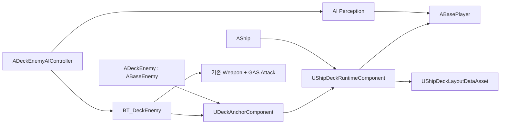
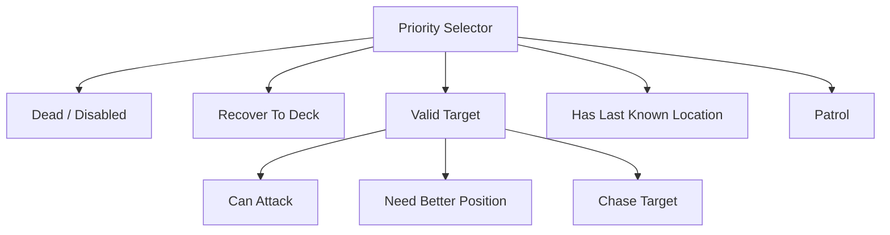

# 함선 갑판 전투용 적 AI 전체 설계안

## 0. 문서 목적

움직이고 회전하는 함선의 제한된 갑판 위에서 적이 플레이어를 발견하고, 갑판 밖으로 이탈하지 않으면서 접근·포위·공격·수색·복귀하도록 만드는 전체 구조를 정의한다.

이 문서는 현재 프로젝트의 다음 구현을 재사용하는 것을 전제로 한다.

- `ABaseEnemy`: GAS, 체력, 무기, 사망, 드랍, 웨이브 연동
- `ABaseAIController`: AI Perception의 시야 감지와 Behavior Tree 실행
- `UBTT_EnemyBasicAttack`: 무기 데이터와 GAS 기본 공격 실행
- `UBTT_StrafeAroundTarget`: 표적 주변 이동
- `UBTS_SetFocusToTarget`: 표적 주시
- `AShip`: Network Physics 기반 함선과 `ShipDeckMesh`

목표는 별도 적 프레임워크를 하나 더 만드는 것이 아니라, 기존 적 시스템에 **함선 로컬 공간과 갑판 제약 계층**을 추가하는 것이다.

---

## 1. 먼저 확정할 플레이 규칙

### 1.1 권장 탑승 상태

플레이어의 함선 탑승 상태를 다음 두 가지로 분리한다.

1. **갑판 탑승(Boarded On Deck)**
   - 플레이어 캐릭터가 계속 PlayerController에 빙의된다.
   - 걷기, 회피, 공격, 피격이 가능하다.
   - `CharacterMovement`의 Movement Base가 `ShipDeckMesh`가 된다.
   - 갑판 적이 플레이어를 정상적인 전투 표적으로 사용한다.

2. **조타(At Helm)**
   - 플레이어가 함선을 직접 조종한다.
   - 현재 `AShip::Board()`의 함선 빙의 방식은 이 상태에 해당한다.
   - 캐릭터 충돌과 이동이 비활성화되므로 근접 적의 유효 표적으로 삼지 않는다.
   - 갑판 적이 존재하면 조타 진입을 막거나, 적에게 맞으면 조타를 강제 해제하는 규칙을 권장한다.

현재 `AShip::Board()`는 위 두 상태를 하나로 처리한다. 탑승 중 플레이어는 충돌이 꺼지므로 `ABaseWeapon`의 Pawn Sphere Trace에 맞지 않는다. 따라서 갑판 전투를 시작하기 전에 `BoardDeck()`과 `EnterHelm()`의 의미를 분리해야 한다.

### 1.2 MVP 규칙

첫 구현에서는 규칙을 단순화한다.

- 적은 자신과 **같은 함선 갑판 위의 살아 있는 플레이어 캐릭터**만 공격한다.
- 수영 중이거나 다른 함선에 있거나 조타 때문에 비활성화된 캐릭터는 공격하지 않는다.
- 적은 갑판에서 바다로 뛰어내리지 않는다.
- 적이 물리 충격으로 갑판 밖에 나가면 전투를 중단하고 복귀를 시도한다.
- 복귀 불가능 상태가 일정 시간 지속되면 서버가 구조 지점으로 재배치하거나 제거한다.

---

## 2. 핵심 기술 결정

### 2.1 움직이는 갑판에 일반 Recast NavMesh를 주 이동 수단으로 사용하지 않는다

현재 순찰과 회피 태스크는 `UNavigationSystemV1`에 의존한다. 하지만 물리로 계속 이동·회전하는 함선은 월드 고정 NavMesh와 좌표계가 맞지 않는다. 매 프레임 동적 NavMesh를 다시 생성하는 방식도 비용, 지연, 네트워크 재현성 면에서 부적합하다.

갑판 AI는 다음 방식을 사용한다.

- 갑판의 경계, 이동 노드, 연결선, 구조 지점을 **함선 로컬 좌표**로 저장
- AI 판단과 경로 탐색은 로컬 좌표에서 수행
- 실제 이동 직전에 목적지를 현재 함선 Transform을 이용해 월드 좌표로 변환
- 함선이 움직이므로 이동 중에도 월드 목적지를 주기적으로 갱신
- 단순 갑판에서는 직접 조향, 장애물이 있는 갑판에서는 작은 로컬 그래프의 A* 사용

### 2.2 캐릭터는 함선에 Attach하지 않고 Movement Base를 사용한다

전투 중인 플레이어와 적을 함선 Root에 Attach하면 CharacterMovement, 충돌, 루트 모션, 넉백과 네트워크 보정이 충돌하기 쉽다.

권장 방식은 다음과 같다.

- `ShipDeckMesh`가 Pawn을 Block하는 이동 가능한 바닥 역할을 맡는다.
- 걷는 캐릭터는 `CharacterMovement`의 이동 바닥 감지를 통해 함선을 Movement Base로 사용한다.
- AI 판단과 공격 판정은 서버 권한으로 실행한다.
- 캐릭터 Replicated Movement와 함선 Network Physics의 동시 보정은 별도 PIE 테스트로 검증한다.

### 2.3 WaterAndShip은 갑판 공간만 제공하고 Enemy는 AI를 소유한다

모듈 의존성의 역전을 피한다.

- `WaterAndShip`: 갑판 영역, 좌표 변환, 로컬 경로 데이터, 구조 지점 제공
- `Enemy`: 표적 선정, Behavior Tree, 이동 태스크, 공격 판단 제공
- `Enemy -> WaterAndShip` 의존은 현재 이미 존재한다.
- `WaterAndShip -> Enemy` 의존은 만들지 않는다.

---

## 3. 런타임 구성



### 3.1 `UShipDeckLayoutDataAsset`

함선 종류별로 에디터에서 설정하는 정적 데이터다.

```cpp
USTRUCT(BlueprintType)
struct FDeckNavNode
{
    FName NodeId;
    FVector LocalLocation;
    TArray<int32> NeighborIndices;
    float ClearanceRadius;
    FGameplayTagContainer AreaTags;
};

USTRUCT(BlueprintType)
struct FDeckSafePoint
{
    FName PointId;
    FVector LocalLocation;
    float RequiredClearance;
};
```

포함 데이터:

- 갑판 외곽의 2D 로컬 경계 Polygon
- 이동 가능한 내부 Polygon 또는 로컬 Nav Node/Edge
- 계단, 돛대, 조타 장치 등 고정 장애물 영역
- 적 스폰 지점
- 순찰 지점
- 갑판 복귀/구조 지점
- 근접 적이 사용하면 위험한 좁은 구간 태그
- 원거리 적 전용 사격 지점 태그

### 3.2 `UShipDeckRuntimeComponent`

`AShip`에 붙는 런타임 갑판 서비스다. AI 클래스에 직접 의존하지 않는다.

주요 API:

```cpp
FVector DeckLocalToWorld(const FVector& LocalPoint) const;
FVector WorldToDeckLocal(const FVector& WorldPoint) const;

bool IsPointInsideDeck(const FVector& WorldPoint, float Inset) const;
bool ProjectPointToDeck(const FVector& WorldPoint, FVector& OutWorldPoint) const;
bool IsActorOnDeck(const AActor* Actor) const;

bool FindLocalPath(
    const FVector& StartWorld,
    const FVector& GoalWorld,
    float AgentRadius,
    TArray<FVector>& OutLocalPath) const;

FVector GetNearestRecoveryPointWorld(const FVector& FromWorld) const;
```

책임:

- 월드/함선 로컬 좌표 변환
- 경계 안/밖 판정
- 캐릭터 캡슐 반경만큼 안쪽으로 축소된 안전 영역 판정
- 로컬 A* 경로 생성
- 고정 장애물 회피
- 디버그 경계, 노드, 경로 표시

비책임:

- 표적 선택
- Behavior Tree 상태
- 공격 실행
- 적 클래스 생성

### 3.3 `UDeckAnchorComponent`

`ADeckEnemy`에 붙이며 적과 현재 함선 갑판의 관계를 관리한다.

런타임 상태:

- `TWeakObjectPtr<AShip> HostShip`
- `TWeakObjectPtr<UShipDeckRuntimeComponent> HostDeck`
- `FVector HomeLocalLocation`
- `FVector LastValidLocalLocation`
- `bool bIsOnValidDeck`
- `float TimeOutsideDeck`

책임:

- 스폰 시 아래 방향 Trace 또는 명시적 인자로 HostShip을 결정
- 적의 현재 로컬 위치 계산
- 같은 갑판에 있는 표적인지 판정
- 마지막 안전 위치 저장
- 경계 밖 이탈 감지
- 복구 상태 전환 요청

HostShip은 서버에서 결정하고 복제한다. 클라이언트는 디버그와 표현에만 사용한다.

### 3.4 `ADeckEnemy`

`ABaseEnemy`를 상속한다.

추가 요소:

- `UDeckAnchorComponent`
- 갑판 전용 Behavior Tree
- 갑판 전용 AIController
- 적 유형별 `UDeckEnemyConfigDataAsset`

기존 시스템 중 그대로 유지할 항목:

- ASC와 `UEnemyAttributeSet`
- `UBaseHealthComponent`
- `UBaseWeaponComponent`
- `UGA_BasicAttack`
- 사망/드랍/웨이브 알림
- 체력바

---

## 4. 표적 인식과 선정

### 4.1 감지 채널

1. **Sight**
   - 기존 `UAISenseConfig_Sight` 재사용
   - 벽, 돛대, 선실에 의해 시야가 막히는지 확인
   - 함선 크기에 맞게 Sight Radius를 데이터화

2. **Damage**
   - 자신을 공격한 플레이어는 짧은 시간 동안 후보로 등록
   - 시야 밖 기습에도 반응할 수 있다.

3. **Hearing, 선택 사항**
   - 원거리 공격, 폭발, 달리기 소리를 조사 위치로 사용
   - MVP 이후 추가

### 4.2 후보 필터

후보는 아래를 모두 통과해야 한다.

- Actor가 유효하고 죽지 않음
- `Team.Player`이며 `Team.Enemy`가 아님
- 현재 전투 가능한 Player Character
- 적과 동일한 `UShipDeckRuntimeComponent` 위에 있음
- 갑판 경계 안에 있음
- 조타로 인해 충돌/전투가 비활성화된 Pawn이 아님

현재 `ABaseAIController::OnTargetSighted()`는 감지한 대상이 `ABasePlayer`이면 바로 Blackboard에 넣고, 시야를 잃으면 즉시 지운다. 갑판 전투용으로는 후보 목록을 유지하고 최적 후보를 선정하도록 확장한다.

### 4.3 표적 점수

멀티플레이를 고려한 기본 점수:

```text
TargetScore
= 거리 점수
+ 현재 나를 공격한 대상 보너스
+ 현재 표적 유지 보너스
+ 시야 확보 보너스
- 이미 많은 적에게 둘러싸인 대상 페널티
- 갑판 경계에 너무 가까운 대상 페널티
```

표적이 잠깐 가려질 때마다 바뀌지 않도록 다음 히스테리시스를 둔다.

- 현재 표적 유지 시간: 최소 1.5초
- 새 표적 교체 조건: 새 점수가 현재 점수보다 25% 이상 높음
- 시야 기억: 2~4초
- 완전 포기: 마지막 감지 후 5~8초

### 4.4 표적 위치 저장

함선이 움직이므로 마지막 위치를 월드 좌표로만 보관하면 안 된다.

- `TargetLastKnownLocalLocation`: 함선 로컬 좌표
- 사용할 때 `HostDeck->DeckLocalToWorld()`로 변환
- 표적 Actor가 유효하면 매 서비스 Tick에서 로컬 위치 갱신

---

## 5. Blackboard 설계

`BB_DeckEnemy` 권장 Key:

| Key | Type | 의미 |
|---|---|---|
| `TargetActor` | Object/Actor | 현재 전투 표적 |
| `HostShip` | Object/Actor | 적이 속한 함선 |
| `HostDeck` | Object/Component 또는 HostShip 경유 | 갑판 질의 대상 |
| `HomeLocalLocation` | Vector | 로컬 순찰 기준점 |
| `MoveGoalLocalLocation` | Vector | 현재 로컬 이동 목표 |
| `LastKnownTargetLocalLocation` | Vector | 마지막으로 감지한 표적의 로컬 위치 |
| `HasLineOfSight` | Bool | 현재 시야 확보 여부 |
| `DistanceToTarget` | Float | 현재 월드 거리 |
| `IsInAttackRange` | Bool | 무기 사거리 충족 여부 |
| `IsTargetOnSameDeck` | Bool | 동일 갑판 표적 여부 |
| `IsOutsideDeck` | Bool | 적의 갑판 이탈 여부 |
| `CombatState` | Enum | Patrol/Investigate/Chase/Reposition/Attack/Recover |

Blackboard Vector의 값 자체에는 좌표계 정보가 없으므로 로컬 좌표 Key에는 반드시 `Local` 접미사를 사용한다.

---

## 6. Behavior Tree



우선순위:

1. **Dead/Disabled**
   - 사망, 스턴, 강제 행동 불가

2. **Recover To Deck**
   - 갑판 밖 또는 바닥 없음
   - 공격 취소, Focus 해제, 가장 가까운 구조 지점으로 이동

3. **Combat**
   - 유효한 같은 갑판 표적 존재

   3-1. Attack
   - 사거리, 각도, 시야, 안전 위치 모두 충족

   3-2. Reposition/Strafe
   - 너무 가깝거나 공격 슬롯이 막힘
   - 갑판 안쪽의 안전한 공격 위치 탐색

   3-3. Chase
   - 표적 쪽으로 로컬 경로 이동

4. **Investigate**
   - 표적은 잃었지만 마지막 로컬 위치 기억
   - 마지막 위치로 이동 후 짧게 탐색

5. **Patrol/Guard**
   - HomeLocalLocation 주변의 유효 노드 선택
   - 대기, 시선 회전, 짧은 순찰

### 6.1 필요한 BT Service

`BTS_UpdateDeckCombatContext`

- 0.1~0.2초 간격
- 표적 생존 여부
- 같은 갑판 여부
- 거리와 시야
- 현재 무기의 Min/Ideal/Max Range
- 적의 갑판 경계 상태
- 로컬 마지막 위치
- 공격 가능 여부 갱신

기존 `BTS_SetFocusToTarget`은 전투 Branch에 그대로 사용하되, 같은 갑판과 전투 가능 상태 검사를 추가한다.

### 6.2 필요한 Decorator

- `BTD_IsValidDeckTarget`
- `BTD_CanDeckAttack`
- `BTD_IsOutsideDeck`
- `BTD_HasLastKnownDeckLocation`

`BTD_CanDeckAttack` 조건:

- 표적 유효
- 같은 갑판
- `MinAttackRange <= Distance <= MaxAttackRange`
- 표적과 높이 차가 허용치 이하
- Line of Sight 확보
- 적이 공격 중이거나 스턴 상태가 아님
- 공격 위치가 갑판 안전 경계 안

### 6.3 필요한 Task

- `BTT_FindDeckPatrolPoint`
- `BTT_MoveOnDeck`
- `BTT_FindDeckAttackPosition`
- `BTT_SearchLastKnownDeckLocation`
- `BTT_RecoverToDeck`

기존 `BTT_EnemyBasicAttack`은 재사용한다.

기존 `BTT_FindPatrolLocation`과 `BTT_StrafeAroundTarget`의 `UNavigationSystemV1` 사용 부분은 갑판 전용 태스크에서는 사용하지 않는다.

---

## 7. 갑판 이동

### 7.1 이동 목표 생성

모든 목표는 먼저 로컬 공간에서 검증한다.

```text
Desired Local Goal
-> 갑판 경계 안쪽으로 Clamp
-> Agent Radius와 Edge Safety Margin 적용
-> 고정 장애물 검사
-> 로컬 경로 생성
-> 현재 함선 Transform으로 World Goal 계산
```

권장 기본값:

- Edge Safety Margin: 캡슐 반경 + 30~60cm
- World Goal 갱신: 0.05~0.15초
- Waypoint Acceptance Radius: 40~70cm
- 경로 재탐색: 표적 로컬 이동 100cm 이상 또는 기존 경로 차단 시

### 7.2 `BTT_MoveOnDeck`

동작:

1. Blackboard의 로컬 목표를 읽는다.
2. `FindLocalPath()`로 로컬 Waypoint 목록을 만든다.
3. 현재 Waypoint를 매 Tick 또는 짧은 주기마다 월드 위치로 변환한다.
4. `AAIController::MoveToLocation()`을 Pathfinding 없이 사용하거나 CharacterMovement에 직접 Desired Velocity를 제공한다.
5. 다음 Waypoint로 진행한다.
6. 표적 이동, 함선 급회전, 경계 위험 발생 시 경로를 다시 만든다.

초기 구현은 `MoveToLocation(..., bUsePathfinding=false)`로 시작할 수 있다. 함선 급가속 시 안정성이 부족하면 `UDeckFollowingComponent`에서 로컬 목표 기반 조향을 직접 계산한다.

### 7.3 근접 포위 슬롯

여러 적이 같은 지점으로 겹치는 것을 막기 위해 표적 주변에 공격 슬롯을 만든다.

- 반경: 현재 무기의 `IdealRange`
- 각도 간격: 45~90도
- 각 슬롯을 로컬 갑판 경계와 장애물에 투영
- 유효 슬롯만 후보로 사용
- `UDeckCombatSlotSubsystem` 또는 `UShipDeckRuntimeComponent`가 짧은 Lease로 점유 관리
- 표적 사망, 적 사망, 거리 초과 시 Lease 해제

MVP에서는 4개 슬롯로 시작하고, 슬롯이 없으면 적은 바깥 원에서 Strafe 또는 대기한다.

### 7.4 경계 이탈 방지

이동 목표 검증만으로는 넉백이나 물리 오차를 막지 못한다.

다중 방어:

1. 로컬 목표를 안전 Polygon 안으로 제한
2. 이동 방향 앞쪽을 짧게 Probe하여 바닥 존재 확인
3. CharacterMovement의 Ledge 관련 설정 검토
4. 갑판 가장자리에 AI 전용 Invisible Blocker 사용 가능
5. 마지막 안전 로컬 위치를 계속 기록
6. 이탈 시 Recover Branch 최우선 실행

AI 전용 Blocker는 플레이어 이동을 막지 않도록 전용 Collision Channel을 권장한다.

---

## 8. 공격

### 8.1 기존 공격 파이프라인 재사용

```text
BT CanAttack
-> BTT_EnemyBasicAttack
-> 현재 무기의 Ability 활성화
-> UGA_BasicAttack(ServerOnly)
-> Montage Gameplay Event
-> ABaseWeapon Sphere Trace
-> GameplayEffect 적용
```

기존 `FWeaponCombatData`의 다음 값을 그대로 AI 판단에 사용한다.

- `MinAttackRange`
- `IdealRange`
- `MaxAttackRange`
- `AttackCooldown`
- `AttackMontage`
- `DamageEffectClass`

사거리 값을 Behavior Tree 노드에 중복 입력하지 않는다.

### 8.2 공격 직전 재검증

Montage가 시작되기 직전에 서버에서 다시 확인한다.

- 표적 생존
- 동일 갑판
- 최대 사거리 + 허용 오차
- 높이 차
- 적이 안전 Polygon 안에 있음

공격 도중 표적이 사라지면:

- 짧은 공격은 애니메이션을 끝내되 Hit Trace만 중단
- 긴 차징 공격은 Ability 취소

### 8.3 팀 판정 보강

현재 `ABaseWeapon::ShouldIgnoreActor()`는 자기 자신과 Owner/Instigator만 제외한다. 같은 Enemy가 Trace에 들어오면 ASC에 효과가 적용될 가능성이 있다.

공격 시스템 공통 보강:

- Source와 Target의 `Team.Player`, `Team.Enemy` 태그 비교
- 같은 팀이면 Damage Effect 적용하지 않음
- 필요하면 `IGenericTeamAgentInterface`로 AI Perception의 Affiliation까지 통일

---

## 9. 상태와 타이밍

권장 전투 상태:

| 상태 | 진입 | 종료 |
|---|---|---|
| Patrol | 표적 없음 | 표적 감지 |
| Alert | 소리/피해/잠깐의 시야 | 표적 확정 또는 기억 만료 |
| Chase | 표적 유효, 사거리 밖 | 공격 위치 확보 |
| Reposition | 너무 가깝거나 슬롯 없음 | 슬롯 확보 또는 표적 상실 |
| Attack | 모든 공격 조건 충족 | 공격과 Recovery 완료 |
| Investigate | 시야 상실, 기억 남음 | 재발견 또는 기억 만료 |
| Recover | 갑판 이탈 | 안전 지점 복귀 |
| Disabled | 사망/스턴 | 상태 효과 종료 또는 제거 |

초기 튜닝값:

| 항목 | 권장 시작값 |
|---|---:|
| Sight Radius | 1200cm |
| Lose Sight Radius | 1450cm |
| Peripheral Vision | 70도 |
| Target Memory | 4초 |
| Search Duration | 2초 |
| Target Evaluation | 0.2초 |
| Deck Boundary Check | 0.1초 |
| Recovery Timeout | 3초 |
| Edge Safety Margin | CapsuleRadius + 40cm |

값은 `UDeckEnemyConfigDataAsset`으로 옮겨 적 종류별로 조정한다.

---

## 10. 네트워크 권한

### 10.1 서버

- AI Perception
- 표적 선정
- Behavior Tree
- 경로/조향 결정
- GAS Ability 실행
- Hit Trace와 Damage 적용
- 갑판 이탈 복구
- 공격 슬롯 점유

### 10.2 클라이언트

- 복제된 적 이동 표현
- Montage, VFX, SFX
- 체력바
- 선택적 디버그 표시

AI의 Blackboard와 로컬 경로를 매번 복제하지 않는다. 결과인 적 Transform, Ability 상태, 피해만 기존 방식으로 복제한다.

### 10.3 함선과 캐릭터 이동 보정

다음 조합을 반드시 별도로 시험한다.

- Dedicated Server + 2 Clients
- 함선 정지/등속/급가속/급회전
- Player와 Enemy가 모두 `ShipDeckMesh`를 Movement Base로 사용
- 적 공격 Montage의 Root Motion 유무
- 100ms/200ms 지연과 Packet Loss

함선 보정 직후 적이 갑판을 뚫거나 순간 이동하면, 적의 복제 위치를 단순 월드 Transform이 아니라 함선 기준 상대 상태로 표현하는 별도 방식을 검토한다. 이는 MVP 이후 단계다.

---

## 11. 파일 구성 제안

### WaterAndShip

```text
Source/WaterAndShip/Public/Deck/ShipDeckLayoutDataAsset.h
Source/WaterAndShip/Public/Deck/ShipDeckRuntimeComponent.h
Source/WaterAndShip/Private/Deck/ShipDeckLayoutDataAsset.cpp
Source/WaterAndShip/Private/Deck/ShipDeckRuntimeComponent.cpp
```

`AShip` 변경:

- `UShipDeckRuntimeComponent` 생성
- `ShipDeckMesh`를 RuntimeComponent에 등록
- 갑판 레이아웃 DataAsset 지정
- `BoardDeck`, `EnterHelm`, `ExitHelm`, `LeaveDeck` 의미 분리

### Enemy

```text
Source/Enemy/Public/DeckAI/DeckEnemy.h
Source/Enemy/Public/DeckAI/DeckEnemyAIController.h
Source/Enemy/Public/DeckAI/DeckAnchorComponent.h
Source/Enemy/Public/DeckAI/DeckEnemyConfigDataAsset.h
Source/Enemy/Public/DeckAI/DeckCombatSlotComponent.h

Source/Enemy/Public/DeckAI/Service/BTS_UpdateDeckCombatContext.h
Source/Enemy/Public/DeckAI/Decorator/BTD_IsValidDeckTarget.h
Source/Enemy/Public/DeckAI/Decorator/BTD_CanDeckAttack.h
Source/Enemy/Public/DeckAI/Task/BTT_MoveOnDeck.h
Source/Enemy/Public/DeckAI/Task/BTT_FindDeckPatrolPoint.h
Source/Enemy/Public/DeckAI/Task/BTT_FindDeckAttackPosition.h
Source/Enemy/Public/DeckAI/Task/BTT_RecoverToDeck.h
```

### Content

```text
Content/GameplayAbilitySystem/Enemy/DeckAI/BB_DeckEnemy
Content/GameplayAbilitySystem/Enemy/DeckAI/BT_DeckEnemy
Content/GameplayAbilitySystem/Enemy/DeckAI/BP_DeckEnemyBase
Content/New/Ship/Deck/DA_TestShipDeckLayout
Content/GameplayAbilitySystem/Enemy/DeckAI/DA_DeckEnemy_Default
```

---

## 12. 기존 코드의 변경 지점

### `ABaseAIController`

갑판 Controller가 인식 로직을 재사용할 수 있도록 다음을 `protected virtual` 확장 지점으로 만든다.

- 감지된 Actor가 표적 후보인지 검사
- 후보 등록/해제
- 최종 표적 선택
- 표적 사망 바인딩
- Blackboard 초기값 설정

현재처럼 `OnTargetSighted()` 안에서 즉시 `TargetActor`를 Set/Clear하면 멀티플레이 후보 전환과 시야 기억 구현이 어렵다.

### `ABaseEnemy`

- Behavior Tree와 Weapon/GAS는 그대로 유지
- 갑판 특화 코드는 Base에 넣지 않고 `ADeckEnemy`와 Component에 둔다.

### `UBTT_EnemyBasicAttack`

- 재사용
- 실행 직전 선택적인 `CanActivateDeckAttack()` 검증 Hook 추가 가능
- 공격 Task가 Ability 종료를 기다리는 현재 구조는 유지

### `ABaseWeapon`

- 팀 필터 추가
- 조타 등으로 전투 비활성화된 Target 필터 추가
- 서버 판정 유지

### `AShip`

- 갑판 탑승과 조타를 분리
- `ShipDeckMesh`에 전용 Deck Collision Profile 지정
- Deck Runtime Component 제공

---

## 13. 실패 및 복구 정책

| 상황 | 처리 |
|---|---|
| HostShip 파괴/제거 | 표적 해제, BT 중지, 낙하 또는 Despawn 정책 실행 |
| 표적이 바다로 떨어짐 | 같은 갑판 조건 실패, 마지막 위치 조사 후 복귀 |
| 적이 갑판 밖으로 밀림 | 공격 즉시 중단, Recover 상태 |
| 바닥을 0.5초 이상 찾지 못함 | 마지막 안전 지점 또는 구조 지점으로 서버 Teleport |
| 로컬 경로 없음 | 가장 가까운 유효 노드로 Clamp, 그래도 실패하면 대기 후 재시도 |
| 공격 슬롯 없음 | 바깥 안전 반경에서 Strafe/대기 |
| 표적 사망 | Delegate로 즉시 Blackboard Clear, 후보 재평가 |
| 함선 급회전 | World Goal 갱신, 필요 시 로컬 경로 유지 |
| 적이 서로 끼임 | RVO/간단 Separation + Slot 점유 + 타임아웃 |

구조 Teleport는 플레이어 눈앞에서 남발하지 않도록 Recovery Timeout 이후 최후 수단으로만 사용한다.

---

## 14. 디버그 도구

콘솔 또는 CVar:

```text
ai.Deck.DrawBoundary 1
ai.Deck.DrawGraph 1
ai.Deck.DrawPath 1
ai.Deck.DrawTarget 1
ai.Deck.DrawSlots 1
ai.Deck.LogRecovery 1
```

적 위 Debug Text:

- CombatState
- Target 이름
- HostShip 이름
- Local Position
- 목표 Local Position
- SameDeck 여부
- AttackRange 여부
- Slot 번호

로그는 상태 변경 시에만 남기고 Tick마다 출력하지 않는다.

---

## 15. 테스트 계획

### 15.1 자동화 테스트

1. 로컬/월드 좌표 왕복 오차
2. 갑판 Polygon 내부/외부/경계 판정
3. Agent Radius를 적용한 안전 경계 판정
4. 로컬 A* 경로와 장애물 우회
5. 같은 함선/다른 함선 표적 필터
6. 죽은 Player와 전투 비활성 Player 제외
7. 무기 Min/Max Range 공격 조건
8. 팀 Damage 방지
9. HostShip 제거 시 참조 안전성

### 15.2 PIE 기능 테스트

| 케이스 | 기대 결과 |
|---|---|
| 정지한 배, 플레이어 정면 진입 | 발견 후 접근·공격 |
| 플레이어가 돛대 뒤로 이동 | 시야 상실, 마지막 위치 조사 |
| 플레이어가 다시 나타남 | 즉시 전투 복귀 |
| 플레이어가 바다로 점프 | 추락하지 않고 갑판에서 추적 종료 |
| 배가 이동/회전 | 적이 목표를 계속 따라가며 갑판 유지 |
| 적 4~8마리 | 겹치지 않고 슬롯 분산 |
| 플레이어 사망 | 공격 중지와 Target Clear |
| 적 넉백 | Recover 또는 안전한 구조 |
| 다른 배의 플레이어가 시야에 들어옴 | 표적으로 선택하지 않음 |
| Dedicated Server 2인 | 서버 판정과 클라이언트 표현 일치 |

### 15.3 성능 기준

초기 목표:

- 적 20마리
- Perception/Context 갱신 5~10Hz
- 경로 재탐색은 이벤트 기반
- A* 그래프는 함선당 수십 개 노드 규모
- Tick은 이동 중인 Task와 최소 Component에만 허용

---

## 16. 구현 순서

### 0단계: 플레이 규칙 정리

- `BoardDeck`과 `EnterHelm` 분리
- 전투 가능한 Player Pawn 판정 API 정의
- 갑판 Collision Profile 확정

완료 조건: 플레이어 캐릭터가 움직이는 배 위에서 걷고 피격될 수 있다.

### 1단계: 갑판 공간

- `UShipDeckLayoutDataAsset`
- `UShipDeckRuntimeComponent`
- 로컬/월드 변환
- 경계, 투영, 디버그 표시

완료 조건: 배가 어떤 Transform이어도 같은 로컬 지점을 정확히 표시하고 경계를 판정한다.

### 2단계: 1대1 최소 전투

- `ADeckEnemy`
- `UDeckAnchorComponent`
- 같은 갑판 표적 필터
- 직선형 `BTT_MoveOnDeck`
- 기존 `BTT_EnemyBasicAttack` 연결

완료 조건: 정지/이동하는 빈 갑판에서 적 1마리가 플레이어를 추적하고 공격한다.

### 3단계: 장애물과 수색

- 로컬 그래프 A*
- 순찰
- 마지막 로컬 위치 수색
- 돛대/선실 우회

완료 조건: 시야가 끊겨도 갑판 밖으로 나가지 않고 조사 후 순찰로 돌아간다.

### 4단계: 다수 전투

- 공격 슬롯
- Separation
- 표적 점수와 멀티플레이 후보 관리

완료 조건: 8마리가 한 점에 겹치지 않고 전투한다.

### 5단계: 복구와 네트워크

- 넉백 이탈 복구
- Dedicated Server 테스트
- 지연/Packet Loss 테스트
- 프로파일링과 Tick 간격 조정

완료 조건: 급가속·급회전·네트워크 지연에서도 치명적인 갑판 이탈이나 잘못된 피해가 없다.

---

## 17. 최종 완료 기준

아래를 모두 만족하면 첫 버전 완료로 본다.

- 적이 같은 갑판의 전투 가능한 플레이어만 발견한다.
- 배의 이동과 회전 중에도 추적 목표가 밀리지 않는다.
- 적의 순찰·추적·회피 목적지가 항상 안전 갑판 영역 안이다.
- 시야를 잃으면 마지막 로컬 위치를 조사한 뒤 복귀한다.
- 기존 GAS 무기 사거리와 Cooldown으로 공격한다.
- 적 여러 마리가 같은 위치에 완전히 겹치지 않는다.
- 플레이어 또는 적이 갑판 밖으로 나갈 때 상태가 안전하게 정리된다.
- 서버만 AI와 피해를 결정하며 클라이언트 결과가 일치한다.
- HostShip/Target 사망 및 제거 시 null 참조나 BT 교착이 없다.

---

## 18. 권장 첫 수직 슬라이스

전체 기능을 한 번에 만들기보다 다음 조합으로 기술 위험을 먼저 제거한다.

- 장애물 없는 테스트 함선 1종
- 갑판 Polygon 1개와 구조 지점 2개
- 근접 적 1종
- 플레이어 1명
- 상태: Idle → Detect → Chase → Attack → Lose Target → Return
- 함선 상태: 정지 → 등속 이동 → 회전
- 서버 권한 PIE

이 수직 슬라이스에서 가장 먼저 검증할 것은 공격 애니메이션이 아니라 다음 세 가지다.

1. 플레이어와 적의 Movement Base가 움직이는 `ShipDeckMesh`에서 안정적인가
2. 로컬 목표를 월드로 계속 변환하는 이동이 함선 Network Physics 보정과 공존하는가
3. 현재 탑승/조타 구조를 분리한 뒤 플레이어가 실제로 근접 Hit Trace에 맞는가

이 세 가지가 통과하면 기존 GAS 공격, 체력, 드랍, 웨이브 시스템은 큰 변경 없이 결합할 수 있다.
