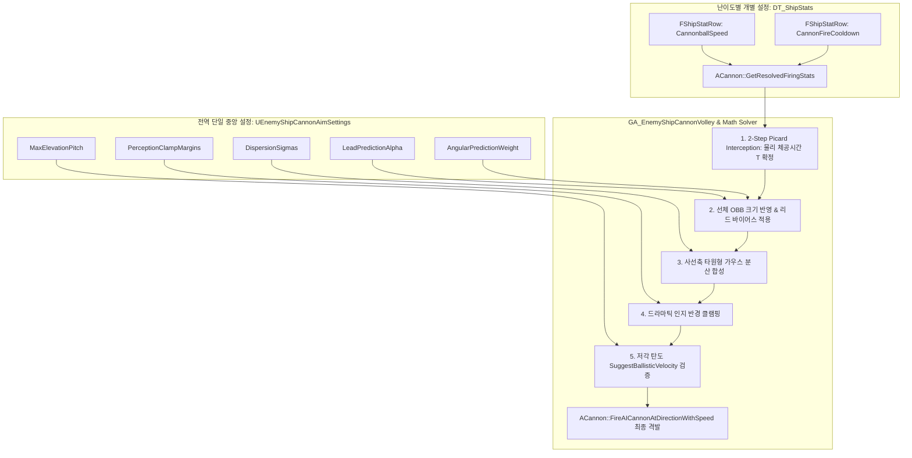

# Enemy Ship Cannon Fire AI Architecture & Implementation Design

## 1. 아키텍처 개요 및 설계 원칙

본 문서는 해상전 프로젝트(`ArtisticSW2026`)의 적 함선(`AEnemyShip`) 주포 사격 AI의 최종 아키텍처 사양서이다.

### 1.1 핵심 설계 원칙 (Core Principles)
1. **난이도별 차등은 오직 '물리 스펙'만 존재**:
   - 적 배의 등급/난이도(Easy, Normal, Hard)에 따라 달라지는 값은 오직 **포구 초속도(`CannonballSpeed`)**와 **재장전 대기시간(`CannonFireCooldown`)**뿐이다.
   - 이는 이미 프로젝트에 구축된 데이터 테이블(`FShipStatRow`) 및 `UEnemyShipArchetypeData`의 스펙 시스템을 100% 그대로 활용한다.
2. **조준 품질/탄착 분산/회피 연출은 '단일 지점(Single Point)'에서 전역 중앙 제어**:
   - 리드 예측 배율, 선회 원호 예측율, 탄착 분산 타원, 인지 반경 클램핑 등은 모든 함선이 공유한다.
   - 개별 DataAsset에 중복 배치하지 않고, 프로젝트 설정(`UDeveloperSettings`) 기반의 **전역 설정 클래스(`UEnemyShipCannonAimSettings`) 단 한 곳**에서 중앙 제어한다.
3. **일제사격(Volley) 제어 로직 배제**:
   - 다연발 시차/군집 제어는 설계 범위에서 완전히 제외하며, 각 함포는 독립적인 탄도 해석 및 오차 주입 파이프라인을 거쳐 격발된다.

---

## 2. 시스템 데이터 흐름도 (Architecture Dataflow)



---

## 3. 세부 수학 및 알고리즘 사양 (Algorithmic Details)

### 3.1 2단계 피카드 반복 요격 솔버 (2-Step Picard Interception)
- **입력**: 포구 위치 $P_{\text{start}}$, 표적 위치 $P_0$, 표적 속도 $\vec{V}_p$, 표적 Yaw 각속도 $\omega_z$, 포구 속도 $V_0$
- **Step 0**: 직선 거리 기반 0차 체공 시간 $T^{(0)} = \frac{\|(P_0 - P_{\text{start}})_{xy}\|}{V_0}$
- **Step 1 (선회 원호 1차 요격점)**:
  $$P^{(1)} = P_0 + \mathbf{R}\left(\omega_z \cdot \frac{T^{(0)}}{2} \cdot W_{\text{angular}}\right) \cdot \vec{V}_p \cdot T^{(0)}$$
- **Step 2 (물리 탄도 체공시간 해석)**:
  `FEnemyShipSkillMath::SuggestBallisticVelocity(P_{\text{start}}, P^{(1)}, V_0, g, ...)`의 저각 해를 통해 $T^{(1)}$ 획득.
- **Step 3 (정밀 요격점 확정)**:
  $$P_{\text{lead}} = P_0 + \mathbf{R}\left(\omega_z \cdot \frac{T^{(1)}}{2} \cdot W_{\text{angular}}\right) \cdot \vec{V}_p \cdot T^{(1)}$$

### 3.2 선체 OBB 크기 적응형 오차 주입 (Error Injection)
- **선체 Bounding Extent**: 타겟 함선의 `ShipDamageMesh`로부터 로컬 반경 $L_{\text{half}} = \text{Extent.X}$, $W_{\text{half}} = \text{Extent.Y}$ 획득.
- **선수/선미 리드 오차 ($\vec{E}_{\text{lead}}$)**:
  - 주행 시 ($\|\vec{V}_p\| \ge V_{\text{min}}$): $\vec{E}_{\text{lead}} = (\alpha - 1.0) \cdot \vec{V}_p \cdot T^{(1)}$
  - 정지/저속 시: $\vec{E}_{\text{lead}} = \text{Sign}(\alpha - 1.0) \cdot (L_{\text{half}} + M_{\text{safe}}) \cdot \hat{u}_{\text{heading}}$
- **사선(Line of Fire) 타원형 분산 ($\vec{E}_{\text{dispersion}}$)**:
  - 사격선 단위벡터: $\hat{u}_{\text{range}} = \frac{(P_{\text{lead}} - P_{\text{start}})_{xy}}{\|(P_{\text{lead}} - P_{\text{start}})_{xy}\|}$
  - 편차 단위벡터: $\hat{u}_{\text{lateral}} = \hat{u}_{\text{range}} \times \hat{z}$
  - $\vec{E}_{\text{dispersion}} = (Z_1 \cdot \sigma_{\text{range}}) \hat{u}_{\text{range}} + (Z_2 \cdot \sigma_{\text{lateral}}) \hat{u}_{\text{lateral}}$ ($Z_1, Z_2 \sim \mathcal{N}(0, 1)$)
- **인지 반경 클램핑 (Perception Clamping)**:
  - 선체 외곽 최소 안전거리: $D_{\text{safe}} = \max(L_{\text{half}}, W_{\text{half}}) + M_{\text{safe}}$
  - 화면 내 극적 연출 최대거리: $D_{\text{dramatic}} = \max(L_{\text{half}}, W_{\text{half}}) + M_{\text{dramatic}}$
  - 최종 탄착 오차 벡터의 길이를 $[D_{\text{safe}}, D_{\text{dramatic}}]$ 범위로 클램핑하여 엉뚱한 먼바다 탄착을 원천 차단.

---

## 4. 코드 수정 및 신규 구현 상세 명세 (Code Modification Blueprint)

다음 단계 구현 에이전트가 정확히 작업할 수 있도록 파일 단위의 수정 포인트를 명시한다.

### 4.1 [NEW] `Source/Enemy/Public/ShipAI/EnemyShipCannonAimSettings.h`
- **역할**: 모든 적 함선이 공유하는 조준 품질, 분산, 연출 마진을 언리얼 프로젝트 세팅에서 단일 제어하는 `UDeveloperSettings` 클래스.
- **선언 코드**:
```cpp
#pragma once

#include "CoreMinimal.h"
#include "Engine/DeveloperSettings.h"
#include "EnemyShipCannonAimSettings.generated.h"

UCLASS(Config = Game, DefaultConfig, meta = (DisplayName = "Enemy Ship Cannon Aim"))
class ENEMY_API UEnemyShipCannonAimSettings : public UDeveloperSettings
{
	GENERATED_BODY()

public:
	virtual FName GetCategoryName() const override { return TEXT("Game"); }

	/** 평사포 비주얼 유지를 위한 전역 최대 고각 한계 */
	UPROPERTY(Config, EditAnywhere, Category = "Ballistics", meta = (ClampMin = "5.0", ClampMax = "45.0", Units = "deg"))
	float MaxElevationPitch = 22.0f;

	/** 리드 예측 배율 계수 (1.0 = 정타, >1.0 = 선수 앞 오차, <1.0 = 선미 뒤 오차) */
	UPROPERTY(Config, EditAnywhere, Category = "Prediction", meta = (ClampMin = "0.5", ClampMax = "1.5"))
	float LeadPredictionAlpha = 1.15f;

	/** 선회 원호 예측 반영율 (0.0 = 직선 예측, 1.0 = 완전 선회 추적) */
	UPROPERTY(Config, EditAnywhere, Category = "Prediction", meta = (ClampMin = "0.0", ClampMax = "1.0"))
	float AngularPredictionWeight = 0.5f;

	/** AI가 리드할 수 있는 플레이어 최대 속도 상한 */
	UPROPERTY(Config, EditAnywhere, Category = "Prediction", meta = (ClampMin = "0.0", Units = "cm/s"))
	float TrackableTargetSpeed = 2000.0f;

	/** 사선 축(전후 거리) 가우스 분산 표준편차 */
	UPROPERTY(Config, EditAnywhere, Category = "Dispersion", meta = (ClampMin = "0.0", Units = "cm"))
	float RangeDispersionSigma = 400.0f;

	/** 편차 축(좌우 횡방향) 가우스 분산 표준편차 */
	UPROPERTY(Config, EditAnywhere, Category = "Dispersion", meta = (ClampMin = "0.0", Units = "cm"))
	float LateralDispersionSigma = 120.0f;

	/** 선체 콜라이더 경계로부터 띄울 최소 안전 마진 (스침 방지) */
	UPROPERTY(Config, EditAnywhere, Category = "Perception", meta = (ClampMin = "0.0", Units = "cm"))
	float MinSafeMargin = 350.0f;

	/** 선체 콜라이더 경계로부터 허용할 최대 연출 마진 (화면 밖 낭비 방지) */
	UPROPERTY(Config, EditAnywhere, Category = "Perception", meta = (ClampMin = "500.0", Units = "cm"))
	float MaxDramaticMargin = 2200.0f;
};
```

---

### 4.2 [MODIFY] `Source/Enemy/Public/ShipAI/EnemyShipArchetypeData.h`
- **수정 위치**: `FEnemyShipCannonAimProfile` 구조체 제거 또는 정리.
- **수정 이유**:
  - `ProjectileFlightTime` (고정 3초) 폐기.
  - 탄속과 쿨타임은 이미 `SpecRow`(`FShipStatRow`)에 존재하므로, `EnemyShipArchetypeData`에 개별 조준 프로필을 둘 필요가 없음.
  - 전역 설정은 `UEnemyShipCannonAimSettings`로 일원화.

---

### 4.3 [MODIFY] `Source/Enemy/Public/ShipAI/Abilities/EnemyShipSkillMath.h` & `.cpp`
- **신규 함수 추가**:
```cpp
static bool SolveAimImpactPoint(
    const FVector& MuzzleLocation,
    const AShip* TargetShip,
    float MuzzleSpeed,
    float GravityZ,
    const UEnemyShipCannonAimSettings* Settings,
    FVector& OutTargetImpactPoint,
    float& OutFlightTime);
```
- **내용**:
  - 2-Step Picard 반복법 수행.
  - `TargetShip->ShipDamageMesh`의 `Bounds.BoxExtent` 추출.
  - $\vec{E}_{\text{lead}}$ 및 $\vec{E}_{\text{dispersion}}$ 계산 및 인지 반경 클램핑 적용.
  - 최종 `OutTargetImpactPoint`와 물리 `OutFlightTime` 반환.

---

### 4.4 [MODIFY] `Source/Enemy/Private/ShipAI/Abilities/GA_EnemyShipCannonVolley.cpp`
- **수정 위치**: `BuildShotSolution` 및 `CalculateLaunchVelocity` (라인 98~188)
- **변경 로직**:
  1. `AimProfile.ProjectileFlightTime` 고정 공식 제거.
  2. `Cannon->GetResolvedFiringStats().ProjectileSpeed`로부터 해당 함선의 물리 초속도 $V_0$ 획득.
  3. `GetDefault<UEnemyShipCannonAimSettings>()`로부터 전역 조준/오차 설정 획득.
  4. `FEnemyShipSkillMath::SolveAimImpactPoint`를 호출하여 목표 탄착점 $P_{\text{target}}$ 획득.
  5. `FEnemyShipSkillMath::SuggestBallisticVelocity`를 호출하여 저각 발사 방향 벡터 산출.
  6. 만약 사거리 초과 시 최대 고각(`MaxElevationPitch`)으로 발사각을 클램핑하여 앞바다 낙하(Falling short) 유도.

---

## 5. 개발자/기획자 파라미터 조작 및 배치 가이드 (Workflow Guide)

개발자와 기획자는 다음의 명확히 분리된 두 단계 경로로 시스템을 제어한다.

### 5.1 적 배의 난이도별 밸런싱 (개별 설정)
- **경로**: 언리얼 에디터 콘텐츠 브라우저 $\to$ `DataTable'/Game/.../DT_ShipStats'`
- **조작 방법**:
  - 난이도별 적 함선 행(Row) 선택 (예: `EnemyShip_Sloop_Easy`, `EnemyShip_Galleon_Hard`).
  - 다음 두 물리 파라미터만 수정:
    - **`CannonballSpeed`**: 포구 초속도.
      - *Easy*: `2500 cm/s` (체공시간이 길어 플레이어가 여유롭게 보고 회피 가능)
      - *Normal*: `3500 cm/s` (표준적인 해상전 속도)
      - *Hard*: `4500 cm/s` (체공시간이 짧아 빠른 조타 반응 요구)
    - **`CannonFireCooldown`**: 재장전 시간 (공격 템포 조절).

### 5.2 회피 연출 및 탄착 분산 밸런싱 (전역 단일 설정)
- **경로**: 언리얼 에디터 상단 메뉴 $\to$ **Edit** $\to$ **Project Settings** $\to$ **Game** 카테고리 $\to$ **Enemy Ship Cannon Aim**
- *(또는 소스 컨트롤의 `Config/DefaultGame.ini` 파일 직접 수정 가능)*
- **조작 방법**:
  - **`LeadPredictionAlpha`**:
    - `1.15` 권장: 플레이어 배 정면 $5\sim 10\text{m}$ 앞바다에 물보라가 치솟으며 진로를 위협하는 극적 연출.
    - `0.90` 설정 시: 배 바로 뒤꽁무니를 스치는 아슬아슬한 추격 연출.
  - **`RangeDispersionSigma` / `LateralDispersionSigma`**:
    - 탄착군의 앞뒤/좌우 산포도 조절 (기본 $400\text{cm} / 120\text{cm}$).
  - **`MinSafeMargin` / `MaxDramaticMargin`**:
    - `MinSafeMargin` ($350\text{cm}$): 회피 탄환이 억울하게 선체에 스치지 않는 최소 여유 공간.
    - `MaxDramaticMargin` ($2200\text{cm}$): 물보라 연출과 포탄 소리가 플레이어 화면/스피커 안에 확실히 들어오도록 보장하는 한계선.
  - **`MaxElevationPitch`**:
    - `22.0 deg`: 어떠한 경우에도 포신이 치솟지 않고 묵직한 평사포 직사 비주얼 유지.
