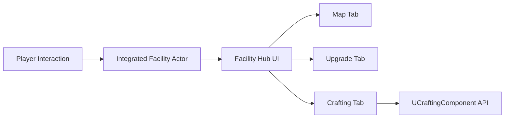

# 아이템 제작 API 설계 및 구현 결과

## 1. 실제 UI 흐름

제작은 어떤 전용 작업대와 상호작용하자마자 열리는 독립 UI가 아니다.

1. 플레이어가 통합 시설 액터와 Interaction한다.
2. 통합 시설의 최상위 허브 UI가 열린다.
3. 허브 UI에는 지도, 강화, 제작 등의 탭이 있다.
4. 플레이어가 제작 탭을 선택한다.
5. 허브 UI가 `UCraftingComponent::OpenCraftingScreen(ContextActor)`를 호출한다.
6. 서버가 해당 액터와 거리 및 제작 접근 컴포넌트를 검증한다.
7. 검증 성공 후 `OnCraftingScreenOpened`가 발생하고 제작 화면 집합을 표시한다.

따라서 신규 제작 시스템은 통합 시설의 Interaction이나 최상위 허브 UI를 소유하지 않는다. 제작 탭이 선택된 뒤의 제작 기능만 담당한다.



## 2. 목표

- 모든 활성 제작법 목록 조회
- 선택 제작법의 필요 재료 조회
- 레시피 아이템이 없으면 재료 정보 은닉
- 재료별 현재량, 필요량, 충족 여부와 최대 제작 가능 횟수 제공
- 서버 권한의 재료 검증, 원자적 차감, 결과 지급
- 인벤토리 또는 승인된 외부 시스템으로 결과 전달
- Data Table에서 제작법 편집
- 기존 `UItemSubsystem`과 `UInventoryComponent` 기능 보존

기존 `UCrafterComponent`는 Legacy이며 사용하거나 확장하지 않는다.

## 3. 런타임 구성

### `UCraftingAccessComponent`

통합 시설 액터에 붙이는 신규 Actor Component다.

이 컴포넌트는 Interaction을 처리하거나 UI를 생성하지 않는다. 통합 시설이 제작 탭을 제공할 수 있다는 사실과 다음 서버 검증 정보만 제공한다.

- 제작 화면을 사용할 수 있는 거리 `UseDistance`
- 외부 제작 결과 수신기 allowlist `AllowedExternalReceivers`

지도나 강화 시스템은 각자의 컴포넌트를 같은 통합 시설 액터에 붙일 수 있다.

### `UCraftingComponent`

`ABasePlayer`에 기본 부착되는 신규 replicated Actor Component다.

담당:

- 통합 시설을 현재 제작 Context로 등록
- 제작 탭 진입과 종료의 서버 검증
- UI용 제작 목록 및 상세 View 생성
- 레시피 아이템 보유 여부 판정
- 서버 제작 RPC와 중복 요청 방지
- 재료 차감과 결과 지급
- UI 이벤트 전달

중요 API:

```cpp
void OpenCraftingScreen(AActor* ContextActor);
void CloseCraftingScreen();
AActor* GetCurrentCraftingContext() const;

TArray<FCraftingListEntry> GetCraftableList(
    const FCraftingListQuery& Query) const;

bool GetCraftingDetails(
    FName RecipeId,
    int32 CraftCount,
    FCraftingDetailsView& OutDetails) const;

void RequestCraft(FCraftingRequest Request);
```

UI 이벤트:

- `OnCraftingScreenOpened(ContextActor)`
- `OnCraftingScreenClosed`
- `OnCraftingResult(Result)`
- `OnCraftingDataChanged`

### `UItemSubsystem`

기존 아이템 Subsystem에 신규 제작법 캐시를 별도로 추가했다.

- 기존 `FindRecipe(TMap<...>)` 및 Legacy 캐시는 유지
- 신규 제작법은 Data Table RowName인 `RecipeId`로 조회
- 활성 제작법을 `SortOrder`, RowName 순으로 반환
- 제작법 데이터 검증 제공

신규 API:

```cpp
const FCraftingRecipeRow* FindCraftingRecipe(FName RecipeId) const;
void GetCraftingRecipeIds(
    TArray<FName>& OutRecipeIds,
    bool bIncludeDisabled = false) const;
bool ValidateCraftingRecipes(TArray<FString>& OutErrors) const;
```

### `UInventoryComponent`

기존 함수와 슬롯 동작은 유지했다.

보존된 기존 API:

- `AddMaterial`
- `RemoveMaterial`
- `GetMaterialCount`
- 슬롯 클릭, 커서, Storage 전송, replication

추가한 일반 아이템 wrapper:

- `AddItem`
- `RemoveItem`
- `GetItemCount`
- `CanAddItem`

추가한 제작 트랜잭션:

- `TryApplyCraftingTransaction`
- `RemoveItemsAtomically`
- `AddItemsAtomically`

인벤토리 출력에서는 재료 차감과 결과 추가를 임시 슬롯 배열에서 먼저 계산한 뒤 한 번에 commit한다.

## 4. 제작법 Data Table

에셋:

`/Game/Blueprints/Item/DT_CraftingRecipes`

설정:

```ini
[/Script/ArtisticSWCore.Settings_Item]
CraftingRecipeDataTable=/Game/Blueprints/Item/DT_CraftingRecipes.DT_CraftingRecipes
```

Row Struct는 `FCraftingRecipeRow`이다.

| 필드 | 의미 |
|---|---|
| RowName | 안정적인 `RecipeId` |
| `ResultItemTag` | 결과 `Item.Id.*` 태그 |
| `ResultQuantity` | 1회 결과 수량 |
| `RequiredRecipeItemTag` | 필요한 레시피 아이템, 없으면 빈 태그 |
| `bConsumeRecipeItem` | 일회용 레시피일 때만 true |
| `Ingredients` | 재료 태그와 1회 필요 수량 배열 |
| `bEnabled` | 목록 노출 및 제작 가능 여부 |
| `SortOrder` | UI 정렬 순서 |

기획 수량이 제공되지 않아 현재 Data Table 행은 비어 있다. 실제 제작법은 에디터에서 입력한다.

아이템 이름, 아이콘, 분류, 희귀도, 최대 스택은 기존 `ItemFeatureDataTable`과 `DA_ItemData`를 계속 사용한다.

## 5. 제작 탭 진입 검증

허브 UI가 제작 탭 버튼을 눌렀다고 즉시 제작 화면으로 전환하지 않는다.

`OpenCraftingScreen(ContextActor)` 호출 후 서버가 다음을 검사한다.

- ContextActor가 유효한가
- ContextActor에 `UCraftingAccessComponent`가 있는가
- 플레이어가 `UseDistance` 이내에 있는가

성공하면 소유 클라이언트에 `OnCraftingScreenOpened`가 발생한다. 허브 UI는 이 이벤트를 받은 뒤 WidgetSwitcher를 제작 화면으로 전환한다.

실패하면 이벤트가 발생하지 않으므로 허브 기본 화면을 유지한다.

제작 탭을 떠나 지도/강화 탭으로 이동하거나 허브를 닫으면 `CloseCraftingScreen()`을 호출한다.

## 6. 목록과 상세 조회

목록:

```cpp
GetCraftableList(FCraftingListQuery)
```

Query:

- `SearchText`
- `bIncludeLocked`
- `bIncludeDisabled`

목록 Entry:

- `RecipeId`
- `ResultItemTag`
- `DisplayName`
- `Icon`
- `CategoryTag`
- `RarityTag`
- `ResultQuantity`
- `Availability`

상세:

```cpp
GetCraftingDetails(RecipeId, CraftCount, OutDetails)
```

상세 결과:

- 결과 아이템 Header
- 필요한 레시피 아이템 태그
- 재료 표시 가능 여부
- 재료별 현재량, 필요량, 충족 여부
- 최대 제작 가능 횟수
- 현재 Availability

레시피 아이템이 없으면 API가 다음을 강제한다.

- `Availability == MissingRecipe`
- `bIngredientsVisible == false`
- `Ingredients.Num() == 0`

## 7. 서버 제작 흐름

제작 요청:

```cpp
void RequestCraft(FCraftingRequest Request);
```

요청 필드:

- `RequestId`: 비어 있으면 자동 생성
- `RecipeId`
- `CraftCount`: 서버 기본 상한 99
- `Output.Type`: `Inventory` 또는 `ExternalReceiver`
- `Output.ReceiverActor`: 외부 출력일 때만 사용

서버 처리:

1. 중복 RequestId 차단
2. 제작법 존재와 활성 상태 확인
3. 제작 횟수 확인
4. 현재 통합 시설 Context와 거리 재검증
5. 필수 레시피 아이템 확인
6. 총 재료 비용 재계산
7. 모든 재료 보유량 확인
8. 결과 수량 overflow 확인
9. 인벤토리 출력이면 차감과 지급을 원자적으로 commit
10. 외부 출력이면 Context의 allowlist와 인터페이스 확인
11. 외부 지급 실패 시 재료 rollback
12. `OnCraftingResult` 반환

클라이언트가 계산한 보유량, 필요량, 제작 가능 상태, 결과 수량은 서버가 신뢰하지 않는다.

## 8. 외부 출력

외부 시스템은 `ICraftingOutputReceiver`를 구현한다.

```cpp
bool CanReceiveCraftedItem(
    FGameplayTag ItemTag,
    int32 Quantity,
    AActor* CraftingOwner) const;

bool ReceiveCraftedItem(
    FGameplayTag ItemTag,
    int32 Quantity,
    AActor* CraftingOwner);
```

수신 액터는 통합 시설의 `UCraftingAccessComponent.AllowedExternalReceivers`에도 등록되어야 한다.

## 9. 실패 사유

- `Success`
- `InvalidRecipe`
- `RecipeDisabled`
- `MissingRecipe`
- `NoActiveContext`
- `OutOfRange`
- `InvalidQuantity`
- `MissingIngredients`
- `OutputUnavailable`
- `OutputRejected`
- `DuplicateRequest`
- `InternalError`

`NoActiveContext`는 제작 탭 진입이 완료되지 않았거나 허브 Context가 사라졌음을 뜻한다.

## 10. 태그와 데이터 주의사항

Data Table에는 C++ 변수명 `Item_Id_...`가 아니라 실제 Gameplay Tag `Item.Id....`를 입력한다.

나무 항목의 실제 기준:

- C++ 변수: `Item_Id_Material_WeaponMaterial_Wood`
- 실제 태그: `Item.Id.Material.WeaponMaterial.Wood`

신규 제작법에는 구형 `Item.Material.*`가 아니라 `Item.Id.*`를 사용한다.

## 11. 자동 검증

테스트:

`ArtisticSW.Crafting.FullPipeline`

검증 항목:

- 통합 시설 액터에 `UCraftingAccessComponent` 구성
- 허브의 제작 탭 호출에 해당하는 `OpenCraftingScreen`
- 서버 검증 후 제작 Context 등록
- 제작 목록 및 상세 조회
- 레시피 미보유 시 재료 은닉
- 원자적 재료 차감과 결과 지급
- 중복 요청 차단
- 재료 부족 시 무차감 실패

결과:

`Result={Success} Name={FullPipeline}`

로그:

`Saved/Logs/Codex_CraftingHubPipeline.log`

## 12. 남은 UI 콘텐츠 작업

1. 통합 시설 BP에 `CraftingAccessComponent` 추가
2. 통합 시설의 기존 Interaction에서 허브 UI 열기
3. 허브 UI에 지도·강화·제작 탭 구성
4. 제작 탭에 제작 화면 Widget 집합 배치
5. 제작 탭 버튼에서 `OpenCraftingScreen(ContextActor)` 호출
6. 실제 제작법을 `DT_CraftingRecipes`에 입력
7. [Crafting_UI_BP_Integration_Guide.md](./Crafting_UI_BP_Integration_Guide.md)에 따라 이벤트와 위젯 연결

