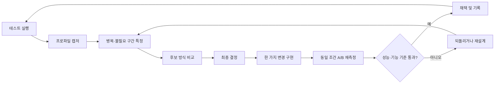

# How to Profile: 물·파동·수영·부력·물리·렌더

작성일: 2026-07-16  
대상 엔진: Unreal Engine 5.7  
대상 프로젝트: `ArtisticSW2026`  
출발 맵: `KKH_Test`  
후보 분석: [물·파동·수영·부력·물리·렌더 최적화 분석](./Water_Wave_Swimming_Buoyancy_Physics_Render_Optimization_Analysis.md)

첫 실행 기록: [Ripple 최적화 01: 기준선과 Revision Gate](./Ripple_Profile_01_Baseline_and_Revision_Gate.md)

## 1. 문서의 목적

이 문서는 최적화 아이디어를 바로 구현하기 위한 문서가 아니다. 다음 과정을 반복 가능하게 만들기 위한 실행 지침이다.



핵심 원칙은 다음과 같다.

> 프로파일에 나타나지 않은 문제를 추측으로 최적화하지 않는다. 한 번에 하나의 가설만 검증하고, 같은 조건의 전후 데이터로 채택 여부를 결정한다.

## 2. 프로파일링의 기본 원칙

### 2.1 FPS보다 frame time을 본다

| 목표 FPS | 전체 frame budget |
|---:|---:|
| 30 FPS | 33.33ms |
| 60 FPS | 16.67ms |
| 120 FPS | 8.33ms |

FPS는 비선형이므로 최적화 효과를 비교하기 어렵다. 예를 들어 30→40 FPS와 100→110 FPS는 같은 10 FPS 증가지만 절약한 시간은 전혀 다르다. 모든 결과는 ms, 호출 수, bytes/sec, allocation 수처럼 선형 단위로 기록한다.

### 2.2 평균만 보지 않는다

각 테스트는 최소 3회, 가능하면 5회 반복하고 다음 값을 기록한다.

- Median: 일반적인 지속 비용
- P95: 자주 체감되는 느린 프레임
- P99 또는 Max: hitch 후보
- 표준편차 또는 run-to-run 범위: 측정 노이즈

평균이 좋아졌더라도 P95/P99가 악화되면 물리 correction, Lock 경합, 간헐적 배열 재할당 같은 문제가 생겼을 수 있다.

### 2.3 빠른 진단과 최종 수치를 구분한다

- PIE: 기능 확인, 대략적인 병목 위치, 계측 이름 확인
- Standalone/New Process: Editor viewport 영향을 줄인 중간 확인
- Development 또는 Test 독립 실행 파일: 최종 CPU/GPU/network 기준값
- 전용 서버 + 별도 클라이언트 프로세스: 복제와 Network Physics 최종 측정

Editor는 Slate, asset 관리, Editor world, 디버그 기능의 비용을 포함한다. PIE 수치는 최종 제품 성능으로 기록하지 않는다.

### 2.4 한 번에 하나만 바꾼다

다음을 동시에 바꾸면 무엇이 효과를 냈는지 알 수 없다.

- Ripple snapshot 구조 변경
- WaterInfo 해상도 축소
- Ship state 양자화
- Storage Tick 빈도 변경

한 변경을 적용하고 같은 capture를 반복한 뒤 채택·기각한다.

### 2.5 프로파일러의 오버헤드를 기록한다

Trace, memory allocation callstack, verbose named event, GPU capture는 모두 실행 비용을 추가한다. 따라서 서로 다른 계측 모드의 절대 시간을 직접 비교하지 않는다.

예:

- CPU baseline과 CPU optimized는 같은 trace channel 사용
- Memory trace 결과는 memory trace를 켠 실행끼리 비교
- RenderDoc capture frame은 GPU 절대 성능 기준이 아니라 draw/resource 진단에 사용

## 3. 테스트 맵이 갖춰야 할 조건

### 3.1 KKH_Test와 프로파일 맵의 역할

`KKH_Test`는 Player, Ship, Storage가 수면 위로 낙하하고 기능을 눈으로 확인하기에 적합하다. 그러나 대량 객체와 반복 시나리오를 수동 배치하면 재현성이 떨어진다.

권장 구조:

- `KKH_Test`: 기능 회귀와 빠른 PIE 확인 유지
- `KKH_Profile_Water`: 성능 전용 맵 또는 `KKH_Test` 복제본
- `BP_SWProfileScenarioController`: 프로파일 시나리오를 서버에서 통제

프로파일 전용 맵을 만드는 이유는 예쁜 장면을 만들기 위해서가 아니라, 매 실행에서 같은 부하를 만드는 데 있다.

### 3.2 필수 액터와 장치

프로파일 맵은 최소한 다음을 포함해야 한다.

- 실제 게임과 동일한 WaterZone, Ocean WaterBody, Water Material
- PlayerStart와 수영 구간
- 실제 Network Physics 설정을 쓰는 Ship 1척
- 실제 `SWBuoyancyComponent`를 쓰는 Storage 1개
- Storage/Ship을 지정 수만큼 생성할 수 있는 deterministic spawner
- 서버에서 지정 시각에 Ripple을 생성하는 trigger/sequencer
- 고정된 render profiling camera
- 수면 근접, 원거리, 수중 camera bookmark
- 각 phase의 시작과 종료를 남기는 trace bookmark
- 현재 객체 수, 활성 Ripple 수, query 수를 표시하거나 trace counter로 기록하는 계측

### 3.3 시나리오의 결정성

다음 값은 실행마다 고정한다.

- random seed
- Actor spawn transform과 순서
- Ship/Storage 초기 속도
- Ripple Event 수, 위치, StartTime 간격, 파라미터
- Player 이동 경로와 입력 재생
- 카메라 위치, 방향, FOV
- Scalability, 해상도, screen percentage
- network emulation 설정
- warm-up과 capture 길이

Player를 사람이 직접 움직이면 매번 수면 쿼리 횟수와 화면 구성이 달라진다. 성능 capture에서는 Enhanced Input replay, 정해진 spline 이동, 또는 서버가 통제하는 자동 이동을 사용한다. 수동 조작은 기능 확인에만 쓴다.

### 3.4 객체 간 간섭을 분리한다

대량 Storage가 서로 충돌하면 Water query가 아니라 Chaos collision 비용을 측정하게 된다. 목적에 따라 lane을 분리한다.

- Buoyancy-only lane: 서로 충돌하지 않거나 충분히 떨어진 배치
- Buoyancy+collision lane: 실제 밀집 상황
- Ship lane: 배끼리 충돌하지 않는 항해 구간
- Combined lane: 최종 실전 부하

두 결과를 별도로 기록해야 “부력이 느린지, 충돌이 느린지”를 구분할 수 있다.

### 3.5 Streaming과 초기화

- 필요한 level과 shader가 준비되기 전에 capture하지 않는다.
- 최소 10~30초 warm-up 후 capture한다.
- 첫 실행의 shader/PSO/asset load hitch는 steady-state 결과와 분리한다.
- streaming hitch를 조사하는 별도 capture가 아니라면 카메라 이동 전 필요한 셀을 미리 로드한다.
- GC가 capture에 포함되었는지 bookmark나 Insights로 확인한다.

초기화 비용도 중요한 경우 `Cold Start` 시나리오로 따로 측정한다. Cold Start와 steady-state를 한 통계에 섞지 않는다.

### 3.6 렌더 측정 조건

- 고정 해상도: 우선 1920×1080, 실제 목표 해상도도 별도 측정
- `r.VSync 0`
- `t.MaxFPS 0` 또는 동일한 cap
- 동일 Scalability와 Device Profile
- 동일 camera와 화면 내 water coverage
- 다른 창이 GPU를 점유하지 않도록 정리
- GPU 온도와 clock이 안정된 뒤 측정
- Dynamic Resolution을 사용한다면 고정 screen percentage 결과와 실제 동적 결과를 각각 보관

화면에 물이 10% 보이는 장면과 80% 보이는 장면의 Water pass 비용은 직접 비교할 수 없다.

### 3.7 네트워크 측정 조건

- 서버와 클라이언트 역할을 명시
- 최종 테스트는 전용 서버 사용
- 가능하면 서버와 render client를 다른 PC에서 실행
- 한 PC에서 실행하면 CPU/GPU 경쟁이 있으므로 절대 성능이 아니라 기능·패킷 구조 확인용으로 표시
- 서버 outbound, client inbound, client outbound를 구분
- 0ms/0% loss baseline 후 현실적인 lag/loss 조건 측정
- 각 프로세스의 trace 파일명을 역할별로 분리

현재 프로젝트는 60Hz async physics와 Network Physics history/prediction을 사용한다. 렌더 FPS 제한을 바꾸더라도 async fixed step 설정은 테스트 도중 변경하지 않는다.

## 4. 표준 부하 시나리오

### 4.1 단일 시스템 시나리오

| ID | 목적 | 구성 |
|---|---|---|
| W0 | 물 렌더 baseline | Water만, Ripple 0, 물리 객체 0 |
| P1 | Player 수영 | Player 1, 고정 수영 경로 |
| R1 | Ripple query scaling | Ripple 0 / 8 / 32 |
| B1 | Storage 단일 | Storage 1, pontoon과 force 정확성 확인 |
| B100 | Storage scale | Storage 100, 충돌 분리 |
| B500 | Storage stress | Storage 500, 구조적 scaling 확인 |
| S1 | Ship 단일 | Ship 1, Network Physics 활성 |
| S10 | Ship scale | Ship 10 |
| S50 | Ship stress | Ship 50 |
| G1 | GPU water | 고정 camera, 물 화면 점유율 높음 |

### 4.2 결합 시나리오

- C-Normal: 실제 목표 동시 객체 수와 평균 Ripple 수
- C-Peak: 게임에서 허용 가능한 최대 동시 객체와 Ripple burst
- C-Network: 4/16 client, Ship/Storage/Ripple이 함께 보이는 상태
- C-BadNet: 목표 RTT와 packet loss에서 Ship rollback 및 Storage 보간 확인

Stress 수치는 제품 목표가 아니다. 비용이 객체 수에 따라 선형인지, 특정 임계점에서 급증하는지 찾기 위한 것이다.

### 4.3 권장 phase timeline

한 실행에서 phase를 자동 진행하되 각 phase를 bookmark로 구분한다.

| 시간 | Phase | 작업 |
|---:|---|---|
| 0~20초 | Warmup | asset/shader/physics 안정화, 기록 제외 |
| 20~35초 | Idle | Water only baseline |
| 35~50초 | Ripple | 정해진 8/32 event 생성 |
| 50~65초 | Swim | Player 자동 수영 |
| 65~80초 | Storage | 지정 수 Storage 활성 |
| 80~95초 | Ship | Ship 자동 입력 |
| 95~110초 | Combined | 모든 시스템 동시 활성 |
| 110~120초 | Cooldown | capture 종료 준비 |

긴 실행 하나보다 짧고 명확한 capture가 분석하기 쉽다. Memory leak나 장시간 time precision은 별도 long-run 시나리오로 분리한다.

## 5. 실행 환경 기록

모든 결과에 다음 metadata를 남긴다.

```text
Date:
Git commit / dirty state:
UE version:
Build configuration:
Executable / role:
Map / scenario ID:
Machine / CPU / GPU / RAM:
OS / GPU driver:
Resolution / screen percentage:
Scalability / Device Profile:
VSync / FPS cap:
Async physics step:
Server count / client count:
PktLag / PktLoss:
Trace channels:
Warm-up / capture duration:
Notes:
```

Git dirty state가 다르면 같은 commit 이름만 기록해서는 부족하다. 실험용 변경 파일 목록도 함께 남긴다.

## 6. 실행 모드 선택

| 목적 | 권장 실행 |
|---|---|
| 빠른 기능 확인 | PIE Client mode |
| console stat 확인 | PIE 또는 Standalone |
| Game Thread/수영 코드 탐색 | Development Editor 또는 Game 독립 프로세스 |
| GPU 최종 수치 | Development/Test packaged client |
| Ship/Storage 복제 | 전용 서버 + 별도 client |
| 서버 CPU/패킷 | Development server, `-NullRHI` 가능 |
| Memory allocation callstack | Development + 시작 시 memory trace |
| VS CPU sampling | Development exe + 일치하는 PDB |

Debug/DebugGame은 코드 최적화가 달라 최종 성능 판단에 적합하지 않다. Test 빌드는 최적화가 켜진 제품 근접 측정에 좋지만 일부 stat/console 또는 LLM 기능의 가용성이 달라질 수 있으므로 Development baseline을 먼저 확보한다.

## 7. Unreal 기본 도구: 빠른 triage

### 7.1 먼저 `stat unit`

```text
stat unit
stat unitgraph
```

해석:

- Frame ≈ Game: Game Thread 또는 GT가 기다리는 작업 의심
- Frame ≈ Draw: Render Thread 병목 의심
- Frame ≈ GPU: GPU 병목 의심
- 큰 간헐 spike: GC, streaming, shader/PSO, lock, network correction 등 별도 확인

`stat unit`은 원인을 확정하지 않는다. 다음에 어떤 profiler를 열지 정하는 분류기다.

### 7.2 이 프로젝트에 유용한 stat 명령

```text
stat game
stat water
stat chaos
stat chaosthread
stat physics
stat gpu
stat scenerendering
stat rhi
stat memory
stat llm
stat net
```

로컬 UE 5.7 source에서 `STATGROUP_Water`, `STATGROUP_Chaos`, `STATGROUP_ChaosThread`가 존재함을 확인했다. 특정 build에서 그룹이 표시되지 않으면 `stat` 자동완성으로 실제 이름을 확인한다.

용도:

- `stat water`: Water subsystem/mesh 관련 큰 비용 확인
- `stat chaos`, `stat chaosthread`: solver, lock wait, physics advance 확인
- `stat gpu`: 실시간 GPU pass 변화 관찰
- `stat scenerendering`, `stat rhi`: draw/primitive/resource 규모 확인
- `stat net`: 현재 packet/actor channel 개요
- `stat memory`, `stat llm`: 메모리 큰 분류 확인

### 7.3 legacy Stats capture

```text
stat startfile
stat stopfile
```

결과는 일반적으로 `Saved/Profiling/UnrealStats`에 저장되며 Session Frontend의 Profiler에서 열 수 있다. `stat stopfile`을 잊으면 파일이 계속 커질 수 있다.

새로운 상세 분석은 Unreal Insights를 우선 사용하되, 기존 stat group을 길게 기록하거나 빠르게 공유할 때 유용하다.

## 8. Unreal Insights

### 8.1 설치 위치

현재 로컬 UE 5.7 설치에서 확인한 실행 파일:

```text
C:\Program Files\Epic Games\UE_5.7\Engine\Binaries\Win64\UnrealInsights.exe
```

Editor 하단 Trace 메뉴로 시작하거나 위 실행 파일을 직접 열 수 있다.

### 8.2 권장 trace channel preset

모든 channel을 한 번에 켜지 않는다.

| 목적 | channel/option |
|---|---|
| CPU 기본 | `cpu,frame,bookmark,counter` |
| Task/멀티스레드 | 위 + `task,contextswitch` |
| GPU timeline | 위 + `gpu` |
| Network | `cpu,frame,bookmark,net` + `-NetTrace=1` |
| Memory | `default,memory,metadata,assetmetadata`를 프로세스 시작부터 |
| Log 연계 | 필요한 capture에만 `log` |

정확한 channel 이름은 UE 5.7 Insights Session Browser/Trace status에서 확인한다. `contextswitch`는 데이터 양과 권한 요구가 늘 수 있으므로 멀티스레드 조사 때만 켠다.

### 8.3 console에서 파일 capture

```text
Trace.File SW_Water_Baseline.utrace cpu,frame,bookmark,counter,task
Trace.Status
Trace.Stop
```

경로를 생략하면 일반적으로 `Saved/Profiling` 아래에 생성된다. 파일명은 다음 규칙을 권장한다.

```text
YYYYMMDD_Scenario_Role_Build_Run_Change.utrace
20260716_B100_Server_Development_R01_Baseline.utrace
20260716_B100_Server_Development_R01_SnapshotRevision.utrace
```

### 8.4 command line 자동 capture

예시 형식:

```text
ArtisticSW2026.exe -trace=cpu,frame,bookmark,counter,task -tracefile=Saved/Profiling/SW_Baseline.utrace
```

Editor 기반 별도 game process 예시:

```text
UnrealEditor.exe ArtisticSW2026.uproject /Game/New/Level/KKH_Test -game -ResX=1920 -ResY=1080 -windowed -NoVSync -trace=cpu,frame,bookmark,counter,task
```

command-line spelling과 channel은 실행 후 `Trace.Status`로 확인한다.

### 8.5 Timing Insights 분석 순서

1. bookmark로 Warmup을 제외하고 동일 phase 범위를 선택한다.
2. Game Thread, Render Thread, RHI Thread, Task threads, Physics/Chaos 관련 thread를 확인한다.
3. 선택 구간의 Timing Event aggregation을 연다.
4. Total/Inclusive Time으로 상위 시스템을 찾는다.
5. Self/Exclusive Time으로 실제로 시간을 소비하는 leaf를 찾는다.
6. Count를 함께 본다.
7. 한 프레임의 spike와 전체 구간의 지속 비용을 분리한다.
8. Wait/idle을 계산으로 오해하지 않는다.

판정 예:

- `GetRippleHeight` total이 크고 self는 작음: 하위 evaluator 또는 lock/Water query가 원인
- 함수 1회 비용은 작지만 count가 매우 큼: query 중복 또는 batching 후보
- Game Thread가 Physics 완료를 기다림: GT 함수를 줄이기 전에 PT/lock/동기화 확인
- 여러 worker가 짧게 실행되지만 task dispatch가 큼: 지나친 미세 병렬화 의심

### 8.6 Task/멀티스레드 분석

다음을 확인한다.

- 실제 동시에 실행된 worker 수
- task enqueue와 실행 사이 대기
- Game Thread가 task 완료를 기다리는 구간
- lock 또는 event wait
- Physics Thread와 Game Thread의 sync point
- 작은 task 수가 지나치게 많은지
- 한 worker에만 일이 몰렸는지

“스레드가 여러 개 보인다”는 것은 최적화가 아니다. frame critical path가 짧아졌는지가 기준이다.

## 9. GPU 프로파일링

### 9.1 1차 분류

```text
stat gpu
profilegpu
```

- `stat gpu`: 장면을 움직이며 pass 변화 관찰
- `profilegpu`: 특정 frame의 GPU Visualizer를 열어 pass hierarchy 분석

고정 카메라에서 다음을 비교한다.

- Ripple 0 / 8 / 32
- Ocean Foam On / Off
- Water Mesh tessellation 6 / 5
- WaterInfo 1024 / 512
- 수면 화면 점유율 낮음 / 높음

각 비교는 하나의 변수만 바꾼다.

### 9.2 Water 렌더에서 볼 값

- Water/Single Layer Water 관련 pass ms
- BasePass와 translucency/reflection 영향
- Water Mesh draw/primitive/vertex 규모
- Ocean Foam permutation 비용
- WaterInfo update pass
- Ripple 수 증가에 따른 pass 기울기
- Render Thread의 texture upload command와 MID update CPU 비용

Ripple 이벤트 수를 늘렸는데 GPU water pass가 선형 증가하면 shader analytic loop 후보가 된다. GPU 시간은 그대로인데 Render Thread만 증가하면 CPU-side texture/MID 작업이 후보다.

### 9.3 RenderDoc

`profilegpu`로 비싼 pass를 찾은 뒤 RenderDoc으로 해당 frame을 조사한다.

- 실제 draw event 수
- bound shader와 resource
- Ripple texture 내용과 format
- overdraw와 render target
- Water material permutation
- 예상치 못한 texture upload 또는 barrier

RenderDoc은 원인을 해부하는 도구이며 지속 frame time 통계 도구가 아니다. capture frame 자체의 절대 시간은 baseline으로 쓰지 않는다.

### 9.4 VS GPU Usage의 위치

Visual Studio Performance Profiler의 GPU Usage도 Direct3D 활동을 볼 수 있다. 하지만 Unreal pass 이름과 RDG/Material 맥락은 `ProfileGPU`와 RenderDoc이 더 직접적이다. VS GPU Usage는 OS 관점의 CPU/GPU 겹침이나 Present/VSync 문제를 보조 확인할 때 사용한다.

## 10. Network 프로파일링

### 10.1 Networking Insights를 주 도구로 사용

서버와 클라이언트를 다음 option으로 시작한다.

```text
-trace=cpu,frame,bookmark,net -NetTrace=1 -tracehost=localhost
```

파일 capture를 쓴다면 역할별 파일을 분리한다.

```text
..._Server.utrace
..._Client01.utrace
..._Client02.utrace
```

Networking Insights에서 확인할 항목:

- packet timeline과 packet size
- connection별 송수신
- replicated Actor/Object
- property와 RPC가 차지하는 bits
- Ripple FastArray delta
- Ship Network Physics state/input
- Storage ReplicateMovement
- 전송 빈도와 burst

서버가 replicated property를 생성하므로 bandwidth 원인 분석의 중심은 서버 trace다. 클라이언트 trace는 수신 처리, client RPC, correction 체감을 확인한다.

### 10.2 질문별 측정법

| 질문 | 확인 값 |
|---|---|
| Ripple event 1개가 몇 byte인가? | event 직전/직후 packet content와 delta bits |
| Ship state가 과한가? | state property size × send count × relevant clients |
| 정적 값이 반복되는가? | 같은 property가 매 state sample에 나타나는지 |
| AlwaysRelevant가 문제인가? | connection 수 증가에 따른 동일 actor bytes 기울기 |
| Storage가 너무 자주 갱신되는가? | movement replication count, bytes/sec, 시각 품질 |
| packet 압축이 필요한가? | 먼저 property payload, header, bunch 분포를 분리 |

### 10.3 간단한 runtime 확인

```text
stat net
net.ActorReport
net.DumpRelevantActors
```

이 명령은 빠른 상태 확인용이다. 최종 byte 판정은 Networking Insights packet content를 사용한다.

### 10.4 Network emulation

UE 5.7은 Editor Preferences의 Network Emulation 또는 console command를 지원한다.

예시:

```text
Net PktLag=100
Net PktLagVariance=20
Net PktLoss=1
```

권장 단계:

| Profile | RTT/지연 예 | Loss | 목적 |
|---|---:|---:|---|
| Ideal | 0ms | 0% | 순수 bandwidth/CPU baseline |
| Normal | 목표 지역 평균 | 0~1% | 일반 플레이 |
| Bad | 높은 RTT | 2~5% | rollback/correction 내성 |

Network Physics에서는 bytes만 보지 않고 다음을 함께 기록한다.

- rollback 발생 횟수
- resimulation frame 수
- correction magnitude
- Physics Thread 추가 시간
- 체감 위치/회전 오류

### 10.5 레거시 Network Profiler

UE는 `networkprofiler=true` 또는 `netprofile enable/disable`로 `.nprof` capture를 지원해 왔다. 다만 현재 로컬 UE 5.7 Launcher 설치에는 문서에 언급되는 `NetworkProfiler.exe`가 확인되지 않았다. 따라서 이 프로젝트의 표준 workflow는 Networking Insights로 정한다. 별도 source build/tool 설치로 실행 파일을 확보한 경우에만 보조 도구로 사용한다.

## 11. Memory·할당 프로파일링

### 11.1 Memory Insights

Memory allocation callstack은 프로세스 시작부터 memory channel이 필요하다.

```text
ArtisticSW2026.exe -trace=default,memory,metadata,assetmetadata
```

Development build와 일치하는 PDB가 있어야 callstack과 source symbol을 제대로 해석할 수 있다.

확인할 항목:

- frame마다 반복되는 작은 allocation
- `TArray` capacity 증가와 해제 반복
- Ship GT→PT 입력 배열 복사
- Ripple texture capture buffer allocation
- snapshot 교체 전후 live allocation
- 장시간 실행 후 살아 있는 allocation

Memory Insights에서는 두 시점 A/B 사이의 growth, 특정 시점에 살아 있는 allocation, allocation callstack 기준 grouping을 사용한다.

### 11.2 LLM

```text
-LLM
-LLMCSV
stat LLM
stat LLMFULL
```

`-LLMCSV` 결과는 일반적으로 `Saved/Profiling/LLM`에 기록된다. LLM은 큰 메모리 분류와 시간 변화에 적합하고, 개별 `TArray` churn은 Memory Insights가 더 적합하다.

### 11.3 이 프로젝트에서 먼저 볼 allocation

- `GetEventsSnapshot`/`GetActiveEventsSnapshot`의 배열 복사
- Ship의 Pontoon/Gerstner/Ripple async input arrays
- `FAsyncInputShip::Reset`의 `Empty()` 이후 재할당
- Ripple texture command가 캡처하는 임시 `TArray<FLinearColor>`
- Ripple 발생 시 Pawn 검색 임시 배열
- Storage/Swimming query 내부 임시 결과

allocation이 관측되었다고 바로 custom allocator를 도입하지 않는다. 먼저 수명, capacity 재사용, snapshot 변경 빈도를 고친다.

## 12. CSV Profiler

CSV Profiler는 장시간 반복 테스트와 자동 비교에 적합한 저비용 frame profiler다.

```text
csvprofile start
csvprofile stop
csvprofile frames=600
```

결과는 `Saved/Profiling/CSV`에 저장된다. 현재 로컬 UE 5.7에는 다음 변환 도구도 존재한다.

```text
C:\Program Files\Epic Games\UE_5.7\Engine\Binaries\DotNET\CsvTools\CSVToSVG.exe
```

활용:

- nightly/per-commit 성능 회귀
- 600 frame median/P95 비교
- scenario event와 시간 그래프 연계
- Ship/Storage 수 증가에 따른 slope 자동 비교

GPU CSV stat은 추가 overhead가 있으므로 필요할 때 `r.GPUCsvStatsEnabled 1` 또는 command-line GPU CSV option을 사용하고 같은 조건끼리 비교한다.

## 13. 소스 코드 계측

### 13.1 계측 위치 선정 원칙

처음부터 모든 함수에 timer를 넣지 않는다. 다음 경계에 넓은 scope를 먼저 추가한다.

- 전체 Water query batch
- Ripple snapshot 취득/평가
- Swimming 한 movement step의 water query
- Storage 한 component tick의 전체 buoyancy
- Ship GT input marshal
- Ship PT buoyancy step
- Ripple render pack/upload/bind

그 scope가 실제 상위 병목일 때만 내부를 나눈다.

### 13.2 CPU trace scope

```cpp
#include "ProfilingDebugging/CpuProfilerTrace.h"

void FSWRippleEvaluator::Evaluate(...)
{
    TRACE_CPUPROFILER_EVENT_SCOPE(SW_Ripple_Evaluate);
    // Work
}
```

고정 이름을 우선 사용한다. 폰툰 ID나 Actor 이름을 매 호출 동적 문자열로 만들면 계측 자체가 allocation과 trace dictionary 비용을 만든다.

### 13.3 Counter와 Bookmark

```cpp
#include "ProfilingDebugging/CountersTrace.h"
#include "ProfilingDebugging/MiscTrace.h"

TRACE_DECLARE_INT_COUNTER(SWRippleEventsScanned, TEXT("SW/Ripple/EventsScanned"));
TRACE_DECLARE_INT_COUNTER(SWWaterQueries, TEXT("SW/Water/Queries"));

TRACE_COUNTER_SET(SWRippleEventsScanned, EventsScannedThisFrame);
TRACE_COUNTER_SET(SWWaterQueries, WaterQueriesThisFrame);

TRACE_BOOKMARK(TEXT("SWProfile Phase=Ripple32 Begin"));
```

Worker/PT에서 여러 thread가 동시에 갱신하는 값은 atomic counter 또는 thread-local 누적 후 frame 끝 합산을 사용한다. 매우 잦은 이벤트를 bookmark로 남기지 않는다. Bookmark는 phase, spawn 완료, Ripple burst 시작 같은 드문 사건에만 사용한다.

### 13.4 Stat group

```cpp
DECLARE_STATS_GROUP(TEXT("SW Water"), STATGROUP_SWWater, STATCAT_Advanced);
DECLARE_CYCLE_STAT(TEXT("Ripple Evaluate"), STAT_SWRippleEvaluate, STATGROUP_SWWater);

SCOPE_CYCLE_COUNTER(STAT_SWRippleEvaluate);
```

이후 console에서 다음처럼 확인할 수 있다.

```text
stat SWWater
```

`SCOPE_CYCLE_COUNTER`는 stat/trace 설정에 따라 Insights named event에도 연결할 수 있지만, 상세 CPU timeline의 표준은 명시적인 `TRACE_CPUPROFILER_EVENT_SCOPE`로 둔다.

### 13.5 CSV custom stat

```cpp
#include "ProfilingDebugging/CsvProfiler.h"

CSV_DEFINE_CATEGORY(SWWater, true);

CSV_SCOPED_TIMING_STAT(SWWater, RippleEvaluate);
CSV_CUSTOM_STAT(SWWater, WaterQueryCount, QueryCount, ECsvCustomStatOp::Set);
CSV_EVENT(SWWater, TEXT("RippleBurst Count=%d"), RippleCount);
```

CSV는 frame별 회귀 추적에 적합하다. 함수 호출 하나하나의 call tree는 Insights를 사용한다.

### 13.6 권장 프로젝트 counter

| Counter | 단위 | 목적 |
|---|---:|---|
| `SW/Water/QueryCount` | calls/frame | 중복 query 탐지 |
| `SW/Water/PositionsEvaluated` | points/frame | batch 크기 확인 |
| `SW/Ripple/EventsScanned` | events/frame | active/history 분리 효과 |
| `SW/Ripple/SnapshotCopies` | copies/frame | Revision cache 효과 |
| `SW/Ripple/SnapshotBytes` | bytes/frame | 복사량 |
| `SW/Buoyancy/ActiveBodies` | bodies | 실제 force 계산 수 |
| `SW/Buoyancy/Pontoons` | points/frame | 물리 부하 정규화 |
| `SW/Ship/GTMarshalBytes` | bytes/frame | GT→PT 전달량 |
| `SW/Ship/PTWaveEvaluations` | eval/frame | 수학량 |
| `SW/Ship/ResimFrames` | frames | network cost/품질 |
| `SW/Render/RippleUploads` | uploads/frame | 변경 기반 upload 검증 |
| `SW/Render/MIDBindings` | calls/frame | 바인딩 cache 검증 |

### 13.7 Cache hit의 두 의미

논리 cache와 CPU hardware cache를 구분한다.

- 논리 cache hit: WaterBody, Ripple snapshot, wave settings 등의 재사용 성공
- CPU hardware cache hit: L1/L2/L3에 데이터가 존재했는지

논리 cache는 소스 counter로 직접 측정한다.

```text
HitRate = Hits / (Hits + Misses)
```

hardware cache miss는 Unreal Insights timer만으로 확정할 수 없다. AoS/SoA 변경 필요성이 보일 정도로 PT loop가 CPU 상위 병목일 때 Windows Performance Analyzer나 CPU vendor profiler의 hardware counter를 별도 사용한다. 그 전에는 자료구조를 추측으로 다시 쓰지 않는다.

## 14. Visual Studio 프로파일링

### 14.1 준비

- `Development` Game 또는 Server target 빌드
- 실행 파일과 정확히 일치하는 PDB 보존
- 가능하면 packaged/client 또는 `-game` 독립 프로세스 대상
- Editor에 attach할 경우 Editor overhead가 포함됨을 기록
- Visual Studio workload에 Desktop development with C++와 profiling tools 설치

프로젝트에는 Game, Editor, Server Target이 모두 존재하므로 역할별 프로파일이 가능하다.

### 14.2 CPU Usage sampling

1. Visual Studio에서 `Alt+F2`로 Performance Profiler를 연다.
2. CPU Usage를 선택한다.
3. 실행 파일을 지정하거나 실행 중인 `ArtisticSW2026`, Server, `UnrealEditor` process에 attach한다.
4. Warmup 동안 collection을 끄거나 분석 범위에서 제외한다.
5. 정해진 phase만 10~30초 수집한다.
6. Call Tree, Modules, Functions, Caller/Callee를 본다.
7. 필요하면 Just My Code를 끄고 Engine/Windows call path를 확인한다.

Sampling을 먼저 사용하는 이유는 상대적으로 낮은 overhead로 실제 hot function을 찾을 수 있기 때문이다.

확인할 항목:

- `FSWRippleEvaluator::EvaluateHeight` sample 비율
- Water Plugin query 하위 call path
- Ship GT marshal과 PT evaluator
- lock/wait로 이어지는 call stack
- `TArray` allocation/copy path
- Render Thread texture update

### 14.3 Instrumentation

VS instrumentation은 함수 진입/종료를 계측해 호출 횟수와 시간을 더 자세히 볼 수 있지만 overhead가 크다.

사용 조건:

- sampling으로 module/function 후보가 좁혀짐
- 매우 짧고 자주 호출되어 sampling에서 잘 안 잡힘
- 대상 module 또는 좁은 실행 파일 범위를 선택할 수 있음

Instrumentation 결과를 비계측 baseline의 절대 frame time과 직접 비교하지 않는다. 특히 Chaos async/task scheduling과 lock timing을 왜곡할 수 있다.

### 14.4 Concurrency Visualizer

멀티스레드 문제에서는 다음을 본다.

- logical core 활용도
- thread별 실행/대기/동기화 시간
- cross-core migration과 context switch
- Game Thread blocking stack
- worker가 실제로 동시에 실행되는지
- 작은 task가 worker를 깨우기만 하고 유효 작업이 적은지

Ship PT나 Storage batch를 병렬화하기 전후로 critical path와 synchronization time을 비교한다. 평균 CPU 사용률이 높아졌지만 frame time이 줄지 않았다면 좋은 병렬화가 아니다.

### 14.5 Visual Studio와 Unreal Insights의 역할 분담

| 질문 | 우선 도구 |
|---|---|
| 어떤 UE thread/phase가 느린가? | Unreal Insights |
| 특정 C++ 함수의 call tree는? | Insights + VS CPU Usage |
| TaskGraph/GT/PT timing 관계는? | Unreal Insights |
| OS thread blocking/context switch는? | Insights context switch 또는 VS Concurrency Visualizer |
| Unreal GPU pass는? | ProfileGPU |
| Direct3D resource/draw는? | RenderDoc |
| allocation callstack은? | Memory Insights |
| packet property bits는? | Networking Insights |

## 15. 병목을 판정하는 방법

### 15.1 병목과 단순히 비싼 함수를 구분한다

다음 조건을 여러 개 만족할 때 최적화 후보로 올린다.

- target frame budget에서 의미 있는 비율을 차지
- critical path 위에 있음
- P95/P99 또는 지속 median에 영향을 줌
- 객체/Ripple/client 수 증가에 따라 가파르게 증가
- 호출 수나 복사 bytes가 의도보다 많음
- 품질을 유지하면서 제거 가능한 중복 작업이 존재

Worker에서 2ms를 쓰더라도 Game Thread와 완전히 겹치고 frame을 지연하지 않는다면, GT critical path의 0.5ms보다 우선순위가 낮을 수 있다.

### 15.2 scaling slope를 본다

예:

```text
Storage 1   : SWBuoyancy 0.03ms
Storage 100 : SWBuoyancy 2.80ms
Storage 500 : SWBuoyancy 15.50ms
```

이 경우 객체당 비용, 고정 비용, 임계점 이후 증가를 분리한다.

```text
PerObjectSlope ≈ (T500 - T100) / 400
```

최적화 후 1개 성능은 같아도 slope가 절반이면 scale 목표에는 성공이다.

### 15.3 불필요 구간의 증거

| 관찰 | 가능한 결론 |
|---|---|
| Ripple Revision 불변인데 upload 60회/초 | 변경 기반 update 후보 |
| client proxy force 0인데 Tick count 증가 | proxy Tick 제거 후보 |
| Ship setting revision 불변인데 marshal bytes 지속 | 정적 데이터 분리 후보 |
| 동일 movement step에서 WaterQuery 2~3회 | batch/context 공유 후보 |
| Ripple 8인데 events scanned가 history 포함 32 | active/history 분리 후보 |
| Network packet에 같은 threshold 반복 | 정적 config 분리 후보 |

증거는 함수 이름만이 아니라 `시간 × 호출 수 × 입력 규모`로 남긴다.

### 15.4 측정 노이즈보다 커야 한다

Baseline run-to-run 변동이 ±3%인데 개선이 1%라면 채택 근거가 부족하다.

권장 판정:

- 개선 폭이 baseline noise의 최소 2배 이상
- 3회 이상 같은 방향
- median뿐 아니라 P95도 악화되지 않음
- 기능/결정론/네트워크 기준 통과

작은 개선이라도 코드가 단순해지고 allocation 60회/초가 0이 되는 등 구조적 증거가 명확할 수 있다. 이 경우 시간 효과가 현재 부하에서 작다는 사실도 함께 기록한다.

## 16. 최적화 후보 선정과 최종 결정

후보마다 다음 표를 작성한다.

| 항목 | 기록 |
|---|---|
| 관측 병목 | trace scope, thread, median/P95 |
| 입력 규모 | Ship/Storage/Ripple/client 수 |
| 원인 가설 | 반복 query, lock, copy, shader loop 등 |
| 후보 방식 | 최소 1~3안 |
| 기대 효과 | 줄어드는 count/bytes/ms |
| 기능 위험 | CMC replay, PT rollback, 렌더 정밀도 등 |
| 구현 범위 | 파일/시스템 |
| 검증 방법 | 같은 scenario와 metric |
| 되돌리기 | feature flag/commit |

의사결정 우선순위:

1. 결과를 바꾸지 않는 중복 제거
2. 호출 빈도와 복사량 축소
3. 자료형 양자화/패킷 축소
4. 배치와 멀티스레딩
5. 공식 근사와 렌더 품질 축소
6. 아키텍처 교체

위 순서는 항상 고정된 법칙은 아니지만 기존 시스템 안정성을 중시하는 현재 프로젝트에 적합하다.

## 17. 구현 후 A/B 검증

### 17.1 동일 조건

- 같은 commit 기준에서 변경분만 다름
- 같은 build config와 trace channel
- 같은 map/scenario/seed
- 같은 machine, resolution, quality
- 같은 warm-up/capture 시간
- 같은 server/client/network emulation

### 17.2 함께 통과해야 하는 기능 기준

- 동일 위치·동일 simulation time의 GT/PT water query 허용 오차
- 서버/클라이언트 Ripple query 허용 오차
- Player CMC correction/replay 악화 없음
- Ship rollback/resim 증가 없음
- Storage 시각 보간 악화 없음
- 수면, foam, ripple 렌더 회귀 없음
- 장시간 session과 world origin 이동에서 정밀도 회귀 없음

### 17.3 채택 기록 예시

```text
Change: Ripple texture upload on Revision only
Scenario: R32 + G1, Development client, 1080p
Runs: 5 baseline / 5 optimized

RenderThread Ripple Update Median: 0.18ms -> 0.01ms
RippleUploads: 60/s -> 0/s while revision unchanged
GPU Water Pass: no measurable change
P95 Frame: 15.8ms -> 15.4ms
Visual regression: none in 10-minute run

Decision: Adopt
Reason: Removes proven redundant work; improvement exceeds run noise.
```

## 18. 첫 번째 실제 프로파일링 실행 순서

### Pass A: 기능 및 map 검증

- [ ] `KKH_Profile_Water` 또는 동등한 profile scenario 준비
- [ ] Player/Ship/Storage/Ripple가 자동으로 실행되는지 확인
- [ ] phase bookmark와 seed 확인
- [ ] PIE Client mode에서 기능 회귀 확인

### Pass B: 빠른 병목 분류

- [ ] `stat unit`, `stat unitgraph`
- [ ] `stat water`, `stat chaos`, `stat gpu`, `stat net`
- [ ] W0, B100, S10, R32, G1 실행
- [ ] Game/Draw/GPU/Physics 중 우선 조사 영역 선택

### Pass C: CPU/Physics Insights

- [ ] Development server와 client를 역할별로 실행
- [ ] `cpu,frame,bookmark,counter,task` trace
- [ ] Warmup 제외
- [ ] GT/PT/Task critical path 분석
- [ ] time, count, bytes counter가 부족한 지점만 소스 계측

### Pass D: Network

- [ ] `net` trace와 `-NetTrace=1`
- [ ] Ideal, Normal, Bad 조건
- [ ] Ripple/Ship/Storage property bits와 빈도 기록
- [ ] rollback/resim/correction 함께 기록

### Pass E: GPU

- [ ] packaged Development/Test client
- [ ] `stat gpu`, `profilegpu`
- [ ] 고정 camera에서 Ripple/foam/tessellation/WaterInfo 단일 변수 A/B
- [ ] 필요한 pass만 RenderDoc 분석

### Pass F: Memory/할당

- [ ] 시작 시 Memory trace
- [ ] B500/S50/R32에서 allocation callstack
- [ ] 장시간 snapshot/history growth 확인
- [ ] 반복 allocation과 실제 live growth 분리

### Pass G: 후보 결정

- [ ] 병목 표 작성
- [ ] 최소 변경 후보부터 정렬
- [ ] 기능 위험과 기대 ms/bytes 기입
- [ ] 한 후보만 구현
- [ ] 같은 실행으로 A/B
- [ ] 채택/기각 이유 기록

## 19. 결과 기록 템플릿

```markdown
# Profile Run: <Scenario / Change>

## Environment
- Commit:
- Dirty files:
- UE/Build:
- Machine:
- Role:
- Map/Scenario:
- Resolution/Quality:
- Network:
- Trace channels:

## Hypothesis
- 관측:
- 가설:
- 예상 metric 변화:

## Baseline
| Metric | Run1 | Run2 | Run3 | Median | P95 |
|---|---:|---:|---:|---:|---:|

## Candidate
| Metric | Run1 | Run2 | Run3 | Median | P95 |
|---|---:|---:|---:|---:|---:|

## Functional checks
- GT/PT query:
- Server/client Ripple:
- CMC correction:
- Ship rollback/resim:
- Storage interpolation:
- Render regression:

## Decision
- Adopt / Reject / Inconclusive:
- Evidence:
- Next action:
```

## 20. 이번 프로젝트의 우선 계측 지점

아직 최적화 구현을 결정하지 않고, 다음 scope와 counter부터 확보하는 것이 좋다.

1. `USwimmingComponent`와 CMC 한 movement step의 WaterQuery count/time
2. `USWBuoyancyComponent`의 active body, pontoon, WaterBody query count/time
3. Ship GT input marshal time/bytes와 PT wave/ripple evaluation time/count
4. Ripple lock wait, events scanned, snapshot copy count/bytes
5. Ripple render upload count, staging allocation, MID binding count/time
6. Ship rollback/resim frames와 state packet bits
7. Storage movement replication count/bytes

이 데이터가 있어야 기존 최적화 분석 문서의 후보들 가운데 무엇을 먼저 구현할지 결정할 수 있다.

## 21. 프로젝트 및 도구 확인 기록

- `DefaultEngine.ini`: async physics 60Hz, physics prediction/history 활성
- Physics Replication LOD: 현재 비활성
- Game/Editor/Server Target 존재
- Unreal Insights 실행 파일 존재
- CSVToSVG 실행 파일 존재
- 레거시 `NetworkProfiler.exe`: 현재 로컬 UE 5.7 Launcher 설치에서는 확인되지 않음

## 22. 공식 참고 자료

- [UE 5.7 Performance Profiling and Configuration](https://dev.epicgames.com/documentation/unreal-engine/introduction-to-performance-profiling-and-configuration-in-unreal-engine?lang=en-US)
- [UE 5.7 Unreal Insights Reference](https://dev.epicgames.com/documentation/unreal-engine/unreal-insights-reference-in-unreal-engine-5?lang=en-US)
- [UE 5.7 Trace Developer Guide](https://dev.epicgames.com/documentation/unreal-engine/developer-guide-to-tracing-in-unreal-engine?lang=en-US)
- [UE Stat Commands](https://dev.epicgames.com/documentation/en-us/unreal-engine/stat-commands-in-unreal-engine)
- [UE 5.7 Memory Insights](https://dev.epicgames.com/documentation/unreal-engine/memory-insights-in-unreal-engine?lang=en-US)
- [UE 5.7 Low-Level Memory Tracker](https://dev.epicgames.com/documentation/unreal-engine/using-the-low-level-memory-tracker-in-unreal-engine?lang=en-US)
- [UE Networking Insights](https://dev.epicgames.com/documentation/unreal-engine/networking-insights-in-unreal-engine?lang=en-US)
- [UE 5.7 Network Emulation](https://dev.epicgames.com/documentation/unreal-engine/using-network-emulation-in-unreal-engine)
- [UE 5.7 RenderDoc](https://dev.epicgames.com/documentation/unreal-engine/using-renderdoc-with-unreal-engine?lang=en-US)
- [Visual Studio Performance Profiler](https://learn.microsoft.com/en-us/visualstudio/profiling/?view=visualstudio)
- [Visual Studio CPU Usage](https://learn.microsoft.com/en-us/visualstudio/profiling/beginners-guide-to-performance-profiling?view=vs-2022)
- [Visual Studio Concurrency Visualizer Threads View](https://learn.microsoft.com/en-us/visualstudio/profiling/threads-view-reports?view=visualstudio)
