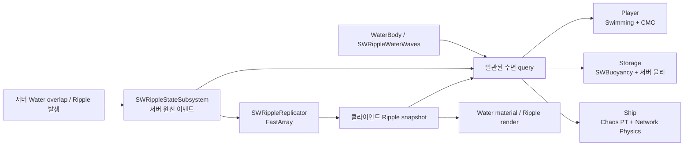

# 물·파동·수영·부력·물리·렌더 최적화 분석

작성일: 2026-07-15  
대상 맵: `KKH_Test`  
범위: Water Plugin 연동, Ripple, Swimming/CMC, `USWBuoyancyComponent`, Ship Network Physics, Water 렌더링  
문서 분류: `Planning/Optimization`  
측정 절차: [How to Profile](<./How to Profile.md>)

## 1. 결론 요약

현재 구조에서 가장 먼저 줄여야 할 것은 **수학 공식 자체의 비용이 아니라, 같은 정적 데이터를 매 프레임 다시 찾고 복사하고 직렬화하는 비용**이다.

우선순위가 높은 항목은 다음과 같다.

1. PIE에서 실질적으로 사용되지 않는 `SwimmingComponent` 디버그 수면 쿼리를 제거한다.
2. 힘을 계산하지 않는 클라이언트 Storage 프록시의 `SWBuoyancyComponent` Tick을 끈다.
3. Ripple 렌더 텍스처 업로드와 Water MID 순회를 매 프레임 하지 않고, 데이터 변경 시점과 바인딩 변경 시점에만 수행한다.
4. Ship이 매 프레임 수행하는 WaterBody 탐색, 리플렉션, 폰툰·Gerstner·Ripple 배열 복사를 **초기화/Revision 기반 갱신**으로 바꾼다.
5. Ripple과 수면 쿼리는 하나의 시각에 대한 불변 스냅샷을 만들고, 여러 폰툰/객체가 이를 배치로 사용하도록 한다.
6. 네트워크에서는 Ship 상태의 raw `double` 벡터와 반복되는 정적 임계값을 양자화·분리하고, Ripple 이벤트는 FastArray를 유지한 채 커스텀 `NetSerialize`를 적용한다.
7. GPU는 추측으로 품질을 낮추기보다 `ProfileGPU`로 Water Mesh, Ocean Foam, WaterInfo, Ripple 평가 비용을 분리한 뒤 품질 계층을 만든다.

가장 중요한 구조 원칙은 다음과 같다.

> Player/CMC, Storage/서버 권위 물리, Ship/Network Physics의 동기화 방식은 그대로 유지하되, 셋이 읽는 **수면 스냅샷과 부력 수학의 순수 데이터 계층**만 공유한다.

즉 이번 최적화는 네트워크 아키텍처 통합이나 대격변을 전제로 하지 않는다.

## 2. 현재 데이터 흐름



현재 기능적 방향은 맞다. 문제는 각 소비자가 동일 정보를 사용할 때 다음 작업을 반복한다는 점이다.

- 매 쿼리마다 Lock을 잡고 전체 Ripple 배열을 순회한다.
- 매 폰툰마다 일반적인 WaterBody 쿼리 경로를 처음부터 탄다.
- Ship은 정적 폰툰과 파도 설정까지 매 프레임 GT에서 PT 입력으로 다시 복사한다.
- Ripple 렌더는 이벤트가 바뀌지 않아도 매 프레임 CPU 배열을 만들고 Render Command를 보낸다.
- 네트워크 상태는 실제 정밀도 요구보다 큰 raw 자료형을 보낸다.

## 3. 분석 기준

### 3.1 확정적으로 제거 가능한 낭비

코드 구조만으로도 불필요함을 판단할 수 있는 작업이다.

- 사용되지 않는 디버그용 매 프레임 쿼리
- 권한이 없어 힘을 적용하지 않는 프록시의 Tick
- 정적 설정의 매 프레임 탐색·리플렉션·복사
- 변경되지 않은 Ripple 텍스처의 매 프레임 재업로드
- 동일 Water MID에 같은 텍스처를 매 프레임 다시 바인딩

### 3.2 프로파일링 후 결정할 후보

효과가 플랫폼, 객체 수, 화면 구성에 따라 달라지는 항목이다.

- Gerstner/Ripple 수학의 SIMD 또는 `ParallelFor`
- WaterInfo 1024 → 512 축소
- Water Mesh Tessellation 6 → 5 축소
- Ocean Foam 비활성화 또는 단순화
- Ripple GPU heightfield 전환
- Physics history 1초 축소
- Ship 물리 복제 LOD 도입

이 둘을 섞지 않는 것이 안정성을 지키는 핵심이다.

## 4. Ripple 생성·보관·쿼리

### 4.1 현재 비용

`FSWRippleEvaluator::EvaluateHeight`는 쿼리 하나마다 모든 이벤트를 순회한다. 각 이벤트에서 저렴한 제곱 거리 조기 탈락 후 `sqrt`, 감쇠, 삼각함수를 수행한다. 이벤트 상한이 32라면 연산 자체는 아직 작지만 다음 비용이 겹친다.

- `USWRippleStateSubsystem::GetRippleHeight`가 쿼리마다 Read Lock을 획득한다.
- Subsystem Tick은 매 프레임 Write Lock을 잡고 만료 이벤트를 역순으로 검사한다.
- 물리 롤백을 위한 만료 이벤트 보존 때문에 일반 GT/렌더 쿼리도 불필요한 과거 이벤트를 순회할 수 있다.
- `GetEventsSnapshot`과 `GetActiveEventsSnapshot`은 배열을 복사한다.
- `AddOrUpdateReplicatedEvent`는 EventId를 선형 검색한다.
- Ripple 발생 시 플레이어 근접 여부를 판단하려고 `GetAllActorsOfClass(APawn)`를 호출해 전체 Pawn 배열을 만든다.

### 4.2 권장 구조: Revision 기반 불변 스냅샷

이벤트 쓰기는 드물고 읽기는 매우 많다. 따라서 Read/Write Lock 중심보다 다음 구조가 적합하다.

1. 서버 생성 또는 클라이언트 복제 반영 시에만 새 스냅샷을 만든다.
2. `TSharedPtr<const FSWRippleSnapshot>` 같은 불변 스냅샷을 원자적으로 교체한다.
3. 쿼리는 포인터 하나를 읽고 Lock 없이 끝까지 같은 스냅샷을 사용한다.
4. 스냅샷에 `Revision`, 활성 이벤트, 물리 이력 이벤트를 구분해 저장한다.

효과:

- 폰툰 수에 비례해 증가하던 Lock 경합 제거
- 쿼리 도중 이벤트 배열이 바뀌지 않는다는 보장
- GT, 렌더 패킹, PT 전달이 같은 Revision을 공유
- 변경이 없을 때 배열 복사 제거

이벤트 최대 수가 32인 현재는 공간 해시나 쿼드트리보다 이 변경의 효과와 단순성이 더 좋다. 공간 인덱스는 이벤트 상한이 수백 개로 증가할 때 검토한다.

### 4.3 활성 목록과 물리 이력의 분리

Ship 롤백을 위해 끝난 Ripple을 일정 시간 유지하는 것은 필요하다. 다만 다음 두 목록의 목적이 다르다.

- `ActiveEvents`: 현재 GT 수영/Storage/렌더가 읽는 목록
- `PhysicsHistoryEvents`: Network Physics가 과거 프레임을 재현할 때 읽는 목록

현재 시각 쿼리가 물리 이력까지 스캔하지 않게 분리한다. 정리 작업은 매 프레임이 아니라 다음 만료 시각을 예약하거나 5~10Hz로 실행해도 충분하다.

### 4.4 배치 Query Context

한 물리 Step에서 N개의 폰툰은 같은 서버 시각을 사용한다. 이벤트별 다음 값을 한 번만 계산한 `FSWWaterQueryContext`를 만들 수 있다.

- 현재 파면 반경
- 감쇠된 진폭
- 파장 역수와 위상 상수
- 활성 여부
- 해당 Step의 서버 시각과 Ripple Revision

그 뒤 각 폰툰은 위치에 따른 거리와 위상만 계산한다. Ship 한 척의 폰툰이 4개인 경우에도 이득이 있고, 중앙 배치 처리에서 여러 Storage를 함께 계산하면 효과가 커진다.

### 4.5 Ripple 발생 감지

`GetAllActorsOfClass(APawn)` 대신 서버의 PlayerController/Pawn 약한 참조 목록을 유지하거나 PlayerController를 직접 순회한다. 접속·빙의 변경 때 갱신하면 Ripple 하나가 발생할 때마다 전체 Actor 검색과 임시 배열 할당을 하지 않아도 된다.

## 5. 파도 정보 Query

### 5.1 현재 비용

`USWRippleWaterWaves`의 풀 쿼리는 반복해서 다음 작업을 수행한다.

- World/GameState에서 서버 시각 계산
- Base Waves 호출
- RippleSubsystem 검색
- Ripple Lock 및 이벤트 평가

Storage는 폰툰마다 모든 캐시된 WaterBody를 순회하고, exclusion volume 검사와 `TryQueryWaterInfoClosestToWorldLocation`의 Location/Depth/Velocity/Waves 경로를 요청한다. 강에서는 spline의 가장 가까운 Input Key 검색도 반복될 수 있다.

### 5.2 Query API 제안

기존 외부 API를 유지하면서 내부에 두 단계 API를 추가한다.

```text
PrepareWaterQueryContext(World, ServerTime, CandidateWaterBody)
    -> immutable context

EvaluateWaterSurface(Context, Positions[])
    -> Height/Normal/Velocity/Depth/Ripple 결과 배열
```

중요한 점은 `ServerTime`을 호출자가 명시한다는 것이다. CMC replay와 Chaos PT rollback은 현재 화면 프레임 시간이 아니라 각자의 시뮬레이션 시각으로 같은 공식을 다시 계산해야 한다.

### 5.3 WaterBody 후보 캐시

- Player는 이미 Overlap WaterBody 목록을 유지하므로 이를 활용한다.
- Storage는 물에 진입했거나 가까운 동안 하나 또는 소수의 후보 WaterBody만 유지한다.
- Ship은 BeginPlay/영역 변경 때 typed wave provider를 결정하고 매 프레임 `TActorIterator`를 수행하지 않는다.
- River spline key는 일정 이동 거리 또는 segment 이탈 전까지 재사용한다.
- Ocean처럼 평면 기반이며 exclusion/shoreline 정확도가 필요 없는 영역에는 POD 기반 fast path를 둘 수 있다.

Fast path는 일반 Water Plugin 경로의 기능을 조용히 생략할 위험이 있으므로 WaterBody 타입과 기능 플래그가 명확할 때만 사용한다.

### 5.4 캐시 키

단순한 “이번 렌더 프레임 캐시”는 CMC replay에서 잘못된 결과를 만들 수 있다. 최소한 다음 값으로 캐시를 구분한다.

- Simulation/Server Time 또는 Physics Frame
- WaterBody 식별자 및 Waves Revision
- Ripple Revision
- 위치 셀 또는 정확한 위치
- 쿼리 플래그(높이, 노멀, 속도, 깊이)

Player는 CMC Saved Move/Replay 시각, Ship은 Network Physics frame, Storage는 서버 현재 physics step을 사용한다.

## 6. Swimming / CMC

### 6.1 즉시 수정 가능한 낭비

`USwimmingComponent::TickComponent`는 PIE에서 DrawDebug 코드가 사실상 비활성인데도 매 프레임 전체 수면 쿼리를 수행한다. 디버그 CVar가 켜졌을 때만 Tick과 쿼리를 수행하거나 Component Tick을 기본 비활성으로 둔다.

또한 `USWCharacterMovementComponent`가 이동 상태 확인과 `PhysCustom`에서 반복해서 `FindComponentByClass<USwimmingComponent>()`를 호출한다. BeginPlay/Initialize 시 포인터를 캐시하고 Component 교체가 가능한 경우에만 무효화한다.

### 6.2 한 이동 Step의 중복 Query

수영 중 한 Step에 transition 검사와 swimming movement가 각각 수면 높이를 요청하고, PIE 디버그 Tick까지 포함하면 같은 프레임에 세 번 쿼리될 수 있다.

- 한 이동 Step용 Query Context는 공유한다.
- 발, 부력 기준점처럼 위치가 다른 샘플은 결과를 무조건 재사용하지 말고 `Positions[]` 배치 쿼리로 묶는다.
- 바닥 검사는 매 프레임 `FindFloor`하지 않고 수면 이탈 조건에 가까워졌을 때 또는 낮은 빈도로 수행한다.

### 6.3 멀티스레드 판단

CMC 이동과 Saved Move replay는 CMC의 예측 순서 안에서 실행되어야 한다. 이를 임의 Worker Thread로 옮기면 UObject 접근, movement state, replay 결정성이 깨질 가능성이 높다.

따라서 Player 최적화의 방향은 멀티스레딩이 아니라 다음이다.

- 중복 Water query 제거
- 순수 수학 Query Context 공유
- Component/WaterBody 포인터 캐시
- 디버그 및 바닥 검사 빈도 축소

## 7. Storage / SWBuoyancy

### 7.1 현재 병목

서버 권위 방식에서는 서버만 힘을 계산하고 클라이언트는 복제된 movement를 보간하면 된다. 그러나 현재 Component Tick 활성 조건은 실행 모드만 보고 켜지므로, 힘을 적용하지 않는 클라이언트 프록시에서도 Tick이 호출된 뒤 `ShouldApplyForces()`에서 돌아올 수 있다.

서버에서는 물에서 멀거나 잠든 물체도 매 프레임 다음 작업을 수행할 가능성이 있다.

- Root/Primitive Component 확인
- 모든 WaterBody 후보 순회
- 폰툰별 일반 Water Plugin query
- 폰툰별 force 적용

부력 공식의 산술량보다 WaterBody 검색과 쿼리 비용이 먼저 커진다.

### 7.2 단계별 개선

저위험:

- `ShouldApplyForces() || DiagnosticsEnabled`일 때만 Tick 활성화
- Simulating PrimitiveComponent 캐시
- Overlap/근접 WaterBody 후보 캐시
- 물에서 멀 때 Tick 비활성 또는 저주기 broad-phase 검사
- 폰툰 배열과 런타임 상수를 연속 메모리로 유지

중위험:

- 수면에서 멀리 잠긴/떠 있는 상태에 따라 쿼리 빈도 적응
- 여러 Storage의 폰툰을 중앙 manager가 한 번에 배치 계산
- Ripple/파도 Revision 변경 시 잠든 부유체를 선택적으로 깨우기

주의: “잠든 Rigidbody는 영원히 건너뛴다”는 최적화는 파도와 Ripple이 물체를 다시 깨워야 할 때 틀린 결과를 만든다. 저주기 샘플 또는 수면 변경 이벤트가 필요하다.

### 7.3 멀티스레드 설계

각 Storage의 1~4개 폰툰마다 `ParallelFor`를 만드는 것은 Task 오버헤드가 계산보다 크다. 객체 수가 수백 개일 때만 중앙 배치를 고려한다.

안전한 구조는 다음과 같다.

1. Game Thread PrePhysics에서 필요한 Water/Ripple 데이터를 POD 스냅샷으로 만든다.
2. `UObject` 포인터를 전달하지 않고 위치·반경·질량·파도 상수만 Worker에 전달한다.
3. Worker의 `ParallelFor`는 다수 객체의 부력 force 결과만 계산한다.
4. Game Thread/허용된 Physics 단계에서 force를 적용한다.

WaterBodyComponent의 일반 query를 임의 Worker에서 직접 호출하면 안 된다. 더 큰 변경을 허용할 때만 Ship과 비슷한 Chaos async callback 내부에서 POD 계산을 수행하는 방식을 검토한다. Network Physics를 쓰지 않아도 PT 계산 자체는 가능하지만, 이 변경은 첫 단계가 아니다.

## 8. Ship / Network Physics

### 8.1 가장 큰 CPU·캐시 후보

현재 Ship GT Tick은 다음 입력을 PT로 구성한다.

- 세 개의 폰툰 병렬 배열 복사
- `TActorIterator`로 WaterBody 탐색
- 클래스 이름 문자열 비교 및 `BaseWavesAsset` 리플렉션
- Gerstner 파도 전체 복사
- Ripple 이벤트 전체 Snapshot 복사

그 뒤 Async 입력이 PT 캐시로 다시 복사된다. `FAsyncInputShip::Reset`의 배열 `Empty()` 사용은 매 프레임 capacity 재할당 가능성도 만든다.

이는 물리 계산보다 앞서 제거해야 할 구조적 비용이다.

### 8.2 정적/동적 입력 분리

| 데이터 | 변경 빈도 | 전달 정책 |
|---|---:|---|
| 폰툰 위치·반경·force scale | 매우 낮음 | 초기화 및 편집/손상 시만 |
| Gerstner 파도 설정 | 낮음 | Waves Revision 변경 시만 |
| 부력 계수·질량 관련 설정 | 낮음 | 설정 Revision 변경 시만 |
| Ripple 이벤트 | 이벤트 발생/제거 시 | Ripple Revision 변경 시만 |
| 조종 입력 | 매 물리 입력 | 현재처럼 매 입력 |
| 시뮬레이션 Frame/Time | 매 Step | 현재처럼 매 Step |

PT는 마지막으로 받은 정적 데이터를 캐시한다. Ripple 이벤트에는 Start/Expire 시각이 있으므로 PT가 과거 프레임을 replay할 때도 해당 시각에 존재했던 이벤트만 적용할 수 있다. 단, Ripple 이력 보존 시간은 실제 최대 rollback window보다 길어야 한다.

### 8.3 메모리 배치

폰툰의 위치, 반경, 힘 계수를 별도 `TArray` 세 개로 보관하면 세 번의 할당과 인덱싱이 필요하다. PT 런타임용 구조체 하나로 묶는 편이 순차 접근에 유리하다.

```cpp
struct FSWPontoonRuntimeData
{
    FVector3f LocalOffset;
    float Radius;
    float ForceScale;
};
```

- `FName`, UObject 포인터, 에디터용 자료는 PT 배열에 넣지 않는다.
- Gerstner 파도도 float POD로 패킹하고 불변 상수를 미리 계산한다.
- `Empty()` 대신 `Reset()`/capacity 재사용으로 임시 배열 churn을 막는다.

### 8.4 멀티스레드와 SIMD

Ship은 이미 Chaos PT async callback을 사용하므로 계산 위치 자체는 적절하다. 다음 개선이 우선이다.

1. GT→PT 복사량 축소
2. 한 Step에서 파도별 시간 상수를 한 번만 계산
3. 폰툰 위치를 연속 배열로 평가
4. 그 뒤에도 실제로 trig가 상위 병목이면 batch/SIMD 검토

폰툰 4개짜리 Ship 한 척 내부에서 Task를 나누지는 않는다. Chaos가 여러 Body/solver 작업을 병렬화하는 상황에서 작은 Task를 추가하면 오히려 스케줄링 비용이 늘 수 있다.

## 9. 직렬화·패킷 압축·Relevancy

### 9.1 Ripple FastArray

FastArray를 유지하는 판단은 좋다. 이벤트 단위 추가/수정/삭제가 드물기 때문에 전체 배열 복제보다 적합하다. 개선 대상은 이벤트 payload다.

현재 이벤트에는 `FVector2D`/`double` 시각과 여러 float가 들어 있어 메모리 표현만 대략 50바이트 이상이며, 실제 네트워크에는 프로퍼티 및 FastArray 오버헤드가 추가된다. 정확한 크기는 Network Profiler로 확인해야 한다.

권장 압축:

- EventId: packed integer
- Origin: WaterZone 기준 상대 좌표, 1cm 또는 필요한 정밀도의 fixed point
- StartTime: 공유 epoch 기준 millisecond `uint32`
- Lifetime: `uint16` 또는 규칙으로부터 ExpireTime 파생
- Amplitude/Speed/Decay/Wavelength: 정해진 범위의 12~16bit 양자화
- 자주 쓰는 동일 파라미터 묶음: `RippleProfileId` 하나로 대체

목표는 이벤트당 약 16~28바이트 수준의 payload이며 이는 설계 추정치다. 적용 전후 실제 패킷을 측정하고, 동일 위치·동일 서버 시각의 높이 오차 허용치를 통과해야 한다.

### 9.2 Ripple Relevancy

Replicator가 `AlwaysRelevant`이면 모든 Ripple이 모든 클라이언트에 전달된다. 현재 최대 이벤트 32와 소규모 플레이에서는 심각하지 않을 수 있다. 플레이어 수와 월드가 커질 때 다음 순서로 확장한다.

1. WaterZone/지역별 Replicator
2. Replication Graph 또는 connection별 거리 필터
3. 먼 Ripple은 렌더/물리 모두 전송하지 않음

Ripple의 최대 전파 거리와 물리 영향 반경을 기준으로 relevance를 계산해야 한다. 단순 카메라 거리만 사용하면 원격 Ship simulation에 필요한 Ripple을 누락할 수 있다.

### 9.3 Ship 입력/상태

Ship 입력은 packed frame과 `int8` 조종값을 사용하므로 이미 효율적이다. 큰 후보는 물리 상태다.

현재 상태는 raw `FVector`, `FQuat`, 선형/각속도와 정적 임계값 float를 포함해 논리 payload만 대략 100바이트를 넘을 수 있다. UE5의 double 기반 벡터가 특히 크다.

권장:

- Position: network/world origin 기준 상대 fixed point, 0.1~1cm
- Rotation: smallest-three quaternion
- Linear/Angular Velocity: 게임의 최대 범위를 정한 signed 16bit/component
- Correction threshold: 상태마다 보내지 않고 설정 복제 또는 공통 config로 이동
- Velocity는 replay/resimulation에 필요하므로 삭제하지 않음

목표 payload 30~45바이트는 추정치이며 실제 Serializer overhead와 history 전송 형태를 포함해 측정해야 한다. 현재 5cm rewind threshold보다 훨씬 큰 위치 양자화 오차를 쓰면 correction을 스스로 유발할 수 있다.

### 9.4 Update Rate와 물리 LOD

현재 배치 Ship은 `AlwaysRelevant=true`, 높은 Update Frequency 설정을 갖는다. 한 척에서는 괜찮지만 비용은 대략 `Ship 수 × 관심 Client 수 × State rate`로 증가한다.

확장 단계에서는 다음 LOD가 적합하다.

- Near/owned/충돌 가능: 현재 resimulation
- Mid: predictive interpolation 또는 낮은 state rate
- Far: 서버 보간, 저빈도, dormancy/cull

프로젝트의 Physics Replication LOD는 현재 비활성이다. 활성화는 효과가 크지만 네트워크 동작 변경 위험도 있으므로 별도 milestone에서 pktlag/pktloss 테스트와 함께 진행한다.

Storage는 현재 `ReplicateMovement=true`, 약 150m cull distance, 30Hz 설정이다. 떨림은 예측 보간으로 개선되었으므로 무조건 전송률을 올리지 않는다. 물체가 안정적으로 잠들었을 때 dormancy와 낮은 빈도를 활용하는 쪽이 낫다.

### 9.5 패킷 압축에서 하지 말아야 할 것

- 이미 압축된 여러 작은 이벤트에 범용 zlib 계열 압축을 매 패킷 적용
- 시각/위치를 지나치게 낮은 정밀도로 보내 correction을 증가시킴
- Ripple을 클라이언트에서 임의 생성해 서버 이벤트 전송을 생략
- Ship 상태에서 velocity를 제거하고 transform만 복제

이 시스템에서는 범용 압축보다 **도메인 양자화, 정적 데이터 분리, relevance**가 효과적이다.

## 10. Ripple 렌더 데이터 경로

### 10.1 현재 확정 낭비

클라이언트 `URippleSubsystem::Tick`은 매 프레임 다음 작업을 한다.

- 64 texel 배열 초기화 및 Active Event snapshot 복사
- 캡처용 `TArray<FLinearColor>` 할당
- Render Command enqueue
- 32×2 `PF_A32B32G32R32F` 텍스처 업로드
- 모든 WaterBody를 순회하고 MID를 찾아 RippleTex/ServerTime 설정

업로드 데이터는 약 1KiB라 대역폭 자체는 작다. 문제는 매 프레임 할당, 커맨드 제출, Actor/MID 순회다.

### 10.2 변경 시점 기반 업데이트

- Ripple texture: Ripple Revision이나 slot layout이 변경될 때만 패킹/업로드
- MID texture binding: BeginPlay, WaterBody 추가, material 재생성 시만
- ServerTime: 기존 `MPC_Water_Custom` 같은 Material Parameter Collection을 한 번 갱신
- 패킹 버퍼: persistent/double buffer로 유지해 heap allocation 제거

Shader가 ExpireTime을 보고 종료 이벤트를 무시한다면 만료 순간 텍스처 재업로드도 필요 없다. 그렇지 않다면 다음 visual expiry 시각만 timer로 예약한다.

### 10.3 LWC와 시간 정밀도

절대 월드 Origin과 장시간 누적된 ServerTime을 float 텍스처/파라미터로 전달하면 먼 좌표와 장시간 세션에서 정밀도가 떨어진다.

- Ripple Origin은 WaterZone 또는 rebased world origin 상대 좌표로 패킹
- Start/Current Time은 공유 epoch 기준 상대 시간 또는 modulo time 사용
- half float texture는 이 rebasing을 한 뒤에만 검토

텍스처가 1KiB이므로 half float 전환은 우선순위가 낮다. 먼저 커맨드와 순회를 제거한다.

## 11. Water 렌더링

### 11.1 KKH_Test 확인값

- Water Material: Masked, Two Sided, Single Layer Water
- Ocean Foam: 활성
- Waves: 활성
- WaterInfo Texture: 활성, 1024×1024
- Caustics: 비활성
- WaterZone full extent 설정: `50400cm × 50400cm`, 즉 약 504m × 504m
- Water Mesh tile size: 2400cm
- Tessellation factor: 6, 최대 타일 한 변 약 65 vertices
- 강제 원거리 density collapse: 비활성(`-1`)
- DX12/SM6, Lumen, VSM, Ray Tracing, Substrate 사용

참고: material의 top-level expression 수는 많지만 Material Function 내부와 최종 permutation 때문에 expression 개수만으로 GPU 병목을 단정할 수 없다.

### 11.2 프로파일링 순서

1. `ProfileGPU`에서 Water BasePass/Translucency 또는 SingleLayerWater pass, reflection, foam 비용 분리
2. Water Mesh primitive/vertex 수 확인
3. Material Stats와 shader instruction 확인
4. 같은 카메라에서 다음 A/B 캡처

권장 A/B:

- Tessellation factor 6 vs 5: 타일 최대 한 변 65 → 33 vertices, 최대 격자 정점은 대략 1/4
- WaterInfo 1024 vs 512: 픽셀 수와 관련 대역폭은 1/4, 해안·깊이·foam 품질 확인
- Ocean Foam On vs Off/cheap variant
- Distant density collapse 활성 단계별 비교
- 낮은 품질 tier에서 Water ray tracing geometry 비활성 비교

### 11.3 품질 계층

- High: 현재 foam, ripple, 고품질 waves
- Medium: tessellation/WaterInfo 축소, foam 단순화
- Low/Far: 저비용 normal/wave, 제한된 ripple, RT water geometry 제외

Two Sided 비활성화는 underwater 시점과 뒷면 렌더에 영향을 주므로 안전한 즉시 최적화가 아니다.

### 11.4 Ripple shader의 잠재 위험

Material asset은 바이너리이므로 실제 HLSL loop 비용은 shader stats로 확인해야 한다. 만약 화면의 모든 water pixel/vertex에서 32개 Ripple을 순회한다면 활성 이벤트 수가 많을 때 GPU 병목이 될 수 있다.

- 4~8개 이하 활성 이벤트: analytic 평가가 단순하고 정확함
- 수십 개 이벤트 + 넓은 화면: view-centered heightfield RT를 compute/raster로 생성하고 Material은 1회 sample하는 구조 검토

Heightfield 전환은 렌더 전용 고위험 변경이다. CPU 물리와 결정론 query는 analytic 이벤트를 유지해야 하며, 현재 단계에서 먼저 구현할 대상은 아니다.

## 12. 멀티스레드 종합 판단

| 영역 | 권장 | 이유 |
|---|---|---|
| Player CMC | 이동 안 함 | CMC prediction/replay 순서와 상태 의존 |
| Ship buoyancy | 기존 Chaos PT 유지 | 이미 올바른 실행 위치, 데이터 전달만 최적화 |
| 다수 Storage | 중앙 배치 후 Worker 검토 | 객체 수가 클 때만 task 비용 상쇄 |
| Ripple snapshot 생성 | Writer 시점 GT | 이벤트 수가 작고 쓰기가 드묾 |
| Ripple 다점 평가 | 큰 배치에서만 `ParallelFor` | 개별 4 pontoon은 너무 작음 |
| Render texture upload | Render Thread command 유지 | 빈도와 할당을 줄이는 것이 핵심 |
| WaterBody UObject query | GT 유지 | 일반 UObject/Component API thread safety 보장 없음 |

멀티스레드는 작은 일을 쪼개는 수단이 아니라, **UObject 접근을 끝낸 큰 POD batch**를 병렬 처리할 때만 사용한다.

## 13. 캐시히트·할당 최적화 종합

### 13.1 데이터 지향 변경

- 에디터 설정 구조와 PT 런타임 구조 분리
- 폰툰은 AoS 연속 배열, Gerstner/Ripple은 평가 순서에 맞는 packed POD
- `FVector3f`/float 사용 가능 영역과 LWC double 경계를 명확히 함
- 반복 `TArray`는 `Reserve`/`Reset`으로 capacity 재사용
- UObject/FName/Reflection 결과는 초기화 때 resolved handle로 변환

### 13.2 좋은 캐시와 위험한 캐시

좋음:

- WaterBody/SwimmingComponent 포인터
- 정적 Pontoon/Waves settings + Revision
- Ripple immutable snapshot
- 한 simulation step의 시간 상수
- Water MID 목록

위험함:

- render frame 번호만으로 물리 query 결과 캐시
- 위치가 다른 폰툰의 높이 결과 재사용
- CMC replay와 현재 frame이 같은 cache entry 사용
- Ripple Revision 없이 오래 유지되는 PT 배열
- world origin rebasing 뒤 절대 좌표 캐시 유지

## 14. 측정 계획

### 14.1 부하 행렬

| 축 | 단계 |
|---|---|
| Ship 수 | 1 / 10 / 50 |
| Storage 수 | 1 / 100 / 500 |
| 활성 Ripple | 0 / 8 / 32 |
| Client 수 | 1 / 4 / 16 |
| 렌더 FPS | 30 / 60 / 120 |
| Physics | 현재 60Hz 고정 기준 |

최대 조합만 돌리기보다 한 축씩 늘려 기울기를 확인한다. 예를 들어 Storage 수 증가에 따라 `WaterQuery` 시간이 선형으로 늘어나는지, Ship 수 증가에 따라 GT marshal bytes와 PT trig 시간이 각각 얼마나 늘어나는지를 분리한다.

### 14.2 CPU/Physics 계측

Unreal Insights에 다음 scope/counter를 추가한다.

- `SW.WaterQuery.Count/Time`
- `SW.Ripple.EventsScanned`
- `SW.Ripple.SnapshotRevision`
- `SW.Ship.GTMarshalBytes`
- `SW.Ship.PTCachedRevision`
- `SW.Ship.GerstnerEvaluations`
- `SW.Buoyancy.ActiveBodies/Pontoons`
- `SW.CMC.WaterQueriesPerMove`
- Network Physics rollback 횟수와 resim frame 수

`stat game`, `stat physics`, Chaos 관련 stat은 원인 위치를 좁히고, 최종 판단은 Insights trace로 한다.

### 14.3 네트워크 계측

Network Profiler와 `pktlag`/`pktloss` 조건에서 다음을 기록한다.

- Actor/property별 bytes/sec
- Ripple 이벤트 1개 추가 시 delta bytes
- Ship state 1 sample의 실제 bytes
- client 수 증가에 따른 server outbound 증가율
- correction/rollback rate와 평균 resim frame
- Storage movement update 간격과 보간 품질

양자화는 bytes만 줄고 rollback이 늘면 실패다.

### 14.4 GPU 계측

- `stat unit`, `stat gpu`, `ProfileGPU`
- Water Mesh vertex/primitive 수
- Single Layer Water 및 reflection 비용
- Ocean Foam permutation 비용
- WaterInfo update 비용과 해상도 영향
- Ripple 0/8/32 이벤트에서 water pass 증가량

동일 카메라·동일 파도 시각·동일 해상도로 A/B를 기록한다.

## 15. 안정성 중심 구현 순서

### M0. 계측만 추가

- [ ] Insights scope/counter
- [ ] Network payload 기준값
- [ ] GPU 기준 캡처
- [ ] 1/100/500 Storage, 1/10/50 Ship scaling 결과

### M1. 결과를 바꾸지 않는 낭비 제거

- [ ] Swimming PIE 디버그 query gate
- [ ] 클라이언트 Storage proxy Tick 비활성
- [ ] SwimmingComponent/Primitive/WaterBody 포인터 캐시
- [ ] Ripple render Revision 기반 업로드
- [ ] Water MID 캐시 및 texture one-time binding
- [ ] Ship 배열 `Reset`/capacity 재사용

### M2. Ship 정적 데이터 버전 관리

- [ ] Water wave provider 초기 1회 resolve
- [ ] Pontoon/Waves/Settings Revision 도입
- [ ] Ripple Revision 변경 시에만 GT→PT snapshot 전달
- [ ] PT packed runtime POD
- [ ] rollback/replay에서 과거 Ripple 적용 검증

### M3. 공용 Query Snapshot과 배치

- [ ] Immutable Ripple snapshot
- [ ] Active/PhysicsHistory 분리
- [ ] `FSWWaterQueryContext`와 다점 query
- [ ] Player/Storage/Ship이 각자의 simulation time으로 같은 공식 사용
- [ ] 다수 Storage에서 중앙 batch의 손익 측정

### M4. 네트워크 압축과 LOD

- [ ] Ripple custom `NetSerialize`
- [ ] Ship state quantization
- [ ] 정적 correction 설정 분리
- [ ] zone/relevance 정책
- [ ] Physics Replication LOD 별도 실험

### M5. 렌더 품질 계층

- [ ] Tessellation/WaterInfo/Ocean Foam A/B
- [ ] distant density collapse 검증
- [ ] RT water geometry 품질 계층
- [ ] Ripple shader 32-event 비용 확인 후에만 heightfield 판단

M1과 M2까지는 현재 네트워크 방식과 부력 결과를 거의 건드리지 않으면서 큰 구조적 낭비를 줄일 가능성이 높다. M3 이후는 결정론·rollback 검증과 함께 작은 단위로 적용한다.

## 16. 검증 기준

성능 개선 외에 다음 기능 기준을 동시에 통과해야 한다.

- 동일 위치·동일 서버 시각의 GT/PT 물 높이 및 노멀 오차가 기존 허용치 이내
- 서버/클라이언트 동일 Ripple query 결과가 양자화 허용치 이내
- CMC correction 빈도와 Saved Move replay 결과가 악화되지 않음
- Ship rollback rate/평균 resim frame이 악화되지 않음
- Storage의 클라이언트 시각 보간이 기존보다 끊기지 않음
- world origin rebasing과 장시간 세션에서 Ripple 위치/위상이 튀지 않음
- 해안, River spline, exclusion volume, underwater 시점의 렌더 회귀 없음

## 17. 최종 제안

현재 시스템에 가장 맞는 최적화 전략은 “모든 부력을 한 Component나 한 Thread로 합치기”가 아니다.

공유해야 할 것은 다음 세 계층이다.

1. **Authoritative water state**: 서버 Ripple 이벤트와 Water/Waves Revision
2. **Immutable query snapshot**: 특정 simulation time에 평가 가능한 POD 데이터
3. **Pure buoyancy math**: 위치·속도·수면 결과를 받아 force/가속도를 계산하는 공통 공식

각 실행기는 그대로 분리한다.

- Player: CMC prediction/replay 안에서 공식을 소비
- Storage: 서버 권위 Chaos force 적용 후 movement 복제/예측 보간
- Ship: Chaos PT Network Physics resimulation 안에서 공식을 소비
- Render: 같은 이벤트 스냅샷을 GPU 표현으로 소비

이 경계를 유지하면 기존 시스템의 안정성을 보존하면서도, Lock·탐색·할당·GT→PT 복사·패킷 크기·GPU 중복 작업을 각각 독립적으로 줄일 수 있다.

## 18. 코드 근거 색인

분석 당시 확인한 주요 경로다. 행 번호는 이후 편집으로 달라질 수 있다.

| 관찰 | 경로 |
|---|---|
| Ripple 이벤트별 높이 평가 | `Source/ArtisticSWCore/Private/Water/SWRippleTypes.cpp` |
| Ripple 매 프레임 정리, Lock, Snapshot 복사 | `Source/ArtisticSWCore/Private/Water/SWRippleStateSubsystem.cpp` |
| FastArray, AlwaysRelevant, 갱신 주기 | `Source/ArtisticSWCore/Private/Water/SWRippleReplicator.cpp` |
| Ripple 발생 시 Pawn 검색, 매 프레임 texture upload/MID 순회 | `Source/WaterAndShip/Private/RippleSubsystem.cpp` |
| Base Waves + Ripple 수면 query | `Source/WaterAndShip/Private/SWRippleWaterWaves.cpp` |
| 수영 수면 query와 transition/floor 처리 | `Source/ClassFeature/Private/SwimmingComponent.cpp` |
| CMC의 SwimmingComponent 반복 검색 | `Source/ClassFeature/Private/SWCharacterMovementComponent.cpp` |
| Storage 폰툰별 WaterBody query/force | `Source/WaterAndShip/Private/Buoyancy/SWBuoyancyComponent.cpp` |
| Ship GT의 WaterBody 탐색·파도/Ripple 입력 구성 | `Source/WaterAndShip/Private/Ship.cpp` |
| Async 입력 배열 `Empty()` 및 PT 자료 구조 | `Source/WaterAndShip/Public/ShipPhysicsAsync.h` |
| Ship 입력/상태 `NetSerialize` | `Source/WaterAndShip/Public/Ship.h` |
| Ship PT Gerstner/Ripple 부력 평가 | `Source/WaterAndShip/Private/ShipPhysicsAsync.cpp` |
| Async Physics, prediction/history, replication LOD 설정 | `Config/DefaultEngine.ini` |

자산 값은 `KKH_Test`에 배치된 WaterZone, Ocean WaterBody, Water Material Instance, Ship, Storage를 Editor commandlet에서 읽어 확인했다. GPU 비용과 실제 네트워크 바이트는 정적 검사로 확정할 수 없으므로 M0 계측 대상으로 남겼다.
