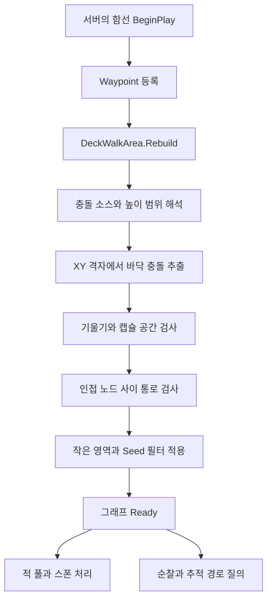
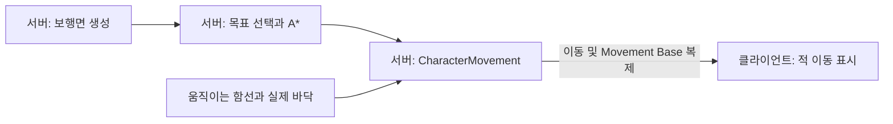

# 함선 보행면 구현 설명서

## 1. 기능의 개요

함선 보행면은 **배의 충돌 형상에서 걸을 수 있는 위치를 찾아 연결한 함선 전용 길찾기 그래프**다. Enemy는 이 그래프에서 경로를 구하고, CharacterMovement를 통해 실제 바닥 위를 이동한다.

화면에 표시되는 배, 캐릭터가 밟는 바닥, AI가 길을 찾는 데이터는 다음처럼 역할을 나눈다.

| 요소 | 역할 |
|---|---|
| ShipVisualMesh | 배의 외형을 렌더링 |
| DeckMesh_Complex / DeckMesh_Simple | 실제 바닥·벽·울타리·천장의 충돌 제공 |
| 보행 그래프 | 설 수 있는 위치와 서로 걸어서 이동할 수 있는 연결 정보 보관 |
| CharacterMovement | 접지, 실제 이동, 충돌 반응, 움직이는 바닥 추종과 이동 복제 |

보행면 생성은 충돌을 조회하고 이동 데이터를 만든다. 별도의 평면 메쉬나 물리 바닥을 생성하지 않으므로, 실제 충돌 바닥이 있어야 적이 설 수 있다. Unreal의 Recast NavMesh와 별도로 구현되어 있으며, 배에 맞춘 로컬 좌표와 층 구분을 사용한다.

## 2. 현재 두 보행면의 의미

| 식별자 | 높이 기준 | 영역 선택 |
|---|---|---|
| `UpperDeck` | 기존 로컬 Z 범위 200~900 cm | 유효 바닥 중 Seed 7·10200·10120이 속한 연결 영역 |
| `Waypoint1Deck` | WaypointId=1의 배 로컬 Z | 기준 높이 ±75 cm 안의 유효 바닥. Seed 필터 없음 |

`UpperDeck`은 기존 기능과의 호환성을 위해 유지한 이름이다. 두 면의 실제 상하 관계는 바닥 높이로 결정된다.

추가 면을 설정할 당시 1번 포인트의 상대 Z는 677 cm였다. **배 좌표로 변환한 기준 Z가 677일 때** 탐색 범위는 602~752 cm가 된다. 코드는 포인트의 실제 위치를 읽으므로 677이라는 값을 고정하지 않는다.

```text
추가 면의 높이 결정

WaypointId=1의 월드 위치
          ↓ 배 기준 좌표로 변환
     ReferenceLocalZ
          ↓
  [기준 Z - 75, 기준 Z + 75]
          ↓
각 XY 위치에서 기준 Z에 가장 가까운 실제 바닥 선택
          ↓
캐릭터가 설 공간이 있으면 보행 노드로 등록
```

기준 포인트의 XY는 추가 면의 크기나 경계를 정하지 않는다. 면적은 메쉬의 충돌 형상과 공간 검사 결과로 정해진다.

## 3. 코드의 책임 분리

| 구성 | 주요 책임 | 주요 진입점 |
|---|---|---|
| `FDeckWalkSurfaceSettings` | 디자이너가 지정하는 면 이름·소스·높이·Seed 설정 | `HeightMode`, `HeightReferencePointId` |
| `FDeckWalkHeightResolver` | 설정을 배 로컬 높이 범위로 해석 | `Resolve` |
| `FDeckWalkSurfaceSampler` | 충돌 샘플링, 설 공간과 통로 검사 | `Build`, `HasClearance`, `HasPassage` |
| `FDeckWalkGraph` | 노드·연결·연결 영역·A* 탐색 | `LabelRegions`, `FindPath` |
| `UDeckWalkAreaComponent` | 배 한 척의 그래프와 조회 API 관리 | `Rebuild`, `ResolveWaypoint`, `ResolveActorOnDeck` |
| `UDeckWalkRouteComponent` | 적 한 명의 목적지와 경로 진행 관리 | `SetPointGoal`, `SetActorGoal`, `SetPatrolGoal`, `TickRoute` |
| `UDeckEnemySpawnerComponent` | 스폰 플랜, 풀, 포인트 예약·점유 | 보행면에 최종 스폰 바닥 질의 |
| Navigation·BT·Boss Selector | 전투 상황과 순찰 정책에 맞는 목적지 선택 | 선택한 목표를 보행면과 Route에 전달 |

높이 해석기는 적의 전투 상태를 알 필요가 없고, 그래프는 월드 충돌이나 스폰 정책을 알 필요가 없다. AI 판단과 실제 이동 사이에는 보행면 조회와 경로 추종 인터페이스가 놓인다.

### 주요 파일 위치

공개 설정과 컴포넌트 선언은 `Source/Enemy/Public/DeckAI`, 생성·탐색·이동 구현은 `Source/Enemy/Private/DeckAI`에 모여 있다.

- `DeckWalkTypes.h`: 설정 구조체와 조회 핸들.
- `DeckWalkHeightResolver.h/.cpp`: 높이 기준 해석.
- `DeckWalkSurfaceSampler.h/.cpp`: 충돌 기반 노드·통로 추출.
- `DeckWalkGraph.h/.cpp`: 연결 영역과 A*.
- `DeckWalkAreaComponent.h/.cpp`: 함선 단위 관리 및 조회.
- `DeckWalkRouteComponent.h/.cpp`: 캐릭터 단위 경로 추종.

## 4. 생성 파이프라인



### 4.1 배 좌표계를 먼저 정한다

공통 좌표계는 `DeckMesh_Complex`의 Transform이다.

```text
로컬 위치 = 배 Transform의 역변환(월드 위치)
월드 위치 = 현재 배 Transform(저장된 로컬 위치)
```

모든 충돌 소스와 포인트를 이 좌표계로 변환한다. 따라서 Simple과 Complex의 피벗이 같은 위치에 있어도 실제 충돌 형상의 서로 다른 높이를 구분할 수 있다. 포인트에 변형된 부모가 있어도 월드 위치를 거쳐 해석한다.

현재 구현은 기준 프레임의 최종 Scale `(1,1,1)`을 요구한다. 배가 이동·회전하면 저장된 로컬 경로를 현재 Transform으로 변환해 사용한다.

### 4.2 면별 높이 범위를 해석한다

`HeightMode`에는 두 가지 방식이 있다.

- **LocalRange**: MinimumFloorZ와 MaximumFloorZ를 사용한다.
- **WaypointReference**: HeightReferencePointId의 로컬 Z에서 Below/Above 허용 범위를 계산한다.

기준 포인트가 없거나 범위가 잘못되면 생성을 중단한다. 추가 면의 명시적인 높이 범위는 넓은 고정 범위보다 우선한다. 예를 들어 602~752 cm가 추가 면에 속하면 기존 200~900 cm 범위에서는 그 높이를 제외해 중복 소유를 방지한다.

### 4.3 XY 격자에서 실제 바닥을 찾는다

충돌 소스 메쉬의 Bounds를 공통 로컬 좌표로 합친 뒤 CellSize 간격으로 XY를 나눈다. 적용한 BP 설정의 간격은 75 cm다.

각 XY 열에서 높이 범위의 위쪽부터 아래로 `LineTraceComponent`를 실행한다. 충돌점 아래로 검사 시작점을 옮겨 반복하므로 같은 XY에 존재하는 여러 높이의 바닥을 발견할 수 있다.

바닥 후보는 다음 조건을 만족해야 한다.

- 설정된 높이 범위 안에 있다.
- 검사 시작점이 충돌체 내부에 있는 결과가 아니다.
- 바닥의 법선과 배의 Up 방향으로 계산한 기울기가 제한 이하다.

현재 기울기 제한은 40°다. 추가 면은 발견한 후보 중 기준 Z에 가장 가까운 바닥 하나를 XY별로 선택한다. 이 선택 후 공간 검사를 수행하므로, 선택한 바닥이 막혀 있으면 해당 셀을 제외한다.

### 4.4 캐릭터가 설 공간을 검사한다

바닥 위에 캐릭터 크기의 캡슐을 가정하고 `OverlapComponent`로 겹침을 검사한다.

```text
검사 캡슐 중심 = 바닥 월드 위치 + 배 Up × (HalfHeight + Skin)
```

적용한 BP 값은 반경 35 cm, 반높이 90 cm이며 Skin은 5 cm다. 바닥 소스 자체도 장애물 목록에 포함한다. 동일 메쉬 안에 있는 천장이나 다른 구조물도 검사해야 하기 때문이다.

벽·울타리·천장과 겹치는 후보는 제외한다. 이 판정은 형상의 크기와 충돌 결과를 기준으로 하며, 메쉬의 이름만으로 난간과 갑판을 구분하지 않는다.

### 4.5 서로 걸어갈 수 있는 노드만 연결한다

연결 후보는 격자의 상하좌우 이웃이다. 구현에서는 +X와 +Y 방향을 검사하고 연결을 양방향으로 추가한다. 대각선 연결은 생성하지 않는다.

두 노드를 연결하려면 다음을 통과해야 한다.

1. 같은 면이거나 WalkingConnections에 허용된 면 조합이다.
2. 바닥 높이 차이가 MaximumStepHeight 이하다. 현재 값은 45 cm다.
3. 구간의 1/4 지점 단위로 발밑 지지면이 존재하고 단차가 허용 범위 안이다.
4. 높은 쪽 바닥 높이에 맞춘 수평 캡슐 Sweep과 필요한 양 끝의 수직 Sweep이 장애물에 막히지 않는다.

이 과정으로 구멍을 가로지르는 연결이나 울타리를 관통하는 경로를 걸러낸다. 층간 연결 설정은 계단·경사로의 보행 연결을 허용한다. 실제 통로가 검사에 통과해야 연결선이 생긴다.

### 4.6 연결 영역을 정리한다

`LabelRegions(false)`로 면 내부의 연결 영역을 찾고 작은 영역을 제거한다. 현재 최소 크기는 노드 6개다.

SeedPointIds가 있으면 Seed가 속한 영역만 남긴다. 배열이 비어 있으면 크기 조건을 만족하는 영역을 유지한다. 추가 면은 Seed가 비어 있어 다른 Waypoint 위치가 면의 생성 영역을 제한하지 않는다.

Seed는 선택적인 영역 필터다. 현재 Seed 조회는 Seed 포인트의 실제 위치와 PointHeightTolerance를 사용하므로, 추후 추가 면에 Seed를 넣는다면 실제 그 높이 가까이에 배치해야 한다. 스폰·목적지의 높이 투영과 구분되는 설정이다.

마지막으로 층간 연결까지 포함한 전체 연결 영역을 다시 계산한다. Required인 면의 생성에 실패하면 Ready가 되지 않는다.

## 5. 다층 데이터를 저장하는 방법

그래프는 아래 정보를 노드마다 보관한다.

| 필드 | 의미 |
|---|---|
| Floor | 배 로컬 좌표의 바닥 위치 |
| Surface | 어느 보행면에 속하는지 |
| Source | 바닥을 제공한 충돌 컴포넌트 |
| Column | XY 격자 좌표 |
| Region | 연결된 영역 번호 |
| Neighbors | 직접 걸어갈 수 있는 노드 목록 |

`Columns`는 XY 하나에 노드 목록을 저장한다. 같은 XY에 기존 면과 추가 면의 노드가 함께 있어도 높이와 Surface가 서로 구분된다.

외부 조회 결과는 `FDeckWalkLocation`으로 전달한다. NodeIndex, SurfaceId, LocalFloor와 함께 Revision을 보관한다. Rebuild 때 Revision이 바뀌므로 이전 그래프에서 구한 경로를 새 그래프에 잘못 적용하는 것을 막는다.

## 6. Waypoint와 캐릭터를 보행면에 연결하는 방법

### 스폰·전투 목적지

`ResolveWaypoint`가 WalkSurfaceId를 확인한 뒤 해당 면의 유효 노드를 찾는다.

- 기존 면은 포인트의 실제 로컬 위치를 조회 기준으로 사용한다.
- 추가 면은 포인트의 XY와 **면의 기준 Z**를 조합한다.
- XY는 최대 250 cm 이내에서 유효 노드로 보정된다. 추가 면의 최종 Z는 선택한 바닥 노드의 Z다.

따라서 추가 면에 연결한 일반 포인트의 오래된 Z가 목적지를 다른 층으로 돌려보내지 않는다. WaypointId=1은 높이 기준이라는 별도 역할도 가지므로, 이 포인트의 Z를 바꾸면 Rebuild 때 면의 기준이 바뀐다.

### 실제 캐릭터의 소속 면

`ResolveActorOnDeck`는 실제 발밑을 확인한다.

1. 캡슐 중심에서 반높이를 빼 발 위치를 구한다.
2. CharacterMovement의 CurrentFloor가 배의 등록된 충돌인지 확인한다.
3. 발과 바닥의 높이·수평 차이가 허용 범위 안이면 주변 보행 노드에 대응시킨다.
4. 스폰/착지 직후처럼 CurrentFloor로 판정하기 어려우면 발 기준 위 10 cm, 아래 65 cm를 보조 탐색한다.

실제 캐릭터는 자신의 발 위치로 판정된다. 목적지 포인트처럼 기준 Z로 투영하지 않는다. 같은 XY의 다른 층을 추적하거나 도착으로 오인하는 것을 줄이는 핵심 구분이다.

### 스폰 위치

`ResolveSpawnTransform`은 조회한 바닥에서 배 Up 방향으로 `캡슐 반높이 + 2 cm`만큼 올려 캐릭터 중심을 배치한다. 클래스·스탯·등장 조건·예약/점유는 기존 Spawner와 Boss Encounter가 담당한다.

## 7. 경로 탐색과 실제 이동

### A* 경로 탐색

`FDeckWalkGraph::FindPath`는 현재 바닥 노드부터 목표 노드까지 A*를 수행한다.

- 이동 비용: 연결된 두 바닥의 3차원 거리.
- 남은 거리 추정: 현재 노드부터 목표 노드까지 직선거리.
- 연결 영역이 다르거나 노드가 비활성화되어 있으면 실패.
- 층간 이동이 제한된 질의에서는 다른 Surface로 넘어가는 연결 제외.

반환된 경로는 배 로컬 바닥 위치의 순서다. 현재 A*는 Open 목록에서 최소 비용 항목을 선형 검색하는 방식이다. 함선 규모를 크게 늘릴 경우 노드 수와 동시 탐색 비용을 측정해 자료구조 최적화를 검토할 수 있다.

### 경로 추종

`UDeckWalkRouteComponent`는 BT의 이동 태스크가 호출하는 `TickRoute`에서 경로를 진행한다.

1. 서버 권한, 그래프 Revision, 현재 발밑과 접지를 확인한다.
2. 다음 노드까지의 로컬 이동 방향을 계산한다.
3. 현재 배 Transform으로 방향을 월드 방향으로 변환한다.
4. `AddMovementInput`을 전달하고 실제 이동·단차 처리는 CharacterMovement에 맡긴다.
5. 현재 발밑 충돌을 Movement Base로 사용한다. 바닥 컴포넌트가 달라질 때 Base를 변경한다.

중간 노드의 도착 반경은 25 cm다. 마지막 노드는 태스크의 AcceptanceRadius를 사용하되 최소 30 cm이며, 높이 차이 45 cm 이내와 목표 Surface 일치도 확인한다.

목표가 멀어지거나 다른 층으로 이동하면 직접 추적 경로를 재계산한다. SetActorGoal 기반 추적은 Surface 변화, 목표 바닥 Z 차이 45 cm 초과, XY 이동 150 cm 초과를 재탐색 기준으로 사용한다. 포인트를 목표로 선택하는 AI는 자신의 전투 목적지 재선택 정책을 함께 사용한다.

진행이 멈추거나 경로 길이와 이동 속도로 정한 시간 한계를 넘으면 이동을 실패 처리한다. 보행면 재생성이나 발밑 이탈도 이전 경로를 계속 사용하지 않도록 실패로 반환한다.

## 8. 순찰과 전투의 연결

| 행동 | 목적지 선택 |
|---|---|
| 순찰 | 현재 연결 영역에서 XY 거리 250 cm 이상인 후보를 무작위로 골라 실제 경로 확인 |
| 근접 적 추적 | Player의 현재 발밑을 SetActorGoal에 전달 |
| 원거리 적 이동 | 사거리와 사격 시야에 맞는 전투 포인트를 선택하고 보행 경로 확인 |
| 보스 걷기 | Player가 있는 면의 도달 가능한 전투 포인트 선택 |

PatrolAcrossSurfaces=false이면 목적지 선택과 경로 탐색 모두 현재 면 안으로 제한한다. 포인트를 지정하지 않는 순찰도 보행 노드를 대상으로 수행할 수 있다.

사격 시야는 기존 월드 검사와 등록된 갑판 충돌 검사를 함께 사용한다. 함선 액터를 월드 LOS 검사에서 제외하는 기존 동작이 있어도 바닥과 울타리에 의한 차폐를 판정한다. 보스 Vanish/Teleport의 연출과 이동 정책은 걷기 경로와 별도다.

## 9. 움직이는 배와 네트워크



서버가 면 생성, 경로 계산, 목표 선택, 스폰·예약과 이동 입력을 처리한다. 클라이언트는 동일 그래프를 별도로 생성하지 않고 기존 CharacterMovement의 복제 결과를 사용한다.

- 노드와 경로를 매 프레임 RPC로 전송하지 않는다.
- 클라이언트에서 Rebuild가 호출되어도 그래프 상태나 Revision을 변경하지 않는다.
- 클라이언트의 보행면 컴포넌트 Tick은 비활성화한다.
- Dedicated Server에서는 디버그 도형을 그리지 않는다.
- 배의 이동만으로 그래프를 재생성하지 않는다. 로컬 경로 변환과 Movement Base가 이동을 반영한다.

이 구조는 경로 계산의 주체를 서버로 통일하고 클라이언트의 독립적인 높이 보정을 피한다. 네트워크 지연과 패킷 손실에 대한 실제 품질은 별도의 플레이 관찰로 판단한다.

## 10. 설정 변경 시 영향

| 변경하려는 것 | 수정할 설정과 확인점 |
|---|---|
| 추가 면의 기준 높이 | WaypointId=1 위치 또는 HeightReferencePointId. 이후 Rebuild/PIE 재시작 |
| 같은 층에서 포함할 높이 폭 | HeightBelowReference / HeightAboveReference |
| 추출할 실제 형상 | FloorComponentNames와 해당 메쉬의 충돌 설정 |
| 통로를 막는 형상 | ObstacleComponentNames. 새 기둥/벽의 충돌도 등록 |
| 좁은 통로의 탐색 정밀도 | CellSize. 작아질수록 샘플과 노드 수 증가 |
| 더 큰 적의 이동 | ClearanceRadius / ClearanceHalfHeight를 실제 최대 캡슐에 맞춤 |
| 면 사이 이동 | WalkingConnections와 실제 계단·경사로의 통과 가능성 |
| 특정 구역만 활성화 | SeedPointIds. 실제 해당 구역의 높이에 Seed 배치 |

충돌이나 기준점이 배 프레임에 대해 변경되면 그래프를 다시 생성한다. 현재 방식은 생성 시점의 고정된 갑판 형상을 바탕으로 하며, 동적 장애물에 따른 그래프 갱신이나 군중 우회까지 제공하지 않는다. 사다리·점프·낙하 연결도 별도 기능이다.

## 11. 향후 발전 방향: 에디터 사전 생성과 영역 분리

아래는 **아직 구현하지 않은 개선 방향**이다. 배 내부 형상과 컴포넌트의 상대 배치가 고정되어 있다면, 현재 서버 초기화 시 수행하는 바닥 분석을 에디터의 베이크 단계로 옮기고 결과를 배 종류별 보행 데이터 에셋으로 저장하는 것을 권장한다. 이는 C++ 컴파일이나 BP Compile과 별개의 데이터 생성 과정이다.

- **에디터 책임:** 배의 충돌 구조, 갑판·선실 영역, 적의 크기, 경사·단차 설정을 바탕으로 노드와 연결을 생성하고 검토·저장한다. 기존 샘플러를 베이크 도구에서 재사용할 수 있다.
- **영역 정의:** 갑판과 선실을 보행용 메시·볼륨·폴리곤 등으로 명시적으로 구분하고 계단·출입구 연결을 지정한다. Visual Mesh나 기존 Collision Mesh를 반드시 분리할 필요는 없다. 바닥뿐 아니라 천장·난간·기둥을 포함한 배의 조립 구조를 기준으로 베이크한다.
- **런타임 책임:** 서버가 저장된 로컬 그래프를 참조하여 경로를 탐색하고, 현재 배 Transform으로 이동 목표를 변환한다. 동일한 구조의 배들은 원본 데이터를 공유하되 문·장애물에 따른 연결 상태는 배별로 관리하도록 확장한다. 실제 바닥 충돌, Movement Base, 동적 장애물 처리와 이동 복제는 런타임에 남는다.
- **재생성 조건:** 충돌 형상, 상대 Transform, 영역, 적의 캡슐 크기 또는 생성 설정이 변경되면 데이터가 오래되었음을 감지하고 재베이크해야 한다. 보스와 일반 적의 크기가 다르면 공용 데이터의 적합성을 검증하거나 크기별 데이터를 준비한다.
- **적용 범위:** 배의 이동·회전만으로 로컬 그래프를 다시 생성할 필요는 없다. 구조 파괴, 통로 변경, 실제 이동 가능성을 바꾸는 큰 기울기 등은 별도 런타임 정책이 필요하다. 이 제안은 현재 커스텀 로컬 그래프의 확장이며, 기본 Unreal NavMesh를 BP에 부착하는 것만으로 동일하게 동작한다는 의미는 아니다.

사전 생성은 반복 분석 비용과 재사용성을 개선한다. 기존 격자 샘플링을 그대로 옮기면 작은 구멍·가장자리·발밑 지지 면적에 대한 판정 특성은 유지되므로, 정확도 개선은 별도 과제다. 영역을 명시해도 내부 장애물과 통과 여유 검사는 생성 단계에서 필요하다.

## 12. 확인 상태와 관련 문서

사용자가 현재 구현의 정상 동작을 확인했다. 자동화 테스트는 요청에 따라 추가·실행하지 않았다. 이번 설명서 작성에서는 실행 코드와 BP를 변경하지 않았다. 지연·손실 환경 등 개별 네트워크 시나리오의 확인 결과는 별도로 기록해야 한다.

에디터 설정값, 표시 방법, 스폰 조건, 단계별 수동 확인은 [DeckWalk_MultiSurface.md](DeckWalk_MultiSurface.md)를 참고한다.
